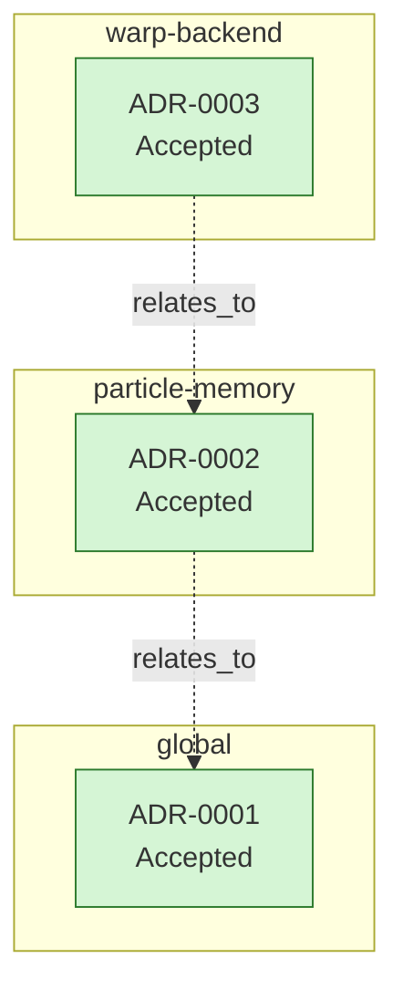

# Decision Graph

Generated from ADR frontmatter. Do not hand-edit.

```mermaid
flowchart TD
  subgraph global[global]
    ADR_0001["ADR-0001<br/>Accepted"]
  end
  subgraph particle_memory[particle-memory]
    ADR_0002["ADR-0002<br/>Accepted"]
  end
  subgraph warp_backend[warp-backend]
    ADR_0003["ADR-0003<br/>Accepted"]
  end
  ADR_0002 -. relates_to .-> ADR_0001
  ADR_0003 -. relates_to .-> ADR_0002
  classDef Accepted fill:#d5f5d5,stroke:#2c7a2c;
  classDef Proposed fill:#fff3bf,stroke:#9a7500;
  classDef Superseded fill:#e5e7eb,stroke:#6b7280;
  classDef Rejected fill:#ffd6d6,stroke:#b91c1c;
  class ADR_0001 Accepted;
  class ADR_0002 Accepted;
  class ADR_0003 Accepted;
```
