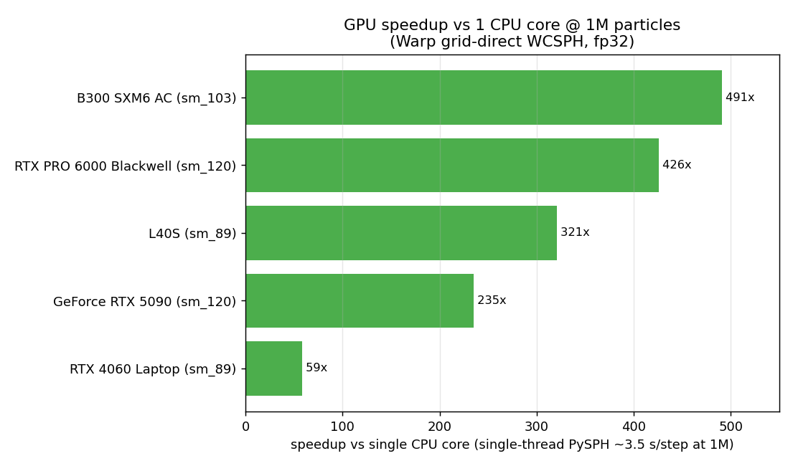
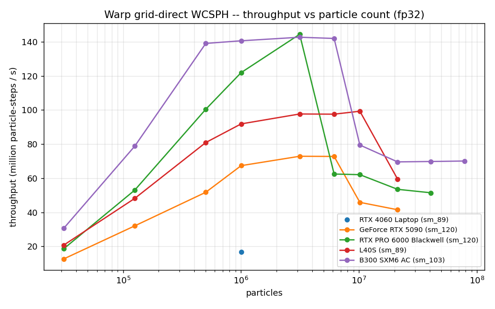
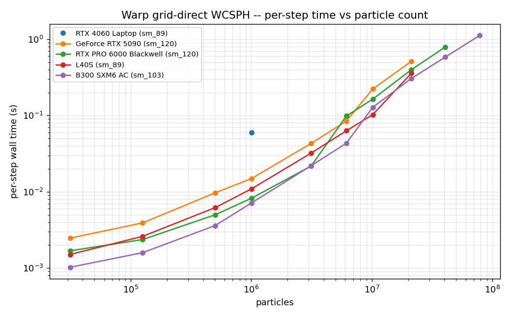
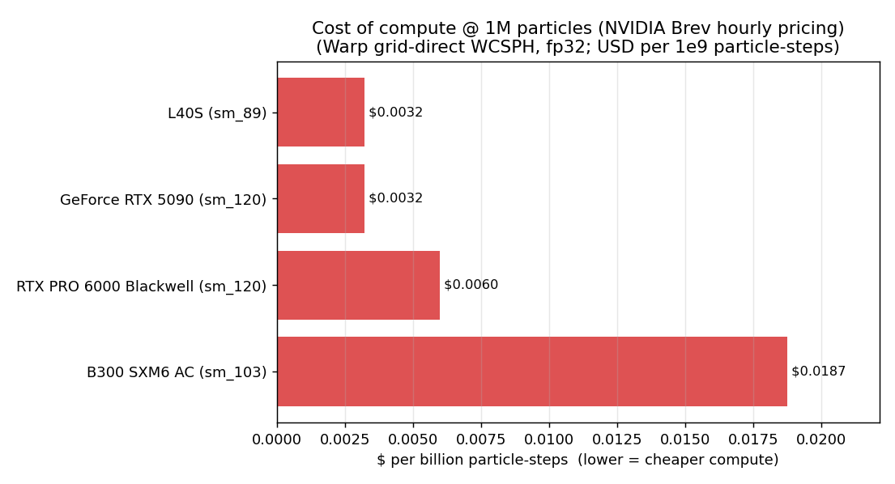
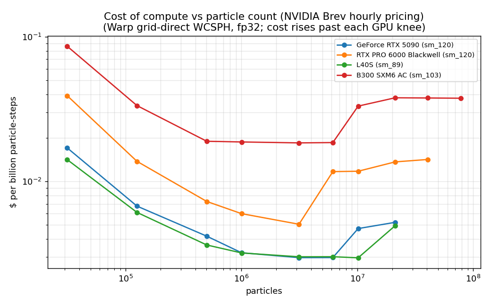
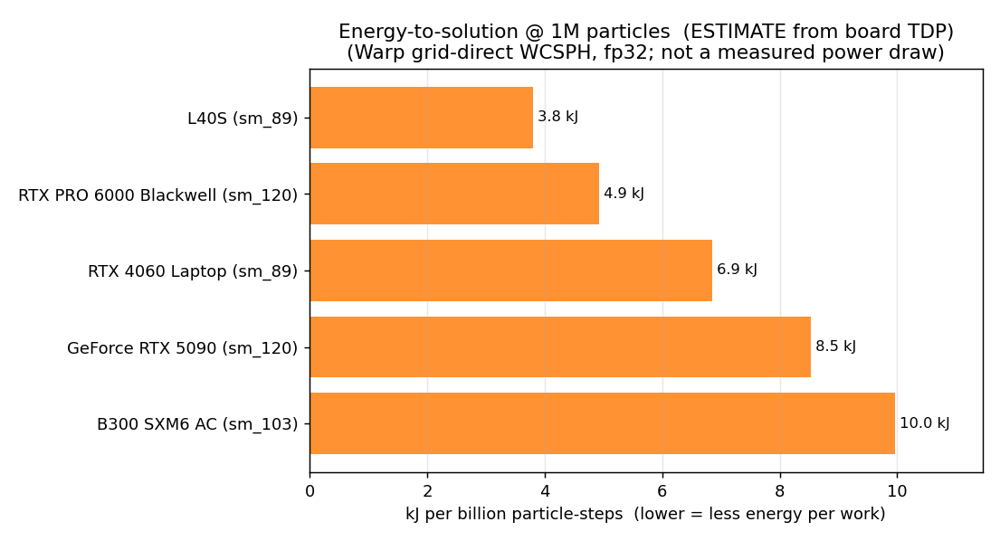
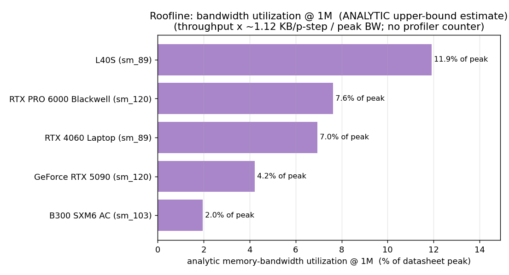

# Cross-GPU performance sweep -- Warp grid-direct WCSPH

Per-GPU throughput sweeps for the grid-direct continuity-density PEC step (fp32),
produced by `../gpu_perf_sweep.py`. Run the script on each GPU and drop its JSON
here; this doc collects the curves and a cross-GPU comparison.

**Metric:** `throughput = particles / per_step_median` (particle-steps per
second), the steady warm per-step over the elliptical-drop workload. Physics:
Gaussian kernel, Tait EOS, continuity density, radius_scale=3, fixed dt, fp32
(`compyle use_double=False`). nx maps to particle count via the disk fill
(`particles ~ pi*nx^2`).

## GPUs collected

| GPU | arch | VRAM | data | file |
|---|---|---:|---|---|
| NVIDIA L40S | sm_89 (Ada) | 48 GiB | full sweep (31k-21M) | `sweep-l40s.json` |
| NVIDIA RTX 5090 | sm_120 (Blackwell consumer) | 32 GiB | full sweep (31k-21M) | `sweep-rtx5090.json` |
| NVIDIA RTX PRO 6000 Blackwell | sm_120 (Blackwell workstation) | 96 GiB | full sweep (31k-40M) | `sweep-rtxpro6000.json` |
| NVIDIA B300 SXM6 | sm_103 (Blackwell Ultra) | 268 GiB | full sweep (31k-78M) | `sweep-b300.json` |
| NVIDIA RTX 4060 Laptop | sm_89 (Ada) | 8 GiB | 1M point only* | `../million-cpu-gpu-grid-direct/fresh-headline-speedups.json` |

\* full `gpu_perf_sweep.py` runs for Blackwell and the 4060 are pending; only the
single 1M-particle point is on record for those so far.

## Figures

Generated from the JSONs by `plot_gpu_sweep.py` (pure matplotlib, no GPU).

**Speedup vs a single CPU core @ 1M particles** -- up to ~491x (B300):

**Throughput vs particle count** -- the ramp, the ~1.43e8 Blackwell ceiling, and
the per-GPU super-linear knees:

**Per-step wall time vs particle count** (log-log) -- linear scaling up to each
card's knee:

### Cost-of-compute lens ($)

The figures above measure *speed*; these measure *price of the work done*, using
the NVIDIA Brev on-demand hourly rates (USD/hr, 2026-06-18): B300 $9.49, RTX PRO
6000 $2.63, L40S $1.06, RTX 5090 $0.78. The metric is **$ per billion
particle-steps** = `($/hr) / (throughput x 3600) x 1e9` -- lower is cheaper. The
4060 is a laptop GPU (no cloud rate) and is excluded.

**Cost of compute @ 1M particles** -- the cheap cards win the $/work race; B300 is
~6x the cost per unit work:

**Cost of compute vs particle count** -- cheapest in each card's plateau, then
rises sharply past its knee (you pay for idle silicon once throughput drops):

### Energy-to-solution lens (estimate -- board TDP, not measured)

> **Estimate, not a measurement.** We did not log GPU power, and there will be no
> profiled re-run, so this lens is **modeled** from each card's datasheet board
> power (TDP) and the recorded throughput. The continuity PEC step is *not*
> FLOP-bound, so the cards will not actually pull full TDP -- this **overstates**
> the energy of the high-TDP idle-headroom parts and should be read as an
> upper-bound *bracket* that orders the cards, not an exact joule count.

Metric: **kJ per billion particle-steps** = `TDP_W / throughput x 1e6`
(equivalently energy-to-solution); its reciprocal is **particle-steps per watt**.
Board power used (datasheet): B300 SXM6 1400 W, RTX PRO 6000 600 W, RTX 5090
575 W, L40S 350 W, RTX 4060 Laptop 115 W.

| GPU | TDP (W) | throughput @1M | kJ / billion p-steps | particle-steps / W | vs best |
|---|---:|---:|---:|---:|---:|
| L40S | 350 | 9.19e7 | **3.8** | 2.63e5 | 1.0x |
| RTX PRO 6000 Blackwell | 600 | 1.22e8 | **4.9** | 2.03e5 | 1.3x |
| RTX 4060 Laptop | 115 | 1.68e7 | **6.9** | 1.46e5 | 1.8x |
| RTX 5090 | 575 | 6.74e7 | **8.5** | 1.17e5 | 2.2x |
| B300 SXM6 | 1400 | 1.41e8 | **10.0** | 1.00e5 | 2.6x |

**Why this lens matters: it breaks the 5090 = L40S dollar tie.** On rental cost
both sit at $0.0032 per billion particle-steps, but on energy the L40S does the
same SPH work for **~2.2x fewer joules** than the 5090 (350 W at 9.19e7 vs 575 W
at 6.74e7) -- so on a power-capped or *owned* fleet (where you pay the power bill,
not the cloud margin) the L40S is the clear pick. The datacenter B300 is the
*least* energy-efficient per unit work (~2.6x the L40S): it spends ~1.4 kW to hold
the same ~1.43e8 ceiling the 600 W RTX PRO 6000 reaches. Cloud $/hr hides this
because it bundles the provider's power, cooling, and margin into one number.

### Roofline lens: memory-bandwidth utilization (analytic estimate)

> **Analytic estimate, not a profiler counter.** With no Nsight/`ncu` run, we
> model the achieved DRAM bandwidth as `throughput x B_eff`, where `B_eff ~= 1.12
> KB per particle-step` (own state read+write ~60 B + the measured `avg_neighbors
> = 44.9` x ~24 B per neighbor read). This counts *logical* reads and ignores L2
> reuse, so it is an **upper bound** on true DRAM traffic -- the real utilization
> is at most this and likely lower. It is also a *whole-step* number (includes the
> grid build and launch overhead, not just the neighbor gather). Treat the
> percentages as an order-of-magnitude bracket, robust to the byte model within
> ~2-3x.

Metric: **MBU** = `achieved_BW / peak_BW`. Datasheet peak DRAM bandwidth: B300
HBM3E ~8 TB/s, RTX 5090 / RTX PRO 6000 GDDR7 ~1.79 TB/s, L40S GDDR6 ~0.864 TB/s,
RTX 4060 ~0.27 TB/s.

| GPU | peak BW | throughput @1M | achieved BW (est.) | MBU (est.) |
|---|---:|---:|---:|---:|
| L40S | 0.864 TB/s | 9.19e7 | ~103 GB/s | **~11.9%** |
| RTX PRO 6000 Blackwell | 1.79 TB/s | 1.22e8 | ~137 GB/s | **~7.6%** |
| RTX 4060 Laptop | 0.27 TB/s | 1.68e7 | ~19 GB/s | **~7.0%** |
| RTX 5090 | 1.79 TB/s | 6.74e7 | ~75 GB/s | **~4.2%** |
| B300 SXM6 | 8.0 TB/s | 1.41e8 | ~157 GB/s | **~2.0%** |

**This sharpens (and partly corrects) the earlier "bandwidth/occupancy-bound"
guess.** Even with the *generous* upper-bound byte model, no card exceeds ~12% of
its peak DRAM bandwidth, and a more realistic multi-pass byte count (~2-3x) still
leaves every card well under ~30%. So the ~1.43e8 Blackwell ceiling is **not a
memory-bandwidth wall** -- it is **occupancy / launch / grid-build bound**, with
large untapped memory headroom. The B300 is the extreme case: it holds the same
peak as the 600 W RTX PRO 6000 while sitting at only **~2% of its 8 TB/s HBM3E**,
i.e. its flat plateau and poor $/work are an *un-tuned-kernel* artifact, not an
intrinsic hardware verdict. This is the single most actionable signal in the
sweep: the next perf win is occupancy/launch tuning (and the super-linear knee is
most likely a grid-build / cache-residency effect), not faster memory.

> Caveat shared by both lenses: these are *single-machine, model-based* estimates
> meant to order the cards and frame the next optimization -- not validated
> against measured power or profiler counters.

## Full sweep -- NVIDIA L40S (sm_89, 44 GiB usable)

| nx | particles | per-step (s) | throughput (particle-steps/s) | finite |
|---:|---:|---:|---:|:--:|
| 100 | 31,417 | 0.001509 | 2.08e7 | yes |
| 200 | 125,629 | 0.002607 | 4.82e7 | yes |
| 400 | 502,625 | 0.006209 | 8.10e7 | yes |
| 565 | 1,002,885 | 0.010915 | 9.19e7 | yes |
| 1000 | 3,141,549 | 0.032157 | 9.77e7 | yes |
| 1400 | 6,157,477 | 0.063098 | 9.76e7 | yes |
| 1800 | 10,178,545 | 0.102492 | 9.93e7 | yes |
| 2600 | 21,236,953 | 0.356544 | 5.96e7 | yes |

- Throughput ramps with particle count (better GPU saturation) and **plateaus at
  ~9.8e7 particle-steps/s from ~1M to ~10M**, with per-step scaling roughly
  linearly (1M -> 10M is ~9.4x particles for ~9.4x time).
- At **21M** throughput drops to 5.96e7 (per-step 3.5x higher for 2.1x more
  particles) -- a super-linear knee, not OOM (44 GiB has headroom). Likely grid
  build / cache-locality at very large N; worth profiling later.
- All points finite. Cold compile on this fresh box was ~89 s
  (warp_nnps 20.9 s + the generated grid kernel 66.2 s), then disk-cached.

## Full sweep -- NVIDIA RTX 5090 (sm_120 consumer Blackwell, 31 GiB)

| nx | particles | per-step (s) | throughput (particle-steps/s) | finite |
|---:|---:|---:|---:|:--:|
| 100 | 31,417 | 0.002473 | 1.27e7 | yes |
| 200 | 125,629 | 0.003915 | 3.21e7 | yes |
| 400 | 502,625 | 0.009707 | 5.18e7 | yes |
| 565 | 1,002,885 | 0.014879 | 6.74e7 | yes |
| 1000 | 3,141,549 | 0.043096 | 7.29e7 | yes |
| 1400 | 6,157,477 | 0.084586 | 7.28e7 | yes |
| 1800 | 10,178,545 | 0.221873 | 4.59e7 | yes |
| 2600 | 21,236,953 | 0.511236 | 4.15e7 | yes |

- Plateaus lower (**~7.3e7** from ~1M to ~6M) than the L40S, and the
  super-linear knee comes **earlier, at ~10M** (vs the L40S's 21M) -- consistent
  with the 5090's smaller 31 GiB (capacity pressure sooner) and consumer-card
  power/clock limits. Same `sm_120` arch as the workstation Blackwell, but
  capacity/bandwidth-shaped throughput on this fp32 SPH workload.

## Full sweep -- NVIDIA RTX PRO 6000 Blackwell (sm_120 workstation, 95 GiB)

| nx | particles | per-step (s) | throughput (particle-steps/s) | finite |
|---:|---:|---:|---:|:--:|
| 100 | 31,417 | 0.001683 | 1.87e7 | yes |
| 200 | 125,629 | 0.002368 | 5.30e7 | yes |
| 400 | 502,625 | 0.005003 | 1.00e8 | yes |
| 565 | 1,002,885 | 0.008223 | 1.22e8 | yes |
| 1000 | 3,141,549 | 0.021753 | **1.44e8** | yes |
| 1400 | 6,157,477 | 0.098554 | 6.25e7 | yes |
| 1800 | 10,178,545 | 0.163877 | 6.21e7 | yes |
| 2600 | 21,236,953 | 0.396781 | 5.35e7 | yes |
| 3600 | 40,714,821 | 0.790790 | 5.15e7 | yes |

Peak **1.44e8** at 3M, then a sharp knee at 6M (per-step 0.022 -> 0.099 s).

## Full sweep -- NVIDIA B300 SXM6 (sm_103 Blackwell Ultra, 268 GiB)

| nx | particles | per-step (s) | throughput (particle-steps/s) | finite |
|---:|---:|---:|---:|:--:|
| 100 | 31,417 | 0.001025 | 3.07e7 | yes |
| 200 | 125,629 | 0.001594 | 7.88e7 | yes |
| 400 | 502,625 | 0.003614 | 1.39e8 | yes |
| 565 | 1,002,885 | 0.007132 | 1.41e8 | yes |
| 1000 | 3,141,549 | 0.022015 | **1.43e8** | yes |
| 1400 | 6,157,477 | 0.043366 | 1.42e8 | yes |
| 1800 | 10,178,545 | 0.128046 | 7.95e7 | yes |
| 2600 | 21,236,953 | 0.305089 | 6.96e7 | yes |
| 3600 | 40,714,821 | 0.583046 | 6.98e7 | yes |
| 5000 | 78,539,677 | 1.120131 | 7.01e7 | yes |

Holds the **~1.43e8 plateau from ~0.5M to 6M**, knee at 10M, then a stable
~7.0e7 post-knee plateau out to **78.5M particles** (largest run; ~1.12 s/step).

## Cross-GPU comparison

At **1M particles (nx=565)** -- the common anchor.

Headline speedup is **vs a single CPU core**: the single-threaded PySPH Cython
Application runs this step at **~3.5 s/step at 1M** (measured 3.445 s on the
4060 host, 3.574 s on the Blackwell host -- same workload, host-CPU dependent).
The speedup column below uses CPU = 3.5 s/step; the GPU-vs-GPU column is relative
to the 4060.

| GPU | arch | VRAM | per-step (s) | throughput (p-steps/s) | **vs 1 CPU core** | vs RTX 4060 |
|---|---|---:|---:|---:|---:|---:|
| RTX 4060 Laptop | sm_89 | 8 GiB | 0.0598 | 1.68e7 | **~59x** | 1.0x |
| RTX 5090 | sm_120 | 32 GiB | 0.014879 | 6.74e7 | **~235x** | 4.0x |
| L40S | sm_89 | 48 GiB | 0.010915 | 9.19e7 | **~321x** | 5.5x |
| RTX PRO 6000 Blackwell | sm_120 | 96 GiB | 0.008223 | 1.22e8 | **~426x** | 7.3x |
| B300 SXM6 | sm_103 | 268 GiB | 0.007132 | 1.41e8 | **~491x** | 8.4x |

Directly-measured CPU-vs-Warp pairs (from `headline_million_100step.py`, fresh
on the same host) corroborate the column: 4060 **57.6x** (CPU 3.445 / Warp
0.0598) and RTX PRO 6000 Blackwell **414x** (CPU 3.574 / Warp 0.008625, its
100-step fixed run). The single-thread CPU step is O(N) like the GPU, so the
speedup is roughly flat with particle count **until the GPU knee**, past which it
falls (e.g. B300 at 10M: CPU ~35 s/step vs Warp 0.128 s -> ~273x).

### Cost of compute at 1M ($ lens)

Same 1M anchor, priced by NVIDIA Brev on-demand rates (2026-06-18). `$ per
billion particle-steps` = `($/hr) / (throughput x 3600) x 1e9` -- the dollar cost
of the actual numerical work, independent of wall-clock.

| GPU | $/hr (Brev) | throughput @1M (p-steps/s) | $ per billion particle-steps | vs cheapest |
|---|---:|---:|---:|---:|
| RTX 5090 | $0.78 | 6.74e7 | **$0.0032** | 1.0x |
| L40S | $1.06 | 9.19e7 | **$0.0032** | 1.0x |
| RTX PRO 6000 Blackwell | $2.63 | 1.22e8 | **$0.0060** | 1.9x |
| B300 SXM6 | $9.49 | 1.41e8 | **$0.0187** | 5.8x |

The two cheap cards (5090 / L40S) do the same SPH work for **~6x less money**
than the B300, and ~3x less than the RTX PRO 6000. The expensive datacenter cards
do **not** win on cost-per-work on this fp32 SPH step -- their value is **scale
and latency**: the B300 fits 78.5M particles in one box and finishes any single
step ~2x faster than the 5090, but you pay a large premium for that wall-clock.
**Pick by constraint:** lowest $/work for throughput-bound batch jobs -> RTX 5090
/ L40S; largest single problem or fastest turnaround -> B300 / RTX PRO 6000.

Peak / sustained throughput and the super-linear knee:

| GPU | peak throughput | peak at | knee at | post-knee plateau | max run |
|---|---:|---:|---:|---:|---:|
| RTX 5090 | ~7.3e7 | 3M | 10M | ~4.2e7 | 21M |
| L40S | ~9.9e7 | 10M | 21M | -- | 21M |
| RTX PRO 6000 | ~1.44e8 | 3M | 6M | ~5.2e7 | 41M |
| B300 SXM6 | ~1.43e8 | 1M-6M | 10M | ~7.0e7 | 78M |

Observations (`*` = open question):
- **Both Blackwell cards hit the same peak ceiling (~1.43e8)** despite very
  different class/VRAM -- not raw-FLOP-bound. The analytic roofline lens above
  refines the earlier "bandwidth/occupancy-bound" guess: every card sits well
  under peak DRAM bandwidth (B300 ~2% of 8 TB/s at the plateau), so the ceiling
  is **occupancy / launch / grid-build bound, not a memory-bandwidth wall** --
  there is large untapped headroom, especially on the big-memory cards. The
  **B300's edge is scale**: it sustains the peak to 6M, reaches **78.5M
  particles**, and holds a higher post-knee plateau (~7.0e7 vs RTX PRO 6000
  ~5.2e7, 5090 ~4.2e7).
- On this fp32 SPH workload the **datacenter Ada L40S (9.19e7) beats the consumer
  5090 (6.74e7)** at 1M -- capacity/bandwidth/occupancy shaped, not FLOP shaped.
- `*` The **super-linear knee is non-monotonic with VRAM**: RTX PRO 6000 (95 GiB)
  knees at 6M, B300 (268 GiB) at 10M, 5090 (32 GiB) at 10M, L40S (44 GiB) at
  21M. So it is **not** a capacity ceiling -- likely an algorithmic/grid effect
  (cell-list build cost, occupancy, or Warp mempool behavior at scale). The
  segmented profiler (`profile_grid_direct_neighbors.py`: grid-build vs equation
  time) is the tool to diagnose it; treat the cause as unconfirmed.
- arch note: B300 reports **sm_103** (Blackwell Ultra) -- distinct from
  datacenter Blackwell sm_100 and consumer/workstation sm_120; all ran on Warp
  1.14 / CUDA Toolkit 12.9 with no code or build changes (BUILD.md section 10).
- The 4060 1M point is from the fixed-step headline run, not a `gpu_perf_sweep.py`
  sweep (close enough for the anchor; a full 4060 sweep would round out the low end).
