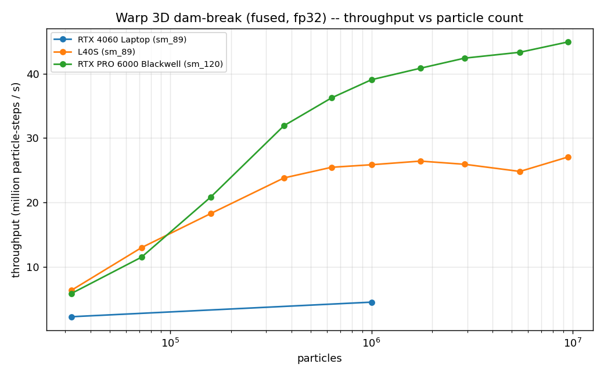
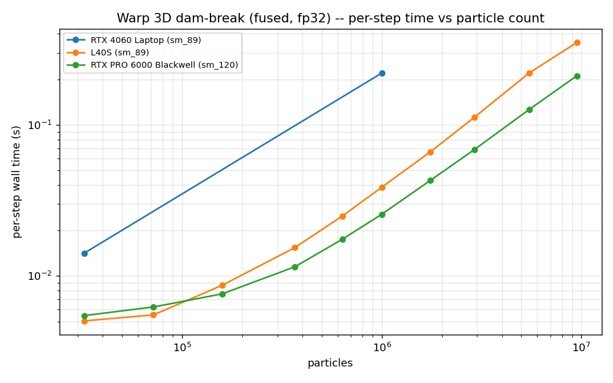
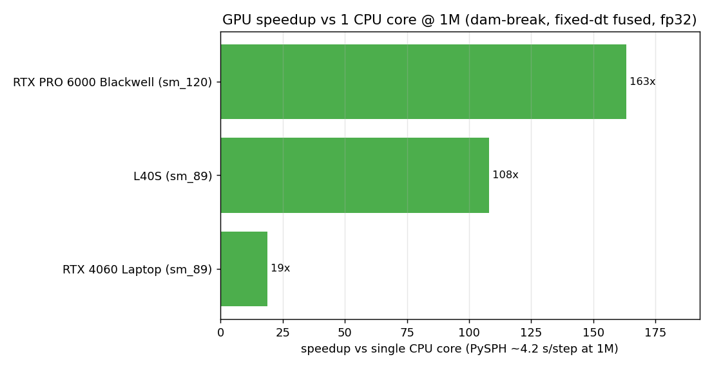
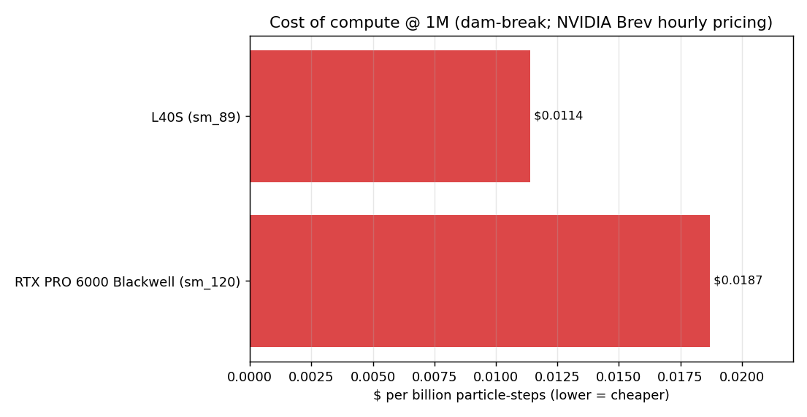
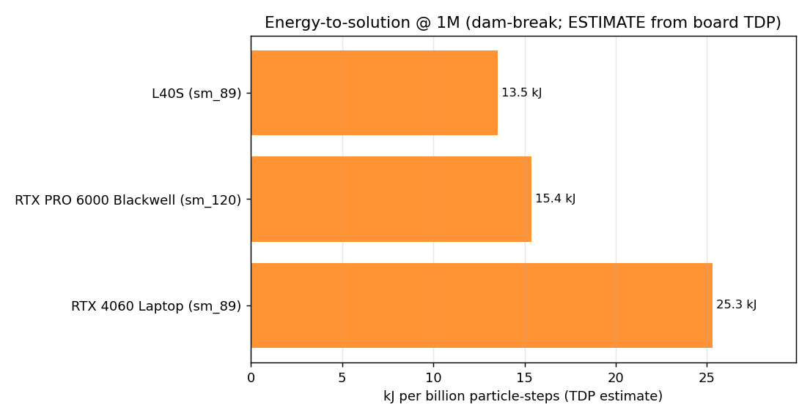
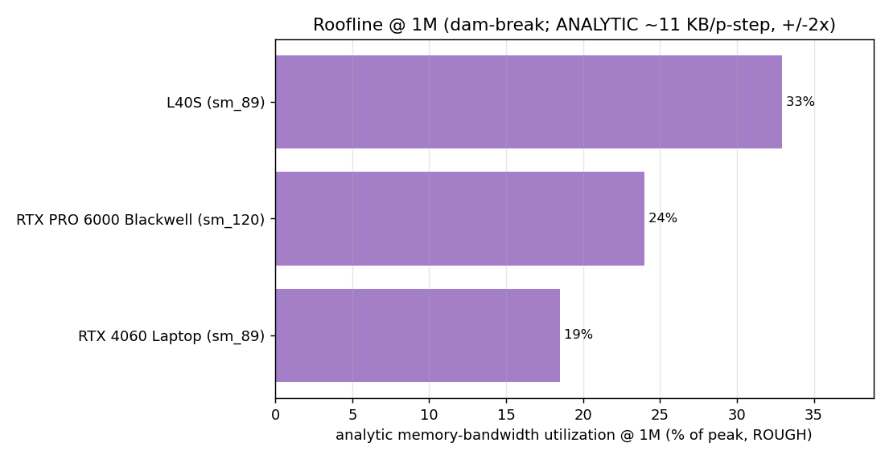

# Cross-GPU sweep -- Warp 3D dam-break (fused, fp32)

Per-step throughput of the fused `wc_sph_dam_break_step` (Lobovsky no-obstacle:
fluid + one wall array, WendlandQuintic, Tait + Tait-HG walls, gravity, fp32) vs
particle count, on each GPU. Generated by `gpu_perf_sweep_dam_break.py` (run on
each GPU, GPU-only) + `plot_gpu_sweep_dam_break.py` (lenses + figures).

Methodology mirrors the elliptical-drop sweep: **fixed dt** per-step (no adaptive
CFL kernel / dt readback), so the number is the step's pure compute throughput,
comparable across GPUs. The production runner uses adaptive dt (one extra CFL
kernel + a scalar device->host readback per step), ~1.5x slower per step at 1M,
so end-to-end production speedups are correspondingly lower.

Sweep: dx = 0.04 -> 0.005 over the Lobovsky geometry = **32k -> 9.49M particles**
(identical counts on every GPU; ~1M point = dx=0.011 = 999,975). steps=12,
warmup=4. The fused kernels cold-compile once per cold disk cache (~145-200 s,
absorbed by warmup). Per-point OOM is recorded; both cards here cleared the full
list (L40S 44 GiB, RTX PRO 6000 95 GiB).

GPUs run so far: **L40S, RTX PRO 6000 Blackwell** + an RTX 4060 Laptop anchor.
(RTX 5090 and B300 deferred -- drop their `sweep-dambreak-*.json` here and re-run
the plot script to extend every lens.)

## Lenses at ~1M particles (999,975), fixed-dt fused step

| GPU | throughput (Mp-st/s) | per-step (ms) | vs 1 CPU core | $ / billion p-st | kJ / billion p-st | perf/W (p-st/s/W) | MBU% (rough) |
|---|---:|---:|---:|---:|---:|---:|---:|
| RTX PRO 6000 Blackwell (sm_120) | 39.1 | 25.6 | 163x | $0.0187 | 15.4 | 65,099 | ~24 |
| L40S (sm_89) | 25.9 | 38.7 | 108x | **$0.0114** | **13.5** | **73,908** | ~33 |
| RTX 4060 Laptop (sm_89) | 4.5 | 220.1 | 19x | n/a (laptop) | 25.3 | 39,513 | ~19 |

CPU ref: single-thread PySPH Cython dam-break Application **4.18 s/step** at
999,975 particles (run-to-run 4.2-5.0 s/step; the CPU runs adaptive dt).

## Findings per lens

- **Throughput / speed.** RTX PRO 6000 leads at every resolution past ~150k and
  is still climbing at 9.5M (45 Mp-st/s, 95 GiB headroom); the L40S saturates at
  ~25-27 Mp-st/s from ~600k on. At <100k both Blackwell-class and Ada are tied --
  launch/grid-build bound (the GPU is starved). At 1M, RTX PRO 6000 is **~1.5x**
  the L40S.
- **Speedup vs 1 CPU core** (fixed-dt compute, vs 4.18 s/step CPU): **163x** (RTX
  PRO 6000), **108x** (L40S), **19x** (4060) at 1M. (The adaptive production step
  is ~1.5x slower, so production end-to-end is lower -- e.g. ~12x on the 4060.)
- **$ cost-of-compute** (Brev hourly): the **L40S is cheaper per unit work**
  ($0.0114 vs $0.0187 per billion p-steps) -- its $1.06/hr beats the RTX PRO
  6000's $2.63/hr by more than the ~1.5x throughput gap. Same pattern as the
  elliptical sweep: cheaper cards do the same work for less money.
- **Energy-to-solution / perf-per-watt** (datasheet TDP estimate): the **L40S
  also wins on energy** -- 13.5 vs 15.4 kJ/billion, 73.9k vs 65.1k p-steps/s/W --
  its 350 W beats the RTX PRO 6000's 600 W. (Estimate from board TDP; the step is
  not FLOP-bound so true draw is below nameplate -- an upper bracket, not a
  measurement.)
- **Roofline / bandwidth utilization** (ROUGH analytic, ~11 KB/p-step +/-2x): ~33%
  (L40S) / ~24% (RTX PRO 6000) of peak DRAM BW at 1M -- notably higher than the
  elliptical drop's ~12% because the fused multi-array dam-break step moves ~10x
  more bytes per particle-step. Still <50%, so it is **not yet bandwidth-bound**:
  there is occupancy/launch headroom (consistent with the small-N launch-bound
  plateau). A profiler run would be needed for a real number.

Versus the **elliptical drop** at 1M on the same cards: dam-break throughput is
~3.5x lower (25.9 vs 91.9 Mp-st/s on the L40S) -- expected, since each dam-break
step does pressure + AV + continuity over two source arrays + XSPH + wall
continuity + two EOS + an EPEC double evaluation, vs the elliptical's single
fused continuity kernel.

## Figures

## Caveats

- Fixed-dt compute throughput; production adaptive dt is ~1.5x slower/step.
- Two cloud GPUs + a 4060 anchor (5090/B300 deferred).
- $ and energy/perf-W are **estimates** from public hourly rates and datasheet
  TDP; no measured power. MBU uses a rough ~11 KB/p-step byte model (+/-2x), no
  profiler counter.
- CPU reference has ~10-20% run-to-run variance on the laptop host.
