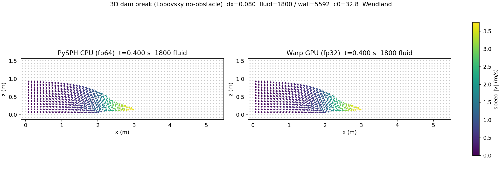
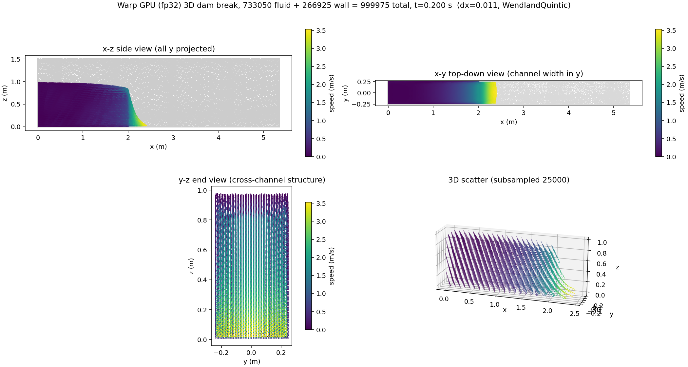
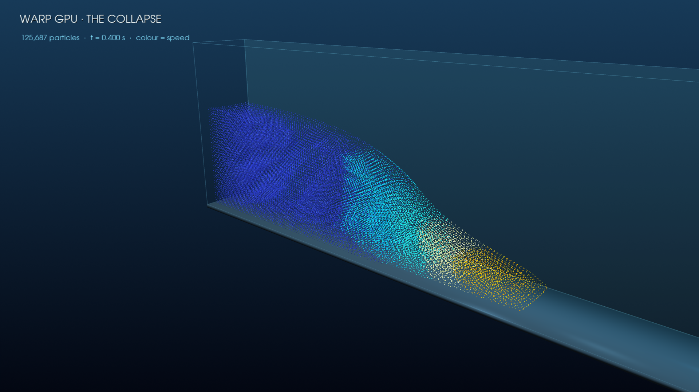
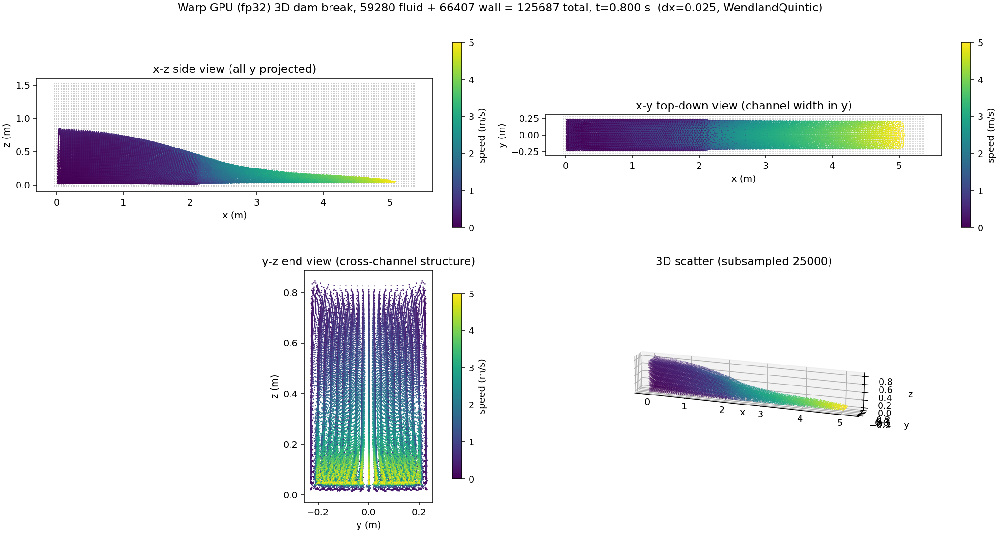

# Review: Warp 3D dam-break (Lobovsky no-obstacle)

## Case

A 3D dam break (Lobovsky et al. 2014, no-obstacle variant): a rectangular water
column held in a closed container is released at `t=0` and collapses under
gravity, a surge front runs along the floor and up the far wall. WCSPH with the
WendlandQuintic kernel, Tait equation of state, Monaghan artificial viscosity,
and XSPH; one solid **wall** particle array held fixed, its pressure enforced by
`TaitEOSHGCorrection` (clamp `rho>=rho0`). Reference: PySPH's shipped
`dam_break_3d_lobovsky.py` (`WCSPHScheme` + `EPECIntegrator`, fp64 CPU). Domain
~5.367 x 0.5 x 1.5 m, fluid column 2.0 x 0.5 x 1.0 m, `rho0=1000`, `gamma=7`,
`alpha=0.25`, `c0~32.85`, `gz=-9.81`.

## Resolution & particle counts

- Tier-1 (hand-rolled CPU parity), `dx=0.15`: **234 fluid + 1809 wall**.
- Tier-2 (real Application), `dx=0.12`: **512 fluid + 2647 wall**.
- Smoke / perf+snapshot, `dx=0.10` / `dx=0.08`: 1000 fluid + 3824 wall /
  **1800 fluid + 5592 wall = 7392 total**.
- Reference production resolution is `dx=H/30` (finer; not run here -- correctness
  uses coarser, bounded resolutions).

## Performance (Warp fp32 vs default PySPH CPU)

Same case to the same physical time `tf=0.4 s` at `dx=0.08` (7,392 particles),
RTX 4060 Laptop fp32 vs single-threaded PySPH Cython fp64. CPU = `app.solve()`
loop only (setup/compile excluded); Warp = GPU stepping loop only. Both use their
native adaptive dt + `n_damp`. Reproduce: `perf_and_snapshot_dam_break_3d.py`
(writes `cpu-vs-warp-perf.json`).

| | steps to t=0.4 | wall | per-step |
| --- | --- | --- | --- |
| PySPH CPU (fp64) | 461 | 6.01 s | **13.0 ms** |
| Warp GPU (fp32) | 460 | 3.92 s | **8.5 ms** |

- **~1.53x faster** on the GPU -- per-step and total wall now agree because the
  two adaptive-dt schedules match (460 vs 461 steps to the same `tf`).
- Step-count parity required a runner fix: the reference's
  `dt = 0.25*h0/(1.1*c_max)` is only the *initial/seed* dt -- PySPH's
  `Integrator.compute_time_step` returns the CFL-limited `cfl*dt_min` with **no
  clamp to the seed**, so its dt grows to ~9.2e-4. The runner originally capped
  Warp's adaptive dt at that seed (~5.3e-4), forcing ~1.7x more, smaller steps
  (775 vs 461); `dt_max` now defaults to uncapped (CFL + `n_damp` govern, like the
  reference), so Warp lands at 460 steps.
- This is the expected **small-N regime**: at ~7k particles the GPU is
  launch/grid-build-overhead bound, so ~1.5x is modest.

### At ~1M particles (the meaningful large-N comparison)

`bench_1M_and_3d_snapshot.py` at `dx=0.0108` (**1,014,072 particles**), per-step
throughput over a fixed step count (a *developed* 1M run to a physical `tf` is
multi-hour on the CPU, so it is intentionally not run -- matching how the
committed 1M elliptical comparison was measured):

| >1M particles | per-step | particle-steps/s | vs CPU |
| --- | --- | --- | --- |
| PySPH CPU (fp64) | 4.5-5.0 s | ~0.21 M | 1x |
| Warp fp32, single-block | 0.415 s | 2.45 M | ~10.9x |
| Warp fp32, **fused** | **0.337 s** | **3.01 M** | **~13-15x** |

- **~13-15x faster per step at >1M** (CPU per-step has ~10-20% run-to-run
  variance on the laptop, 4.2-5.0 s/step; the Warp numbers are stable). The GPU
  advantage scales steeply with N: 1.53x at 7k -> ~14x at >1M. (The 3D snapshot
  above is a companion run at 999,975 particles, `dx=0.011` -- same scale.)
- **The fluid acceleration+density blocks are now fused** (pressure + Monaghan
  AV + continuity in one kernel per source -- one neighbour walk / one per-pair
  geometry computation instead of three), which made the Warp step **1.23x**
  faster (0.415 -> 0.337 s/step) over the initial additive single-block
  composition. XSPH (fluid-only) and wall continuity (fluid->wall) stay separate
  (heterogeneous source/destination sets), so the step is still not a single
  fused kernel like the single-array elliptical drop (57.6x at 1M); closing the
  rest of that gap would require fusing across the heterogeneous source sets.
  See also the committed cross-GPU sweep (414x per-step at 1M on an RTX PRO 6000). It is lower than the elliptical drop's 57.6x at
  1M on this same 4060 because the dam-break step is **not fused**: it issues ~18
  separate equation launches per step (continuity + pressure + AV over 2 sources,
  XSPH, wall continuity, 2 EOS, gravity, x2 predictor/corrector), vs the
  elliptical's single fused continuity kernel. Fusing the dam-break step is a
  natural future optimisation (out of scope for this correctness-focused ADR).
  See also the committed cross-GPU sweep (414x per-step at 1M on an RTX PRO 6000).

## Representative final snapshot

Side-by-side x-z view at `t=0.4 s` (fluid coloured by speed, walls grey). Both
panels show the collapsed column with the surge front advanced to x ~ 2.5-3 m
along the floor and peak speed ~3.5 m/s at the front; the PySPH CPU (fp64) and
Warp GPU (fp32) states are visually indistinguishable (consistent with the
fp32-vs-fp64 deltas quantified below).

(CPU<->Warp parity at 7,392 particles; x-z projection. Review images live in
`2026-06-19_warp-3d-dam-break-lobovsky_assets/`; generated by
`experiments/2026-06-18_warp-dam-break-3d-runner/perf_and_snapshot_dam_break_3d.py`.)

### 3D-explicit view at ~1M particles

To show the case is genuinely 3D (not a 2D run plotted in 3D), the developed Warp
state at **999,975 particles** (`t=0.2 s`) in four views -- x-z side (all y
projected), x-y top-down (fluid spread across the full channel width in y), y-z
end view (cross-channel particle layers), and a subsampled 3D scatter:

(Generated by `bench_1M_and_3d_snapshot.py`. The x-y and y-z panels make the
multi-layer y-structure explicit; the simulation runs `dim=3` NNPS + 3D physics
throughout.)

### Medium-resolution developed showcase (2026-06-20)

Fresh `dx=0.025` run: **59,280 fluid + 66,407 wall = 125,687 particles**.
Warp measured `0.03140 s/step` versus `0.42733 s/step` for single-threaded
PySPH CPU (`13.61x`). The adaptive run reached `t=0.8016 s` in 2,837 steps,
remained finite, and kept density in `989.74..1014.13 kg/m^3`.

The collapse-phase hero at `t=0.3996 s` uses the actual Warp particles coloured
by speed (not a generative rendering):

The developed `t=0.8016 s` state is shown in four verification views:

Splashsurf reconstruction was exercised successfully. Blender/ffmpeg are not
installed on this host, so the retained hero is explicitly a polished particle
visualization rather than a photorealistic animation.

## Diff summary

Implements plan step 5 (the experiment packet) on top of the already-present
additive backend physics (steps 1-4: WendlandQuintic id 2, `apply_body_force`,
`compute_tait_eos_hg_correction`, `wc_sph_dam_break_step`, dim=3 codegen/parity
tests).

- New experiment packet `experiments/2026-06-18_warp-dam-break-3d-runner/`:
  - `dam_break_3d_runner.py` -- Application-style 3D runner; IC built by the
    *same* `DamBreak3DGeometry(no obstacle)` the reference uses -> warp fluid +
    wall; `UniformGridWarpNNPS(dim=3)`; `wc_sph_dam_break_step`; adaptive dt with
    PySPH `n_damp` *timestep* damping; 3D metrics (surge-front x, max height,
    z-extent, 3D KE, wall p range).
  - `run_correctness.sh` -- coarse smoke wrapper (venv python; no stale activate).
  - `compare_warp_pysph_dam_break_3d.py` -- tier-1 hand-rolled CPU EPEC parity
    (`LinkedListNNPS(dim=3)` + `WendlandQuintic`), mirrors the step block-for-block;
    fixed dt / no damping / full gravity for a clean fp32-vs-fp64 diff.
  - `resolved_dam_break_3d_comparison.py` -- tier-2 vs the real PySPH
    `dam_break_3d_lobovsky.py` Application (subprocess `run(argv=...)`, shared t~0
    IC, step Warp to matched checkpoints), persists a summary JSON.
  - `perf_and_snapshot_dam_break_3d.py` -- runs the real PySPH Application and
    the Warp runner to the same `tf`, reports particle counts + wall/per-step
    performance + speedup, and renders the side-by-side x-z snapshot.
  - `bench_1M_and_3d_snapshot.py` -- ~1M-particle per-step throughput comparison
    (CPU vs Warp, fixed step count) + a 3D-explicit four-view developed snapshot.
  - `experiment.md`, `results-smoke.npz`, tier-1/tier-2 summary JSONs,
    `cpu-vs-warp-snapshot.png`, `cpu-vs-warp-perf.json`.
- `pysph/base/warp_sph.py`: added the four Wendland device leaves to
  `_WARP_DEVICE_FUNCS` for parity with cubic/gaussian (not part of any cache key
  or generated source; kernel_id==2 already resolved transitively). Also **fused
  the dam-break fluid step**: new `_WCSPH_DAM_BREAK_FLUID_BLOCKS`
  (PressureGradient + ArtificialViscosity + ContinuityEquation) run as one
  generated kernel per source (`accumulate_outputs=True`) instead of three
  separate single-block launches -- a new cache entry, the 2D path / generated
  source unchanged (byte-identity guard still passes). 1.23x faster Warp step.
- `pysph/base/tests/test_warp_codegen.py`: cache-stability regression guard
  `test_2d_path_generated_source_is_byte_identical_to_golden` (md5-pins the
  cubic/gaussian 2D-path generated source, flat + grid; asserts no `wendland`).
- ADR-0005 -> Accepted, with corrected cache wording + a Validation section;
  decisions graph/index updated.

## Validation evidence

- **Backend targeted tests:** `5 passed` (Wendland 3D summation density, ramped
  gravity + 2D guard, Tait-HG, two-array 3D dam-break step). Full focused suite
  (`test_warp_codegen` + `test_warp_sph` + `test_warp_nnps`) rerun -- see
  current.md for the count.
- **Tier-1:** kinematics + density match to ~1e-8 relative; pressure abs 0.17 Pa
  < fp32 Tait floor 2.06 Pa -> `passed: true`.
- **Tier-2 (real Application):** KE / surge-front / max-height / density agree to
  fp32 across checkpoints; p_max 1.11% relative at the developed checkpoint;
  per-particle x/z ~1e-7 near rest.

## Adversarial review (workflow, 5 dims x verify)

24 confirmed findings; acted on the real ones (byte-identity guard, tier-2
summary JSON + `--prefix`, dead wall-velocity pull, ADR wording, dict consistency).
The synthesis-elevated "blocker" (Wendland leaves missing from
`_WARP_DEVICE_FUNCS`) was **refuted by reality** -- every Wendland run already
passed because the routers resolve their leaves via module `__globals__`; the
leaves were added anyway for hygiene.

## Known deltas / caveats (documented in experiment.md + ADR Validation)

- Near-rest pressure is at the fp32 Tait-EOS cancellation floor (relative error
  large only because p ~ 1 Pa); recovers to ~1% relative when developed.
- EPEC matches the reference `EPECIntegrator` (no PEC substitution).
- `n_damp` damps the timestep (not gravity); `c0 = 10*sqrt(2*9.81*0.55) ~ 32.85`.
- Cache: emitted 2D source byte-identical + logic-preserving router extension
  (one-time recompile possible, results unchanged).

## Out of scope (ADR-0005 follow-ups)

SPHERIC/Kleefsman obstacle case; full `tf=2.5` run + probe-pressure vs
`db_exp_data.get_lobovsky_data()`; cubic/gaussian dam-break cross-check;
performance/cross-GPU characterisation.

## Sign-off

- Reviewer: @prabhu
- Verdict, verbatim quote:
  > @prabhu: LGTM
- Timestamp: 2026-06-21T02:06:46 CEST
