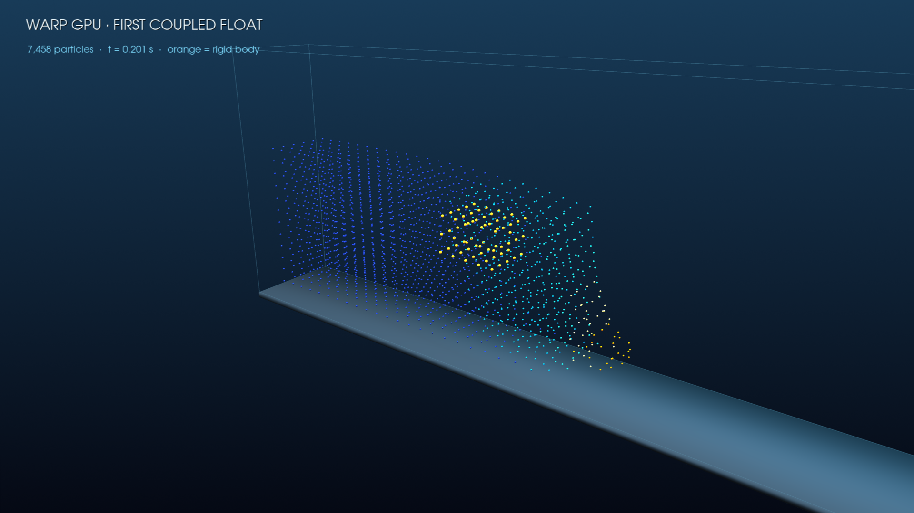

# Review - Liu fluid/rigid coupling and coupled dam-break driver (P3)

## Diff summary

- Added `RigidNumberDensity`, `LiuFluidAcceleration`, and `LiuBodyReaction`
  equation blocks. Liu coupling uses two destination-register passes, avoiding
  nondeterministic fp32 source atomics while preserving equal-and-opposite
  pair momentum.
- Added device kernels/helpers for rigid density save/midpoint/full staging and
  per-particle body-force initialization.
- Added sibling `wc_sph_dam_break_rigid_step`; the existing fixed-wall driver
  is unchanged. The new driver performs two EPEC force evaluations, advances
  fluid/fixed walls through PEC, advances body density separately, and invokes
  P2's device-resident rigid RK2 stages.
- Added fp32/fp64 Liu parity/reaction tests, Wendland number-density parity,
  rigid staging checks, and a genuine 3D coupled-step smoke test.
- Added `warp_floating_box_runner.py` and a scientific hero render from a
  7,458-particle, 241-step coupled transient.

Host diff for this slice: `warp_sph.py` +354 lines;
`test_warp_sph.py` +181/-4 lines. Experiment/review memory is additive.

## Aspects touched and host files modified

- `warp-backend`: additive Liu blocks, rigid staging kernels, coupled driver.
- `gpu-nnps`: repeated grid-direct cross-array traversal; no flat CSR cache.
- `particle-memory`: fluid, rigid particle, and compact 6-DOF state remain
  device-authoritative; adaptive `dt` is the existing scalar handoff.
- `validation-benchmarks`: exact primitive parity plus an end-to-end transient.
- Host files: `pysph/base/warp_sph.py` and
  `pysph/base/tests/test_warp_sph.py`, both inside the approved boundary.

## Behavioral / numerical changes

- Fluid pressure acceleration from body particles follows PySPH's
  `LiuFluidForce`; the second pass applies the reversed, mass-weighted reaction
  to body particle forces. No source-side atomic accumulation is used.
- Body self-neighbor `V = sum(W)` is initialized once. It is a static parity /
  volume diagnostic; Liu itself does not consume `V`.
- Body contribution to fluid `arho` is evaluated exactly once outside the
  pre-existing fluid+wall fused block. Body `arho` comes from fluid once; the
  body is never integrated as independent fluid particles.
- Body gravity is initialized as `m*g` before each Liu force evaluation. The
  existing f64 rigid reduction then produces force/torque and advances the
  body entirely on the GPU.
- The existing `wc_sph_dam_break_step`, generated 2D source, and fixed-wall
  behavior were not edited.

## Tests / validation run

Primitive fp32/fp64 Liu parity on the final tree:

```text
$ python -m pytest -q --disable-warnings pysph/base/tests/test_warp_sph.py \
    -k warp_liu_coupling_matches_reference_and_reacts_equally
..                                                                       [100%]
2 passed, 52 deselected, 2 warnings in 242.67s (0:04:02)
```

Focused P3/cache guard collected before the final fp64 parameter was added:

```text
$ python -m pytest -q \
    pysph/base/tests/test_warp_sph.py::test_warp_liu_coupling_matches_reference_and_reacts_equally \
    pysph/base/tests/test_warp_sph.py::test_warp_rigid_number_density_matches_cpu_wendland \
    pysph/base/tests/test_warp_sph.py::test_warp_rigid_density_and_body_force_stages \
    pysph/base/tests/test_warp_sph.py::test_warp_dam_break_rigid_step_is_finite_and_moves_body \
    pysph/base/tests/test_warp_codegen.py::test_2d_path_generated_source_is_byte_identical_to_golden
.....                                                                    [100%]
5 passed, 49 deselected in 350.63s
```

The unchanged fixed-wall behavior test
`test_warp_dam_break_step_two_array_3d_is_finite_and_walls_fixed` also passes
in the final 54-test suite.

Final exact-tree full Warp SPH suite:

```text
$ python -m pytest -q --disable-warnings pysph/base/tests/test_warp_sph.py
......................................................                   [100%]
54 passed, 2 warnings in 1886.59s (0:31:26)
```

The long wall time is the known CPU-side NVRTC compilation of large generated
Wendland 3D kernels. The process stayed active at ~100% CPU; all 54 tests
completed with no failure.

Substantial coupled transient (RTX 4060, `dx=0.08`, collision-free horizon):

```text
particles:                  1,800 fluid + 5,592 wall + 66 body = 7,458
steps / simulated time:     241 / 0.200603 s
all_finite / device_error:  true / 0
body COM displacement:      [0.02396, -0.01009, -0.08081] m
body vc:                    [0.24182, -0.06702, -0.65823] m/s
body omega:                 [-0.14531, 0.70659, 0.20398] rad/s
final body force:           [29.23, -5.27, 14.18] N
fluid rho:                  991.68 .. 1015.78 kg/m^3
body rho:                   912.75 .. 1015.08 kg/m^3
relative geometry drift:    1.90e-6
```

The final positive vertical force despite body weight is computed fluid
reaction, not the prescribed-force P2 setup. The horizon deliberately ends
before rigid-wall contact, which remains P4 scope.

```text
$ python -m py_compile pysph/base/warp_sph.py \
    pysph/base/tests/test_warp_sph.py \
    .ai/implementations/blast-from-the-past/experiments/2026-06-19_warp-floating-body-rigid/warp_floating_box_runner.py
<no output; exit 0>

$ git diff --check
<no output; exit 0>
```

## validate-memory.py

```text
$ python .ai/implementations/blast-from-the-past/scripts/update-decision-graph.py
Generated decisions/index.json and decisions/graph.md

$ python .ai/implementations/blast-from-the-past/scripts/validate-memory.py
validate-memory: PASS
```

## Boundary amendment

- `implementation.md` boundary update: n/a. Both host files match the existing
  `pysph/base/warp_*.py` and `pysph/base/tests/test_warp_*.py` entries.
- Amendments log entry: n/a.

## Visual aid



Blue/cyan points are the actual fluid checkpoint, orange points are the rigid
box, and the faint grey geometry is the fixed flume. This is a scientific
particle render from the coupled run, not the P4 photorealistic animation.

## Adversarial review

Reviewed six dimensions: Liu sign/mass algebra; equal-and-opposite momentum;
`arho` accounting; EPEC stage ordering; device residency/determinism; and
fixed-driver/cache isolation.

- Liu fp32 and fp64 match a direct NumPy/Wendland reference, including total
  pair reaction at dtype tolerance.
- The body reaction is accumulated as a destination output, so there are no
  fp32 source atomics. P2's force/torque reduction remains f64.
- The rigid body is excluded from `_WCSPH_DAM_BREAK_FLUID_BLOCKS`; fluid/body
  continuity is launched once in each direction, avoiding `arho` duplication.
- Fixed walls remain fixed and the existing driver/golden source guards pass.
- Production stages contain no particle-state pull or host rigid solve. The
  adaptive timestep retains the already-established scalar handoff.

No blocker was found in the implemented P3 boundary.

## Risks

- Two-pass Liu coupling traverses fluid/body neighbors twice. It favors
  deterministic correctness over launch/traversal minimization; profile before
  considering fusion or mixed-dtype atomics.
- Body density reaches 912.75 kg/m^3 in the transient. Tait-HG prevents tensile
  body pressure, but this excursion merits monitoring in P4's longer/contact
  case.
- There is no rigid-wall contact yet. The reviewed transient is intentionally
  collision-free and must not be extrapolated past first wall impact.
- Particle-based RK2 preserves geometry to `1.90e-6` relative over this run;
  P4 must measure drift over the longer cinematic case before deciding whether
  orientation-matrix/quaternion state is needed.

## Unresolved questions / accepted validation deviation

- The approved plan requested a complete hand-staged NumPy oracle for every
  output of one coupled EPEC step. P3 instead has exact fp32/fp64 primitive Liu
  parity, equal reaction, exact number-density/staging tests, the established
  P2 RK2 oracle, and an end-to-end coupled smoke/transient. A monolithic EPEC
  oracle was not added because it would mostly duplicate already-pinned
  primitives and the current Python 3.14 environment cannot run the shipped
  Compyle rigid Application. This is disclosed for reviewer acceptance rather
  than silently claimed complete.
- P4 decides contact handling and whether the cinematic run needs a rigid/contact
  timestep criterion in addition to the current fluid CFL scalar.

## Sign-off

- Reviewer: @prabhu
- Verdict, verbatim quote:
  > alright. @prabhu: LGTM and closeout
- Timestamp: 2026-06-21T02:02:00 CEST
