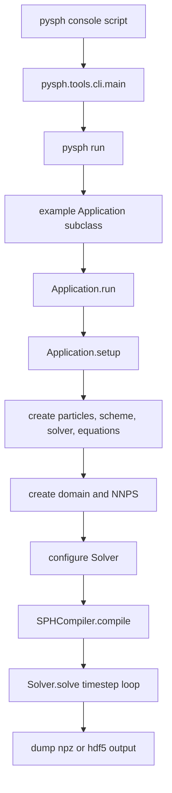
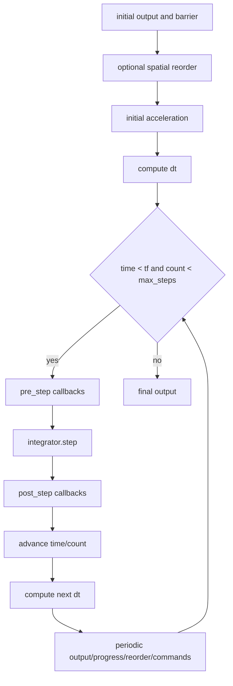
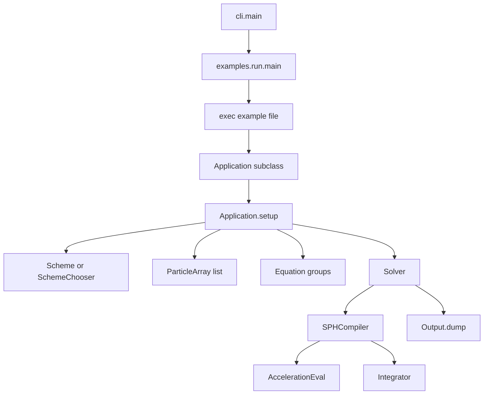

# PySPH Codebase Understanding

Generated for the repository rooted at `/home/kunalp/work/particles/pysph`.

This report uses these labels:

- `[Confirmed]` means the statement is directly supported by cited source code, docs, or command output.
- `[Inferred]` means the statement follows from multiple cited facts but is not stated verbatim in one location.
- `[Unverified]` means the code suggests the point, but this pass did not execute enough runtime paths to prove it.
- `[Unknown]` means the pass did not find enough evidence to make a claim.

## 1. Executive Summary

[Confirmed] PySPH is a Python framework for Smoothed Particle Hydrodynamics (SPH), with performance-critical code paths in Cython and optional PyOpenCL-backed acceleration; the README explicitly says high-level Python code is automatically converted to Cython or OpenCL and can use OpenMP, OpenCL, and MPI when available (`README.rst:7`, `README.rst:10`, `README.rst:13`, `README.rst:15`). [Confirmed] The package metadata calls it "A general purpose Smoothed Particle Hydrodynamics framework" and classifies the project as beta, console-oriented, and targeted at science/research and developers (`setup.py:732`, `setup.py:737`, `setup.py:762`, `setup.py:765`, `setup.py:766`, `setup.py:773`).

[Confirmed] The repository is organized around five core subsystems: particle storage and neighbor search in `pysph/base`, equation/code generation and schemes in `pysph/sph`, solver/application orchestration in `pysph/solver`, MPI/Zoltan partitioning in `pysph/parallel`, and command-line/post-processing tools in `pysph/tools` (`pysph/base/particle_array.pyx:68`, `pysph/base/nnps.py:1`, `pysph/sph/sph_compiler.py:1`, `pysph/solver/application.py:52`, `pysph/parallel/parallel_manager.pyx:1`, `pysph/tools/cli.py:11`). [Confirmed] Example applications live under `pysph/examples`, are discoverable through `pysph run`, and can be executed by module/file name (`pysph/examples/run.py:49`, `pysph/examples/run.py:97`, `pysph/examples/run.py:137`, `pysph/examples/run.py:153`).

[Inferred] The intended product shape is a research and simulation framework rather than a single-purpose solver binary: users create particle arrays, choose or write SPH equations/schemes, run through `Application`, and receive particle-output files that can be viewed or converted (`pysph/solver/application.py:52`, `pysph/solver/application.py:1625`, `pysph/sph/equation.py:392`, `pysph/solver/output.py:306`, `pysph/tools/cli.py:58`). [Confirmed] It includes many published formulations, including WCSPH, transport-velocity variants, EDAC, delta-SPH, ISPH/IISPH/SISPH, GSPH, CRKSPH, AGSPH, ADKE, and Akinci-style rigid/fluid support (`README.rst:50`, `README.rst:60`, `README.rst:68`, `README.rst:74`, `README.rst:78`, `README.rst:82`, `README.rst:86`, `README.rst:90`, `README.rst:94`).

[Confirmed] The central execution path is `pysph` console script -> `pysph.tools.cli.main` -> `pysph run`/example execution -> `Application.run()` -> `Application.setup()` -> solver/equation/particle creation -> `Solver.setup()` compilation -> `Solver.solve()` timestepping (`setup.py:758`, `pysph/tools/cli.py:58`, `pysph/examples/run.py:137`, `pysph/solver/application.py:1525`, `pysph/solver/application.py:1543`, `pysph/solver/solver.py:186`, `pysph/solver/solver.py:425`). [Confirmed] Generated SPH code is compiled through `SPHCompiler`, which wires acceleration evaluations into the integrator, selects Cython/OpenCL/CUDA helper paths, compiles generated modules, and attaches compiled objects back to runtime evaluators (`pysph/sph/sph_compiler.py:1`, `pysph/sph/sph_compiler.py:26`, `pysph/sph/sph_compiler.py:61`).

[Confirmed] The build is hybrid Python/Cython and optionally MPI/Zoltan/OpenMP/GPU-enabled: build requirements are declared in `pyproject.toml`, Cython extension modules are built in `setup.py`, OpenMP/MPI/Zoltan detection is handled by setup-time probes and configuration files, and extras expose `mpi`, `opencl`, `ui`, `tests`, `docs`, `dev`, and `all` dependency sets (`pyproject.toml:1`, `setup.py:1`, `setup.py:117`, `setup.py:217`, `setup.py:266`, `setup.py:318`, `setup.py:596`, `setup.py:701`). [Confirmed] CI tests Linux, macOS, and Windows for Python 3.11 and 3.12, with a separate Zoltan/MPI workflow on Ubuntu (`.github/workflows/tests.yml:15`, `.github/workflows/tests.yml:55`, `.github/workflows/tests.yml:70`, `.github/workflows/zoltan-tests.yml:17`, `.github/workflows/zoltan-tests.yml:64`).

## 2. Repository Map

### 2.1 Top-Level Shape

[Confirmed] A Phase 1 file survey found top-level project files including `README.rst`, `CHANGES.rst`, `LICENSE.txt`, `pyproject.toml`, `setup.py`, `setup.cfg`, `tox.ini`, `Makefile`, `.github`, `docs`, `docker`, `pysph`, and `starcluster` (command: `ls -la`, repository root). [Confirmed] The source tree contains major directories `pysph/base`, `pysph/sph`, `pysph/solver`, `pysph/parallel`, `pysph/tools`, and `pysph/examples` (command: `tree -L 2 -d`, repository root). [Confirmed] A Phase 1 extension histogram found 296 Python files, 22 Cython `.pyx` files, 20 `.pxd` files, 10 Mako templates, 33 reStructuredText files, 15 PNGs, and 13 CSVs outside `.git` (command: `find . -path ./.git -prune -o -type f ...`, repository root).

### 2.2 Core Directories

| Path | Role | Confidence and Evidence |
| --- | --- | --- |
| `pysph/base` | Particle arrays, low-level typed arrays, NNPS, kernels, domain managers, GPU NNPS exports. | [Confirmed] `ParticleArray` is documented as a collection of particles with properties and constants (`pysph/base/particle_array.pyx:68`, `pysph/base/particle_array.pyx:83`). [Confirmed] `pysph/base/nnps.py` exports linked-list, box-sort, spatial-hash, cell-indexing, z-order, stratified, octree, and compressed NNPS variants (`pysph/base/nnps.py:1`). |
| `pysph/sph` | SPH equation abstraction, schemes, integrators, compiler helpers, backend templates. | [Confirmed] `Equation` is the base abstraction for SPH equations and stores destination/source particle arrays (`pysph/sph/equation.py:392`). [Confirmed] `SPHCompiler` compiles acceleration evaluators and integrators for Cython/OpenCL/CUDA helper paths (`pysph/sph/sph_compiler.py:1`, `pysph/sph/sph_compiler.py:61`). |
| `pysph/solver` | Application lifecycle, solver loop, output, visualization helpers, command interfaces. | [Confirmed] `Application` documents the simulation lifecycle and the methods subclasses usually override (`pysph/solver/application.py:52`, `pysph/solver/application.py:1543`). [Confirmed] `Solver.solve()` performs the timestep loop (`pysph/solver/solver.py:425`). |
| `pysph/parallel` | MPI/Zoltan distributed particle exchange and load balancing. | [Confirmed] `parallel_manager.pyx` imports `mpi4py.MPI` and PyZoltan modules, and implements `ParticleArrayExchange`, `ParallelManager`, and Zoltan partition managers (`pysph/parallel/parallel_manager.pyx:1`, `pysph/parallel/parallel_manager.pyx:47`, `pysph/parallel/parallel_manager.pyx:343`, `pysph/parallel/parallel_manager.pyx:1040`). |
| `pysph/tools` | CLI dispatch and post-processing utilities. | [Confirmed] `pysph.tools.cli` dispatches `view`, `run`, `dump_vtk`, and `dump_xdmf`, plus utility subcommands such as `test`, `binder`, `cull`, and `cache` (`pysph/tools/cli.py:11`, `pysph/tools/cli.py:58`). |
| `pysph/examples` | Runnable examples and example-discovery CLI support. | [Confirmed] The example runner scans example modules recursively, maps names to modules, and executes examples by file/module name (`pysph/examples/run.py:49`, `pysph/examples/run.py:97`, `pysph/examples/run.py:137`). |
| `docs` | User and developer documentation. | [Confirmed] Installation docs describe pip, dev installs, MPI/PyZoltan setup, compiler requirements, and optional dependencies (`docs/source/installation.rst:39`, `docs/source/installation.rst:71`, `docs/source/installation.rst:170`, `docs/source/installation.rst:219`). |
| `docker` | Container support. | [Confirmed] Phase 1 found `docker/base/Dockerfile` and `docker/README.md` (command: `find . -maxdepth 3 ...`, repository root). |
| `starcluster` | Legacy/deployment-adjacent assets. | [Inferred] Phase 1 found a small `starcluster` top-level directory, but this pass did not trace it into the main build or runtime paths (command: `tree -L 2 -d`, repository root). |

### 2.3 Source, Test, and Documentation Inventory

[Confirmed] A Phase 1 count found 315 code/template files under `pysph` when counting `.py`, `.pyx`, `.pxd`, and `.mako` files (command: `find pysph -maxdepth 3 -type f ... | wc -l`). [Confirmed] A Phase 1 test count found 37 `test*.py` files below `pysph/*/tests` (command: `find pysph -path '*/tests/*' -name 'test*.py' | wc -l`). [Confirmed] Default pytest configuration excludes the `slow` marker (`setup.cfg:1`, `tox.ini:5`), while `Makefile` provides separate `test` and `testall` targets for non-slow and all tests respectively (`Makefile:52`, `Makefile:55`).

### 2.4 Peripheral, Generated, and Legacy Areas

[Confirmed] Runtime-generated code is intentionally cached outside the repository under `~/.pysph/source`, according to the README (`README.rst:208`). [Confirmed] CI caches both `~/.pysph` and `~/.compyle`, matching the runtime-generation and compiler-configuration design (`.github/workflows/tests.yml:70`, `.github/workflows/tests.yml:73`). [Inferred] `tox.ini` appears stale relative to current CI because it lists Python 2.7 and 3.5-3.7 environments, while GitHub Actions currently tests Python 3.11 and 3.12 (`tox.ini:1`, `.github/workflows/tests.yml:15`). [Inferred] `pysph/tools/pysph_to_vtk.py` looks older or peripheral because newer CLI paths expose `dump_vtk` through `pysph.tools.cli` and `pysph.solver.vtk_output` (`pysph/tools/cli.py:19`, `pysph/solver/vtk_output.py:152`, `pysph/tools/pysph_to_vtk.py:1`).

### 2.5 Dependency Boundaries

[Confirmed] This pass did not find top-level directories named `third_party`, `vendor`, `extern`, or `deps` in the repository survey (command: `find . -maxdepth 3 -type d ...`, repository root). [Confirmed] External packages are instead declared through build-system requirements, install requirements, extras, and CI install steps (`pyproject.toml:1`, `requirements.txt:1`, `setup.py:685`, `.github/workflows/tests.yml:55`). [Confirmed] Optional MPI/Zoltan integration depends on `mpi4py`, PyZoltan, and system Zoltan/Trilinos-style library paths (`setup.py:81`, `setup.py:266`, `setup.py:701`, `docs/source/installation.rst:71`, `.github/workflows/zoltan-tests.yml:30`).

## 3. Build, Install, and Configuration

### 3.1 Normal Python Build

[Confirmed] The PEP 517 build-system dependencies include Beaker, Cython, compyle, cyarray, mako, numpy, pytools, setuptools, and wheel (`pyproject.toml:1`, `pyproject.toml:3`, `pyproject.toml:5`, `pyproject.toml:7`, `pyproject.toml:9`). [Confirmed] Runtime requirements in `requirements.txt` mirror the core package set: numpy, setuptools, Cython, cyarray, compyle, mako, pytools, and Beaker (`requirements.txt:1`, `requirements.txt:2`, `requirements.txt:3`, `requirements.txt:4`, `requirements.txt:5`, `requirements.txt:6`, `requirements.txt:7`, `requirements.txt:8`). [Confirmed] The `Makefile` build target uses `python setup.py build_ext --inplace`, so a developer build compiles extension modules into the working tree (`Makefile:18`).

```bash
python -m pip install -r requirements.txt
python setup.py build_ext --inplace
```

[Confirmed] The installation docs also support `pip install PySPH`, installing from a GitHub archive, or cloning and using `python setup.py develop` for a development install (`docs/source/installation.rst:39`, `docs/source/installation.rst:48`, `docs/source/installation.rst:55`, `docs/source/installation.rst:61`). [Confirmed] The docs say a C/C++ compiler is needed not only for installation but also for runtime code generation (`docs/source/installation.rst:170`, `docs/source/installation.rst:202`).

### 3.2 Cython Extension Matrix

[Confirmed] `setup.py` builds low-level Cython extensions for particle arrays, NNPS, tools, and GPU NNPS wrappers through `get_basic_extensions()` (`setup.py:318`, `setup.py:362`, `setup.py:393`, `setup.py:539`). [Confirmed] OpenMP support is enabled only if setup-time compilation tests succeed or configuration overrides provide flags (`setup.py:117`, `setup.py:156`, `setup.py:340`). [Confirmed] Parallel extensions are added only when MPI is available; otherwise `get_parallel_extensions()` returns an empty list (`setup.py:596`, `setup.py:598`, `setup.py:620`). [Confirmed] Cythonization is performed by `Cython.Build.cythonize` unless setup is running in info mode or the default cythonization check says otherwise (`setup.py:720`, `setup.py:725`).

### 3.3 Optional MPI/Zoltan Build

[Confirmed] MPI detection tries to import `mpi4py` and PyZoltan, then probes MPI compiler/linker flags through config or `mpic++ --showme:*` commands (`setup.py:81`, `setup.py:217`, `setup.py:232`, `setup.py:239`). [Confirmed] Zoltan detection checks `ZOLTAN`, `ZOLTAN_INCLUDE`, `ZOLTAN_LIBRARY`, `USE_TRILINOS`, `sys.prefix`, and PyZoltan include paths (`setup.py:266`, `setup.py:274`, `setup.py:288`, `setup.py:305`). [Confirmed] The installation guide says MPI support should be installed by first installing `mpi4py`, then installing PyZoltan with Zoltan available, and then installing PySPH with `--no-build-isolation` when needed (`docs/source/installation.rst:71`, `docs/source/installation.rst:79`, `docs/source/installation.rst:105`).

```bash
python -m pip install mpi4py
python -m pip install pyzoltan --no-build-isolation
python -m pip install -e . --no-build-isolation
```

[Confirmed] The separate Zoltan CI workflow installs `openmpi-bin`, `libopenmpi-dev`, and Trilinos/Zoltan packages, then installs `mpi4py<4`, PyZoltan, and PySPH before running slow/parallel tests (`.github/workflows/zoltan-tests.yml:30`, `.github/workflows/zoltan-tests.yml:43`, `.github/workflows/zoltan-tests.yml:46`, `.github/workflows/zoltan-tests.yml:49`, `.github/workflows/zoltan-tests.yml:64`).

### 3.4 Optional GPU Build and Runtime

[Confirmed] The package exposes an `opencl` extra requiring `pyopencl`, while CUDA support is present in runtime/compiler helper code rather than as a named setup extra (`setup.py:701`, `pysph/sph/acceleration_eval_gpu_helper.py:173`, `pysph/sph/integrator_gpu_helper.py:117`). [Confirmed] Application options include `--opencl`, `--cuda`, `--use-local-memory`, and `--use-double`, so GPU backend selection happens at runtime after command-line processing (`pysph/solver/application.py:421`, `pysph/solver/application.py:429`, `pysph/solver/application.py:434`, `pysph/solver/application.py:922`). [Confirmed] Installation docs show OpenCL example runs with `pysph run elliptical_drop --opencl` and `--use-double` (`docs/source/installation.rst:1062`, `docs/source/installation.rst:1074`).

### 3.5 Local Configuration Files

[Confirmed] `setup.py` reads `~/.compyle/config.py` for compiler and linker flags, including `CC`, `CXX`, OpenMP flags, MPI flags, Zoltan paths, and `USE_TRILINOS` (`setup.py:32`, `setup.py:35`, `setup.py:64`, `setup.py:117`, `setup.py:217`, `setup.py:266`). [Confirmed] The installation guide documents the same `~/.compyle/config.py` knobs with examples for compilers, OpenMP, MPI, and Zoltan (`docs/source/installation.rst:119`, `docs/source/installation.rst:126`, `docs/source/installation.rst:133`, `docs/source/installation.rst:146`, `docs/source/installation.rst:154`).

### 3.6 CI and Test Configuration

[Confirmed] CI runs on Ubuntu, macOS, and Windows with Python 3.11 and 3.12 (`.github/workflows/tests.yml:15`, `.github/workflows/tests.yml:18`). [Confirmed] Non-Windows CI installs `pocl` and `pyopencl`, suggesting OpenCL code paths are expected to be exercised where available (`.github/workflows/tests.yml:35`, `.github/workflows/tests.yml:38`). [Confirmed] CI installs current `cyarray` and `compyle` from GitHub main branches before installing PySPH editable with no build isolation (`.github/workflows/tests.yml:55`, `.github/workflows/tests.yml:58`, `.github/workflows/tests.yml:62`). [Confirmed] CI runs `pytest -m 'slow or not slow' pysph`, which is effectively all tests not filtered by marker expression (`.github/workflows/tests.yml:79`).

## 4. Running the Code

### 4.1 CLI Entry

[Confirmed] The installed console script is `pysph = pysph.tools.cli:main` (`setup.py:758`). [Confirmed] The CLI contains subcommands for `view`, `run`, `dump_vtk`, `dump_xdmf`, `test`, `binder`, `cull`, and `cache` (`pysph/tools/cli.py:58`, `pysph/tools/cli.py:70`, `pysph/tools/cli.py:87`, `pysph/tools/cli.py:96`, `pysph/tools/cli.py:99`, `pysph/tools/cli.py:105`, `pysph/tools/cli.py:110`, `pysph/tools/cli.py:120`). [Confirmed] The README demonstrates `pysph run elliptical_drop`, `pysph run dam_break_2d`, `pysph view`, and `pysph run cavity` (`README.rst:149`, `README.rst:160`, `README.rst:176`, `README.rst:186`).

### 4.2 Common Commands

| Task | Command | Confidence and Evidence |
| --- | --- | --- |
| List examples | `pysph run --list` | [Confirmed] `pysph.examples.run` has list and run modes, and README says examples can be listed with `pysph run` (`pysph/examples/run.py:153`, `README.rst:212`). |
| Run a basic example | `pysph run elliptical_drop` | [Confirmed] README uses this to verify installation (`README.rst:149`). |
| Run a dam break example | `pysph run dam_break_2d` | [Confirmed] README documents this command (`README.rst:160`). |
| Run a cavity example | `pysph run cavity` | [Confirmed] README documents this command and says it uses transport velocity formulation (`README.rst:186`, `README.rst:188`). |
| View output | `pysph view` | [Confirmed] README and CLI expose the viewer command (`README.rst:176`, `pysph/tools/cli.py:70`). |
| Convert to VTK | `pysph dump_vtk <files-or-dir>` | [Confirmed] CLI dispatches `dump_vtk`, and `vtk_output.main` loads input files/directories and writes VTK files (`pysph/tools/cli.py:87`, `pysph/solver/vtk_output.py:152`). |
| Generate XDMF | `pysph dump_xdmf <files-or-dir>` | [Confirmed] CLI dispatches `dump_xdmf`, and the tool generates XDMF for HDF5 outputs or time series directories (`pysph/tools/cli.py:96`, `pysph/tools/dump_xdmf.py:1`, `pysph/tools/dump_xdmf.py:81`). |
| Run MPI example | `mpirun -np 4 pysph run elliptical_drop` | [Confirmed] The runner preserves `sys.argv` and comments specifically mention this MPI invocation (`pysph/examples/run.py:137`, `pysph/examples/run.py:146`). |
| Run OpenCL | `pysph run elliptical_drop --opencl` | [Confirmed] Installation docs document the command (`docs/source/installation.rst:1062`). |

### 4.3 Example Anatomy

[Confirmed] A typical example subclasses `Application`, implements particle creation and scheme creation, optionally adds command-line options, configures the scheme, then calls `app.run()` in `if __name__ == '__main__'` (`pysph/examples/elliptical_drop.py:82`, `pysph/examples/elliptical_drop.py:90`, `pysph/examples/elliptical_drop.py:99`, `pysph/examples/elliptical_drop.py:110`, `pysph/examples/elliptical_drop.py:129`, `pysph/examples/elliptical_drop.py:223`). [Confirmed] `elliptical_drop` can switch between WCSPH and IISPH schemes via `SchemeChooser`, configures kernel/timestep/final time/output times, creates a circular patch of particles, and then post-processes results (`pysph/examples/elliptical_drop.py:99`, `pysph/examples/elliptical_drop.py:110`, `pysph/examples/elliptical_drop.py:129`, `pysph/examples/elliptical_drop.py:164`). [Confirmed] `cavity` offers TVF and EDAC schemes and creates fluid and solid particle arrays with a moving lid velocity (`pysph/examples/cavity.py:58`, `pysph/examples/cavity.py:78`, `pysph/examples/cavity.py:114`). [Confirmed] `sod_shocktube` offers multiple gas-dynamics schemes, uses a mirror-domain manager, and configures density/energy/pressure states for left and right regions (`pysph/examples/gas_dynamics/sod_shocktube.py:22`, `pysph/examples/gas_dynamics/sod_shocktube.py:70`, `pysph/examples/gas_dynamics/sod_shocktube.py:81`, `pysph/examples/gas_dynamics/sod_shocktube.py:95`).

## 5. End-to-End Execution Flow

[Confirmed] `Application` documents its lifecycle explicitly: constructor calls `initialize`, `create_scheme`, scheme option registration, and user option registration; `run()` parses args, consumes options, configures the scheme, creates solver/equations/particles/inlet/domain/NNPS/tools, customizes output, and then enters callbacks and timestepping (`pysph/solver/application.py:52`, `pysph/solver/application.py:78`, `pysph/solver/application.py:117`). [Confirmed] The implemented `setup()` method follows that lifecycle: parse/process/log/config, create solver/equations/particles, create inlet/domain/NNPS, configure solver, configure callbacks/tools/output, log info, write info (`pysph/solver/application.py:1543`, `pysph/solver/application.py:1547`, `pysph/solver/application.py:1555`, `pysph/solver/application.py:1566`, `pysph/solver/application.py:1574`, `pysph/solver/application.py:1583`, `pysph/solver/application.py:1598`).



[Confirmed] The console-script mapping is in package metadata, CLI dispatch is in `pysph.tools.cli`, and example execution occurs through `pysph.examples.run` (`setup.py:758`, `pysph/tools/cli.py:58`, `pysph/examples/run.py:137`). [Confirmed] `Application.run()` calls `setup()` and then `solve()` (`pysph/solver/application.py:1525`, `pysph/solver/application.py:1534`). [Confirmed] `Application.configure_solver()` eventually invokes `solver.setup(...)`, which compiles generated code and wires NNPS, integrator, callbacks, and outputs (`pysph/solver/application.py:1192`, `pysph/solver/solver.py:186`). [Confirmed] Solver output is dumped through `dump()`, which chooses HDF5 or NPZ based on extension and h5py availability (`pysph/solver/solver.py:520`, `pysph/solver/output.py:306`).

### 5.1 Solver Loop



[Confirmed] `Solver.solve()` dumps initial output, optionally reorders particles, computes initial accelerations, computes/adapts `dt`, loops through callbacks and `integrator.step`, updates time and count, dumps output, executes commands, and writes a final dump (`pysph/solver/solver.py:425`, `pysph/solver/solver.py:441`, `pysph/solver/solver.py:449`, `pysph/solver/solver.py:455`, `pysph/solver/solver.py:465`, `pysph/solver/solver.py:471`, `pysph/solver/solver.py:481`, `pysph/solver/solver.py:496`, `pysph/solver/solver.py:514`). [Confirmed] Adaptive timestepping asks the integrator for a timestep and performs an MPI minimum reduction when a parallel manager is present (`pysph/solver/solver.py:647`, `pysph/solver/solver.py:656`).

## 6. Entry Points and Call Graph

### 6.1 Public Entry Points

[Confirmed] The most important public entry point is the `pysph` console script (`setup.py:758`). [Confirmed] Users can also run examples as Python modules because the tutorial notes `python -m pysph.examples.elliptical_drop`, and the example runner ultimately executes the selected file in the `__main__` namespace (`docs/tutorial/1_getting_started.ipynb:75`, `pysph/examples/run.py:17`, `pysph/examples/run.py:137`). [Confirmed] The `Application` class is the main extension point for simulations, with overridable methods such as `add_user_options`, `configure_scheme`, `consume_user_options`, `create_domain`, `create_inlet_outlet`, `create_equations`, `create_particles`, `create_scheme`, `create_solver`, `pre_step`, `post_stage`, `post_step`, and `post_process` (`pysph/solver/application.py:1625`, `pysph/solver/application.py:1632`, `pysph/solver/application.py:1648`, `pysph/solver/application.py:1660`, `pysph/solver/application.py:1680`, `pysph/solver/application.py:1694`, `pysph/solver/application.py:1706`, `pysph/solver/application.py:1716`, `pysph/solver/application.py:1722`, `pysph/solver/application.py:1739`, `pysph/solver/application.py:1745`, `pysph/solver/application.py:1751`, `pysph/solver/application.py:1757`).

### 6.2 Main Call Graph



[Confirmed] `SchemeChooser` wraps several schemes and delegates setup, option consumption, solver creation, and equation creation to the selected scheme (`pysph/sph/scheme.py:141`, `pysph/sph/scheme.py:165`, `pysph/sph/scheme.py:177`, `pysph/sph/scheme.py:185`). [Confirmed] `AccelerationEval` validates particle arrays and equation property requirements, selects a backend, creates backend group objects, and delegates compute calls to a compiled object (`pysph/sph/acceleration_eval.py:32`, `pysph/sph/acceleration_eval.py:166`, `pysph/sph/acceleration_eval.py:189`, `pysph/sph/acceleration_eval.py:228`). [Confirmed] `Integrator` stores per-particle-array steppers, receives compiled acceleration evaluations, and delegates stage execution to compiled integrator objects after setup (`pysph/sph/integrator.py:20`, `pysph/sph/integrator.py:122`, `pysph/sph/integrator.py:266`).

## 7. Major Workflows

### 7.1 Serial SPH Example

[Confirmed] In a serial example, a subclass creates particles, chooses a scheme, lets `Application` create the solver and equations, uses a CPU NNPS by default, compiles Cython evaluator/integrator code, and runs the solver loop (`pysph/examples/elliptical_drop.py:99`, `pysph/examples/elliptical_drop.py:129`, `pysph/solver/application.py:1543`, `pysph/solver/application.py:1007`, `pysph/sph/sph_compiler.py:26`, `pysph/solver/solver.py:425`). [Confirmed] Default CPU NNPS choices include box sort, linked list, spatial hash variants, cell indexing, z-order, stratified SFC, compressed octree, and tree implementations exposed through command-line options (`pysph/solver/application.py:464`, `pysph/solver/application.py:1007`, `pysph/solver/application.py:1115`).

### 7.2 MPI/Zoltan Workflow

[Confirmed] If more than one process is detected, `Application` requires MPI and Zoltan support, creates a Zoltan geometric parallel manager, performs an initial partition update, and attaches the parallel manager to the solver (`pysph/solver/application.py:1275`, `pysph/solver/application.py:1286`, `pysph/solver/application.py:1302`, `pysph/solver/application.py:1344`, `pysph/solver/application.py:1356`). [Confirmed] The parallel manager removes remote particles, repartitions or migrates local particles, computes remote particles, exchanges them, and updates local/remote cell maps (`pysph/parallel/parallel_manager.pyx:512`, `pysph/parallel/parallel_manager.pyx:580`, `pysph/parallel/parallel_manager.pyx:615`, `pysph/parallel/parallel_manager.pyx:622`). [Confirmed] Parallel tests compare serial and parallel example outputs by final time and particle coordinates keyed by global id (`pysph/parallel/tests/example_test_case.py:24`, `pysph/parallel/tests/example_test_case.py:62`, `pysph/parallel/tests/example_test_case.py:144`).

### 7.3 OpenCL/CUDA Workflow

[Confirmed] Runtime GPU selection is command-line driven; `Application` sets `config.use_opencl`, `config.use_cuda`, `config.use_local_memory`, and `config.use_double` from parsed options (`pysph/solver/application.py:421`, `pysph/solver/application.py:922`, `pysph/solver/application.py:930`, `pysph/solver/application.py:937`). [Confirmed] `AccelerationEval` chooses `opencl` or `cuda` backend when those config flags are set and creates OpenCL/CUDA group implementations instead of Cython groups (`pysph/sph/acceleration_eval.py:166`, `pysph/sph/acceleration_eval.py:184`, `pysph/sph/equation.py:895`). [Confirmed] GPU helper code obtains OpenCL contexts/queues through Compyle and CUDA contexts through PyCUDA/Compyle, then launches generated kernels from Mako templates (`pysph/sph/acceleration_eval_gpu_helper.py:173`, `pysph/sph/acceleration_eval_gpu_helper.py:204`, `pysph/sph/acceleration_eval_gpu.mako:1`).

### 7.4 Output/Post-Processing Workflow

[Confirmed] Solver output files are named with `fname`, rank, and iteration count and contain solver metadata plus particle arrays (`pysph/solver/solver.py:520`, `pysph/solver/solver.py:532`, `pysph/solver/solver.py:747`). [Confirmed] `dump()` chooses HDF5 when requested and available, otherwise NPZ, and MPI collection mode writes only from rank 0 when an MPI communicator is supplied (`pysph/solver/output.py:306`, `pysph/solver/output.py:340`, `pysph/solver/output.py:53`). [Confirmed] VTK conversion and XDMF generation are separate tools built on loaded PySPH output files (`pysph/solver/vtk_output.py:15`, `pysph/solver/vtk_output.py:152`, `pysph/tools/dump_xdmf.py:130`).

## 8. Numerics and Solver Architecture

### 8.1 Governing Model

[Confirmed] PySPH is not hard-wired to one PDE; it exposes arbitrary SPH equations operating on particle arrays and ships multiple published SPH formulations (`README.rst:40`, `README.rst:50`). [Confirmed] The base `Equation` class identifies a destination particle array and zero or more source arrays and exposes optional methods such as `initialize`, `loop`, `post_loop`, `reduce`, and convergence hooks through introspection (`pysph/sph/equation.py:392`, `pysph/sph/equation.py:582`, `pysph/sph/equation.py:630`). [Inferred] The governing equations are assembled as equation groups chosen by each scheme or by user code, rather than through one monolithic solver object, because `create_equations()` defaults to the scheme and `AccelerationEval` accepts grouped equations (`pysph/solver/application.py:1680`, `pysph/sph/acceleration_eval.py:14`, `pysph/sph/acceleration_eval.py:166`).

### 8.2 Spatial Discretization

[Confirmed] The dominant discretization model is meshfree SPH particle interaction over neighbor lists: equations are evaluated over destination/source particle arrays, NNPS returns nearest particles, and kernels are selected in solver/application setup (`pysph/sph/equation.py:392`, `pysph/base/nnps_base.pyx:1368`, `pysph/solver/application.py:950`). [Confirmed] NNPS implementations include brute-force fallback logic and acceleration structures such as linked-list cells and multiple hash/tree/SFC variants (`pysph/base/nnps_base.pyx:1325`, `pysph/base/linked_list_nnps.pyx:92`, `pysph/base/nnps.py:1`). [Confirmed] Mesh tools exist for generating/interpolating particles from triangle surfaces, but this pass found no evidence that the primary solvers are finite-volume or finite-element mesh solvers (`pysph/tools/mesh_tools.pyx:291`, `pysph/sph/equation.py:392`, `pysph/base/particle_array.pyx:68`).

### 8.3 Equation Grouping and Generated Loops

[Confirmed] Raw equations are normalized into `Group` objects, and group objects track iteration, NNPS updates, source/destination arrays, pre/post callbacks, and convergence conditions (`pysph/sph/acceleration_eval.py:14`, `pysph/sph/equation.py:448`, `pysph/sph/equation.py:630`). [Confirmed] `CythonGroup` generates Cython code for equation groups, array declarations, wrappers, kernel substitutions, and equation variables (`pysph/sph/equation.py:713`, `pysph/sph/equation.py:748`, `pysph/sph/equation.py:820`). [Confirmed] `OpenCLGroup` and `CUDAGroup` generate backend code by converting equation code to OpenCL/CUDA-compatible forms and respecting local-memory annotations (`pysph/sph/equation.py:895`, `pysph/sph/equation.py:937`, `pysph/sph/equation.py:959`).

### 8.4 Representative Formulations

| Formulation area | Implementation evidence |
| --- | --- |
| WCSPH | [Confirmed] `WCSPHScheme` configures density/equation of state, continuity, momentum, artificial viscosity, tensile correction, delta-SPH, XSPH, and smoothing-length options (`pysph/sph/scheme.py:218`, `pysph/sph/scheme.py:388`, `pysph/sph/scheme.py:508`). [Confirmed] Tait equation of state and WCSPH momentum equation live in `pysph/sph/wc/basic.py` (`pysph/sph/wc/basic.py:9`, `pysph/sph/wc/basic.py:129`). |
| Transport velocity | [Confirmed] `TVFScheme` creates a transport-velocity solver with QuinticSpline, `PECIntegrator`, and `TransportVelocityStep`, and assembles density, state equation, pressure-gradient, viscosity, no-slip, and artificial-stress equations (`pysph/sph/scheme.py:530`, `pysph/sph/scheme.py:577`, `pysph/sph/scheme.py:616`). |
| Gas dynamics | [Confirmed] `GasDScheme` supports Gaussian kernel setup, adaptive smoothing-length schemes, artificial viscosity parameters, density iterations, and gas dynamics equations (`pysph/sph/scheme.py:884`, `pysph/sph/scheme.py:985`, `pysph/sph/scheme.py:1026`). [Confirmed] Gas dynamics includes an ideal-gas EOS and Riemann solver dispatch with multiple solver variants (`pysph/sph/gas_dynamics/basic.py:222`, `pysph/sph/gas_dynamics/riemann_solver.py:19`). |
| Incompressible/pressure-correction variants | [Confirmed] README lists ISPH, SISPH, and IISPH as available formulations (`README.rst:78`, `README.rst:80`, `README.rst:82`). [Unverified] This pass did not fully trace all pressure-solve internals. |
| Solid mechanics and rigid/fluid examples | [Confirmed] README lists elastic dynamics and Akinci-style fluid/rigid coupling, and examples include solid mechanics and rigid body references (`README.rst:64`, `README.rst:94`, `README.rst:198`). [Unverified] This pass did not audit the solid-mechanics equations in detail. |

### 8.5 Boundary Conditions

[Confirmed] User-facing docs list generalized wall, do-nothing outlet, outlet mirror, method-of-characteristics inlet/outlet, and hybrid boundary conditions as implemented papers/formulations (`README.rst:98`, `README.rst:102`, `README.rst:106`, `README.rst:110`, `README.rst:114`). [Confirmed] Code contains classical Monaghan and Monaghan-Kajtar boundary force equations (`pysph/sph/boundary_equations.py:18`, `pysph/sph/boundary_equations.py:81`). [Confirmed] Domain managers implement periodic and mirror boundary support and create periodic/mirror ghost particles when not in parallel (`pysph/base/nnps_base.pyx:227`, `pysph/base/nnps_base.pyx:386`, `pysph/base/nnps_base.pyx:407`). [Confirmed] Inlet/outlet support is modeled through `InletInfo`, `OutletInfo`, and `InletOutletManager`, including optional ghost particle arrays (`pysph/sph/bc/inlet_outlet_manager.py:13`, `pysph/sph/bc/inlet_outlet_manager.py:53`, `pysph/sph/bc/inlet_outlet_manager.py:67`, `pysph/sph/bc/inlet_outlet_manager.py:105`). [Unknown] This pass found no evidence for structured-grid CFD concepts such as mixing planes, sliding mesh, overset mesh, or Chimera methods in `pysph`, `docs`, or `README.rst` (command: `rg -n -i "mixing.?plane|sliding.?mesh|overset|chimera" pysph docs README.rst` returned no matches).

### 8.6 Time Integration

[Confirmed] `Integrator` models ODE integration, stores steppers per particle array, computes timestep constraints from particle-level `dt_cfl`, `dt_force`, and `dt_visc`, and delegates runtime stages to compiled implementations (`pysph/sph/integrator.py:20`, `pysph/sph/integrator.py:62`, `pysph/sph/integrator.py:161`, `pysph/sph/integrator.py:266`). [Confirmed] Implemented integrator families include Euler, PEC, EPEC, TVDRK3, LeapFrog, and PEFRL (`pysph/sph/integrator.py:319`, `pysph/sph/integrator.py:330`, `pysph/sph/integrator.py:367`, `pysph/sph/integrator.py:426`, `pysph/sph/integrator.py:464`, `pysph/sph/integrator.py:481`). [Confirmed] The default PEC one-timestep sequence initializes, runs stage 1, updates the domain, runs a post-stage callback, computes accelerations, runs stage 2, updates the domain, and runs another post-stage callback (`pysph/sph/integrator.py:202`, `pysph/sph/integrator.py:243`).

### 8.7 Nonlinear and Linear Solves

[Confirmed] Equation groups support iterative evaluation with maximum/minimum iteration counts and convergence checks, so nonlinear or fixed-point-style loops can be expressed in the equation grouping layer (`pysph/sph/equation.py:448`, `pysph/sph/equation.py:630`). [Confirmed] Adaptive timestep reduction across MPI ranks is a scalar minimum reduction, not a linear-solver operation (`pysph/solver/solver.py:647`, `pysph/parallel/parallel_manager.pyx:454`). [Unknown] This pass did not identify a general-purpose sparse linear algebra subsystem comparable to PETSc/Trilinos solvers in the main runtime path; PyZoltan/Trilinos references are for partitioning/Zoltan detection (`setup.py:266`, `pysph/parallel/parallel_manager.pyx:1245`).

### 8.8 Turbulence and Closures

[Confirmed] The repository includes viscosity and artificial-viscosity terms in multiple schemes and equations, such as WCSPH momentum viscosity and TVF viscosity/no-slip/artificial stress (`pysph/sph/wc/basic.py:129`, `pysph/sph/scheme.py:616`). [Unknown] A focused search found no direct references to common RANS/LES model names such as Spalart, Smagorinsky, Vreman, WALE, RANS, large eddy, k-omega, or k-epsilon in `pysph`, `docs`, or `README.rst` (command: `rg -n -i "\b(spalart|smagorinsky|vreman|wale|rans|large eddy|k-omega|k-epsilon)\b" pysph docs README.rst` returned no matches). [Inferred] Turbulence modeling is not a prominent named subsystem in this codebase based on that search and the scheme survey, but this pass did not prove absence of all closure-like terms embedded under different names (`pysph/sph/scheme.py:616`, command above).

### 8.9 Units, Nondimensionalization, and Precision

[Unknown] This pass did not find a global unit system or nondimensionalization policy; examples set their own reference constants such as density, velocity, Mach-like speed of sound, Reynolds number, smoothing length, timestep, and final time (`pysph/examples/cavity.py:16`, `pysph/examples/cavity.py:27`, `pysph/examples/elliptical_drop.py:82`, `pysph/examples/gas_dynamics/sod_shocktube.py:12`). [Confirmed] CPU particle properties are typed C arrays such as double, long, float, int, and unsigned int, with default particle-array helper properties mostly double except integer tag/pid/gid (`pysph/base/particle_array.pyx:1020`, `pysph/base/utils.py:40`, `pysph/base/utils.py:47`). [Confirmed] GPU device arrays respect `config.use_double`, and application command-line options expose `--use-double` for OpenCL/CUDA code paths (`pysph/base/device_helper.py:47`, `pysph/solver/application.py:922`).

## 9. Data Structures

### 9.1 ParticleArray

[Confirmed] `ParticleArray` is the core state container: it stores named properties, constants, output array names, stride metadata, and optional GPU helpers (`pysph/base/particle_array.pyx:68`, `pysph/base/particle_array.pyx:109`, `pysph/base/particle_array.pyx:159`). [Confirmed] Properties are dynamic and typed; `add_property()` creates typed C arrays, handles default values and stride, resizes arrays, and mirrors additions to GPU helpers when present (`pysph/base/particle_array.pyx:851`, `pysph/base/particle_array.pyx:1020`). [Confirmed] `get()` returns NumPy arrays, defaulting to real particles unless `only_real_particles=False` is supplied (`pysph/base/particle_array.pyx:704`). [Confirmed] Particle arrays can be pickled through state dictionaries of properties/constants and reconstructed from those states (`pysph/base/particle_array.pyx:179`, `pysph/base/particle_array.pyx:225`).

### 9.2 Standard Particle Properties

[Confirmed] `get_particle_array()` creates standard properties `x`, `y`, `z`, `u`, `v`, `w`, `m`, `h`, `rho`, `p`, `au`, `av`, `aw`, `gid`, `pid`, and `tag`, with integer-like storage for `tag`, `pid`, and unsigned `gid` (`pysph/base/utils.py:40`, `pysph/base/utils.py:47`). [Confirmed] `get_particle_array_wcsph()` adds WCSPH-oriented properties such as `cs`, acceleration components, density derivative, initial-position/state fields, divergence, and timestep constraints (`pysph/base/utils.py:152`). [Confirmed] MPI helper functions can create particle info and dummy particles for non-root ranks (`pysph/base/utils.py:466`).

### 9.3 Domain and NNPS

[Confirmed] `DomainManager` stores bounds, periodic and mirror axis flags, ghost-layer information, and cell-size state (`pysph/base/nnps_base.pyx:227`, `pysph/base/nnps_base.pyx:301`). [Confirmed] `NNPSBase` stores dimension, particle arrays, radius scale, ghost layers, domain manager, cache options, and sort-by-gid options (`pysph/base/nnps_base.pyx:1261`). [Confirmed] `NNPS.update()` refreshes domain/cell-size state, computes bounds, bins particles, and updates neighbor caches when enabled (`pysph/base/nnps_base.pyx:1471`). [Confirmed] Neighbor sorting can be by global id or local id (`pysph/base/nnps_base.pyx:1577`).

### 9.4 Solver State and Output Data

[Confirmed] `Solver` stores integrator, kernel, timestep/final-time settings, adaptivity flags, output frequency, reorder frequency, rank/fname/output directory, and callback lists (`pysph/solver/solver.py:21`, `pysph/solver/solver.py:62`, `pysph/solver/solver.py:105`, `pysph/solver/solver.py:130`). [Confirmed] Output stores solver metadata plus per-particle-array properties and output-array metadata (`pysph/solver/output.py:53`, `pysph/solver/output.py:117`, `pysph/solver/output.py:165`).

## 10. MPI and Distributed Memory

[Confirmed] MPI availability is gated through package-level `has_mpi`, `has_zoltan`, and `in_parallel()` helpers; `in_parallel()` returns true only when MPI and Zoltan are both available (`pysph/__init__.py:11`, `pysph/__init__.py:40`, `pysph/__init__.py:58`). [Confirmed] `Application` initializes MPI communicator/rank if `in_parallel()` is true (`pysph/solver/application.py:165`, `pysph/solver/application.py:189`). [Confirmed] Command-line parallel options expose Zoltan load-balancing method, ghost layers, load-balance frequency, debug flags, cell-size update behavior, scale factor, and parallel output mode (`pysph/solver/application.py:583`, `pysph/solver/application.py:664`).

[Confirmed] `ParticleArrayExchange` performs load-balancing exchanges by removing exported particles, resizing arrays for imports, exchanging property buffers through Zoltan communication helpers, tagging local particles as local, and tagging remote received particles as remote (`pysph/parallel/parallel_manager.pyx:100`, `pysph/parallel/parallel_manager.pyx:159`, `pysph/parallel/parallel_manager.pyx:212`). [Confirmed] `ParallelManager.update()` removes stale remote particles, then either repartitions at load-balance frequency or migrates particles according to an existing partition (`pysph/parallel/parallel_manager.pyx:512`, `pysph/parallel/parallel_manager.pyx:580`, `pysph/parallel/parallel_manager.pyx:615`). [Confirmed] `ZoltanParallelManagerGeometric` supports RCB, RIB, and HSFC methods and builds geometric partition data from cell centroids and weights (`pysph/parallel/parallel_manager.pyx:1290`, `pysph/parallel/parallel_manager.pyx:1346`).

[Confirmed] Remote-particle computation uses Zoltan box assignment over local cell extents and neighbor-process intersections (`pysph/parallel/parallel_manager.pyx:1159`). [Confirmed] Parallel timestep consistency uses `MPI.MIN` over local timestep candidates (`pysph/parallel/parallel_manager.pyx:454`). [Confirmed] Parallel output can be collected or distributed based on application options and solver settings (`pysph/solver/application.py:664`, `pysph/solver/solver.py:130`, `pysph/solver/output.py:24`).

## 11. GPU and Accelerator Model

[Confirmed] GPU acceleration is source-generated rather than handwritten CUDA C kernels in the repository: Mako templates and Python helper classes generate OpenCL/CUDA code, and a focused search for `__global__`, `cudaMalloc`, `cudaMemcpy`, `cudaStream`, `cudaEvent`, and `__device__` in `pysph` returned no matches (command: `rg -n "__global__|cudaMalloc|cudaMemcpy|cudaStream|cudaEvent|__device__" pysph`; `pysph/sph/acceleration_eval_gpu.mako:1`, `pysph/sph/acceleration_eval_gpu_helper.py:1`). [Confirmed] The GPU helper overview states OpenCL/CUDA code differs mainly in backend/NNPS handling, uses Mako templates and transpilation, stores structs/data on the GPU, and has `compute` call the generated acceleration evaluator (`pysph/sph/acceleration_eval_gpu_helper.py:1`, `pysph/sph/acceleration_eval_gpu_helper.py:14`, `pysph/sph/acceleration_eval_gpu_helper.py:31`, `pysph/sph/acceleration_eval_gpu_helper.py:70`).

[Confirmed] `DeviceHelper` mirrors particle-array properties/constants onto `compyle.array.Array` objects, updates min/max state, and supports push/pull of device data (`pysph/base/device_helper.py:47`, `pysph/base/device_helper.py:67`, `pysph/base/device_helper.py:180`). [Confirmed] GPU integrator helpers generate kernels for steppers, select CUDA-specific launch geometry when needed, and attach `GPUIntegrator`/`CUDAIntegrator` objects to the runtime integrator (`pysph/sph/integrator_gpu_helper.py:19`, `pysph/sph/integrator_gpu_helper.py:117`, `pysph/sph/integrator_gpu_helper.py:149`). [Confirmed] GPU NNPS classes are exposed from `pysph/base/gpu_nnps.py`, and application setup chooses `OctreeGPUNNPS` for `gpu_octree` or `ZOrderGPUNNPS` for other GPU NNPS options (`pysph/base/gpu_nnps.py:1`, `pysph/solver/application.py:976`).

[Unverified] This pass did not run OpenCL or CUDA examples, so runtime GPU correctness, device availability, and kernel compilation success are not verified here. [Confirmed] CI installs POCL and PyOpenCL on non-Windows jobs, which is evidence that OpenCL paths are intended to be exercised in automation (`.github/workflows/tests.yml:35`, `.github/workflows/tests.yml:38`).

## 12. I/O, Restart, and Post-Processing

[Confirmed] Output supports NPZ and HDF5 formats, with a configured compression level (`pysph/solver/output.py:13`). [Confirmed] NPZ output stores version metadata, particle metadata, solver data, and particle property arrays using `numpy.savez` or `numpy.savez_compressed` (`pysph/solver/output.py:117`). [Confirmed] HDF5 output stores solver data and particle groups through h5py (`pysph/solver/output.py:165`). [Confirmed] `load()` selects NPZ or HDF5 readers and reconstructs particle arrays and output-array metadata (`pysph/solver/output.py:270`, `pysph/solver/output.py:127`, `pysph/solver/output.py:195`).

[Confirmed] Restart-like behavior is supported in `Application.create_particles_if_needed()`: rank 0 either creates particles or loads a restart file, then broadcasts particle-array metadata; non-root ranks create dummy particles from that metadata (`pysph/solver/application.py:859`, `pysph/solver/application.py:872`, `pysph/solver/application.py:905`). [Confirmed] `Application` writes an `.info` JSON file with solver/application metadata and completion status (`pysph/solver/application.py:1387`, `pysph/solver/application.py:1598`, `pysph/solver/application.py:1603`). [Confirmed] Profiling output can be written to `profile_info.csv`, with MPI gather support (`pysph/solver/application.py:1398`).

[Confirmed] VTK output supports scalar and vector arrays from PySPH particle arrays and writes `.vtu` through either `pyvisfile` or `tvtk` (`pysph/solver/vtk_output.py:15`, `pysph/solver/vtk_output.py:89`, `pysph/solver/vtk_output.py:105`, `pysph/solver/vtk_output.py:123`). [Confirmed] XDMF output is generated from HDF5 files by reading solver/particle properties and rendering a Mako template (`pysph/tools/dump_xdmf.py:1`, `pysph/tools/dump_xdmf.py:130`).

## 13. Testing and Quality Gates

[Confirmed] Default pytest settings exclude tests marked `slow` and define `slow` and `parallel` markers (`setup.cfg:1`, `setup.cfg:3`, `setup.cfg:4`). [Confirmed] `Makefile` provides `test` for non-slow tests and `testall` for all tests under `pysph` (`Makefile:52`, `Makefile:55`). [Confirmed] Phase 1 found 37 test files under `pysph/*/tests` (command: `find pysph -path '*/tests/*' -name 'test*.py' | wc -l`). [Confirmed] CI installs test requirements and runs pytest over the full marker expression on all main OS/Python matrix jobs (`.github/workflows/tests.yml:55`, `.github/workflows/tests.yml:79`).

[Confirmed] Parallel tests use `pytest.importorskip` for `mpi4py` and `pyzoltan`, so they are skipped when MPI/Zoltan dependencies are missing (`pysph/parallel/tests/test_parallel_run.py:17`, `pysph/parallel/tests/test_parallel_run.py:20`). [Confirmed] Parallel example tests run serial and parallel versions of examples, load their final outputs, sort by global id, and compare times and positions with tolerances (`pysph/parallel/tests/example_test_case.py:62`, `pysph/parallel/tests/example_test_case.py:128`, `pysph/parallel/tests/example_test_case.py:144`). [Confirmed] Zoltan CI explicitly runs tests marked `slow` or `parallel` after installing MPI/Zoltan dependencies (`.github/workflows/zoltan-tests.yml:64`).

[Unverified] This report creation pass did not run the test suite. [Inferred] A meaningful verification run for code changes should include at least `make test` for CPU paths and the Zoltan workflow or local `mpirun` tests for parallel changes, because default local pytest excludes slow tests while Zoltan functionality is covered separately (`Makefile:52`, `.github/workflows/zoltan-tests.yml:64`).

## 14. Performance and Scaling Model

[Confirmed] Performance-sensitive loops are generated and compiled through Cython/OpenCL/CUDA backends, rather than interpreting equation loops directly in Python during production runs (`README.rst:10`, `pysph/sph/sph_compiler.py:26`, `pysph/sph/equation.py:713`, `pysph/sph/equation.py:895`). [Confirmed] OpenMP support is optional and detected at build time; application runtime options allow disabling OpenMP and selecting OpenMP scheduling behavior (`setup.py:117`, `setup.py:340`, `pysph/solver/application.py:421`). [Confirmed] Particle neighbor-search performance is configurable through multiple NNPS algorithms and optional spatial reordering (`pysph/solver/application.py:464`, `pysph/base/nnps_base.pyx:1618`, `pysph/solver/solver.py:295`).

[Confirmed] Distributed-memory scaling relies on Zoltan cell/particle partitioning, load-balance frequency, remote ghost-particle exchange, and MPI reductions for global quantities such as timestep and bounds (`pysph/parallel/parallel_manager.pyx:512`, `pysph/parallel/parallel_manager.pyx:885`, `pysph/parallel/parallel_manager.pyx:1245`, `pysph/parallel/parallel_manager.pyx:454`). [Confirmed] Output scaling has a collected/distributed mode, and collected mode gathers arrays to rank 0 before writing (`pysph/solver/application.py:664`, `pysph/solver/output.py:24`, `pysph/solver/output.py:53`). [Inferred] Large simulations are likely sensitive to NNPS choice, output mode, load-balance frequency, ghost-layer count, and generated-code cache behavior because these are explicit runtime knobs around the hottest loops and communication paths (`pysph/solver/application.py:464`, `pysph/solver/application.py:583`, `pysph/solver/application.py:664`, `.github/workflows/tests.yml:70`).

## 15. Configuration and Runtime Parameters

| Scope | Parameters | Confidence and Evidence |
| --- | --- | --- |
| Time control | `--tf`, `--timestep`, `--max-steps`, `--n-damp`, adaptive/CFL options. | [Confirmed] Application parser exposes final time, timestep, max steps, damping steps, adaptive flags, and CFL (`pysph/solver/application.py:265`, `pysph/solver/application.py:304`). |
| Output | `--disable-output`, `--fname`, `--pfreq`, `--directory`, compression/detailed-output options. | [Confirmed] Application parser exposes output control and output directory options (`pysph/solver/application.py:313`, `pysph/solver/application.py:336`, `pysph/solver/application.py:398`). |
| Backend | `--no-openmp`, `--omp-schedule`, `--opencl`, `--cuda`, `--use-local-memory`, `--use-double`. | [Confirmed] Application parser exposes OpenMP, OpenCL, CUDA, local-memory, and precision options (`pysph/solver/application.py:421`, `pysph/solver/application.py:922`). |
| Kernel and NNPS | Kernel choice, NNPS choice, cache, sort GIDs, fixed smoothing length. | [Confirmed] Application parser exposes kernel choices and NNPS choices, and later applies cache/fixed-h/sort options (`pysph/solver/application.py:464`, `pysph/solver/application.py:560`). |
| Parallel | Zoltan method, ghost layers, load-balance frequency, debug, update cell sizes, scale factor, output mode. | [Confirmed] Application parser exposes these options under Zoltan and parallel groups (`pysph/solver/application.py:583`, `pysph/solver/application.py:664`). |
| Scheme-specific | WCSPH alpha/beta/delta/gamma/tensile/update-h, TVF and gas-dynamics options. | [Confirmed] Schemes add their own command-line options through `add_user_options` (`pysph/sph/scheme.py:301`, `pysph/sph/scheme.py:530`, `pysph/sph/scheme.py:940`). |
| Build | Compiler, OpenMP, MPI, Zoltan, Trilinos paths and flags. | [Confirmed] `~/.compyle/config.py` and environment variables configure these build paths (`setup.py:1`, `setup.py:32`, `docs/source/installation.rst:119`). |

## 16. Mental Model for New Contributors

[Inferred] The shortest useful mental model is: PySPH applications define particles and equations; schemes assemble common equation/integrator/solver choices; `Application` wires runtime options and data structures; `SPHCompiler` generates backend code; `Solver` advances time and writes particle outputs (`pysph/solver/application.py:52`, `pysph/sph/scheme.py:7`, `pysph/sph/sph_compiler.py:1`, `pysph/solver/solver.py:425`, `pysph/solver/output.py:306`).

[Confirmed] Particle state lives in `ParticleArray` properties, and equations reference those properties by naming destination/source particle arrays and method argument symbols (`pysph/base/particle_array.pyx:68`, `pysph/sph/equation.py:392`, `pysph/sph/equation.py:582`). [Confirmed] Neighbor interactions are abstracted behind NNPS, so an equation usually does not choose the cell/hash/tree structure directly; `Application` or CLI configuration selects NNPS before solver setup (`pysph/base/nnps_base.pyx:1368`, `pysph/solver/application.py:464`, `pysph/solver/application.py:1007`). [Confirmed] Backend choice is late-bound through global config and helper classes, so the same equation source can be converted to Cython, OpenCL, or CUDA when supported (`pysph/sph/acceleration_eval.py:166`, `pysph/sph/equation.py:713`, `pysph/sph/equation.py:895`).

## 17. Extension Guide

### 17.1 Add a New Example

[Confirmed] Add an `Application` subclass that implements at least `create_particles`; then create or choose a scheme, optionally add command-line options, configure the scheme, and call `app.run()` in the script main block (`pysph/solver/application.py:1706`, `pysph/examples/elliptical_drop.py:90`, `pysph/examples/elliptical_drop.py:99`, `pysph/examples/elliptical_drop.py:110`, `pysph/examples/elliptical_drop.py:223`). [Confirmed] To make it available through `pysph run`, place it under `pysph/examples` and ensure it is not one of the ignored helper/test files in the example discovery logic (`pysph/examples/run.py:49`, `pysph/examples/run.py:53`, `pysph/examples/run.py:61`).

### 17.2 Add a New Equation

[Confirmed] Subclass `Equation`, define destination/source usage, and implement equation methods such as `initialize`, `loop`, `post_loop`, `reduce`, or `converged`; PySPH introspects these methods and generates backend code from their signatures/bodies (`pysph/sph/equation.py:392`, `pysph/sph/equation.py:582`, `pysph/sph/equation.py:713`). [Confirmed] Ensure required particle properties exist before compilation because `AccelerationEval` validates properties referenced by equations against available particle arrays (`pysph/sph/acceleration_eval.py:32`, `pysph/sph/acceleration_eval.py:51`).

### 17.3 Add a New Scheme

[Confirmed] Implement the `Scheme` interface methods: `add_user_options`, `consume_user_options`, `get_equations`, `configure_solver`, `get_solver`, and `setup_properties` as appropriate (`pysph/sph/scheme.py:7`, `pysph/sph/scheme.py:23`, `pysph/sph/scheme.py:45`, `pysph/sph/scheme.py:50`, `pysph/sph/scheme.py:74`). [Confirmed] Existing schemes show the pattern: configure kernel/integrator/solver, define equation groups, and add scheme-specific particle properties (`pysph/sph/scheme.py:357`, `pysph/sph/scheme.py:388`, `pysph/sph/scheme.py:508`).

### 17.4 Add New Output/Post-Processing

[Confirmed] Use `pysph.solver.output.load` to read NPZ/HDF5 outputs and inspect `solver_data` plus particle arrays (`pysph/solver/output.py:270`). [Confirmed] Existing VTK and XDMF tools are good templates for converting output files to visualization formats (`pysph/solver/vtk_output.py:152`, `pysph/tools/dump_xdmf.py:81`).

### 17.5 Add or Change MPI Behavior

[Confirmed] MPI changes should be coordinated with `ParallelManager`, `ParticleArrayExchange`, Zoltan partition managers, and application-level parallel options (`pysph/parallel/parallel_manager.pyx:47`, `pysph/parallel/parallel_manager.pyx:343`, `pysph/parallel/parallel_manager.pyx:1040`, `pysph/solver/application.py:583`). [Confirmed] The relevant tests compare serial and parallel outputs and are skipped unless `mpi4py` and `pyzoltan` are available (`pysph/parallel/tests/example_test_case.py:24`, `pysph/parallel/tests/test_parallel_run.py:17`).

## 18. Risks, Fragile Areas, and Open Questions

### 18.1 Build and Dependency Risks

[Confirmed] The build depends on Cython extension compilation, optional compiler probes, and runtime code generation, which means compiler availability and local `~/.compyle/config.py` can affect both install-time and run-time behavior (`setup.py:117`, `setup.py:720`, `docs/source/installation.rst:202`). [Confirmed] CI installs `cyarray` and `compyle` from GitHub main branches rather than only pinned released packages, which can make CI more current but also couples tests to upstream moving targets (`.github/workflows/tests.yml:58`, `.github/workflows/tests.yml:59`). [Inferred] `tox.ini` is probably not the authoritative current test matrix because it targets Python 2.7 and 3.5-3.7 while CI targets Python 3.11 and 3.12 (`tox.ini:1`, `.github/workflows/tests.yml:15`).

### 18.2 Runtime Risks

[Confirmed] GPU execution depends on OpenCL/CUDA context availability and generated kernels, while this pass did not execute those kernels (`pysph/sph/acceleration_eval_gpu_helper.py:173`, `pysph/sph/acceleration_eval_gpu_helper.py:223`). [Confirmed] MPI execution depends on both MPI and Zoltan availability, and `Application` raises an import error when multiple processes are used without those prerequisites (`pysph/solver/application.py:1286`). [Inferred] Changes to particle property names or equation signatures can fail at compile/setup time because `AccelerationEval` validates required properties before backend compilation (`pysph/sph/acceleration_eval.py:32`, `pysph/sph/acceleration_eval.py:51`).

### 18.3 Design Unknowns

[Unknown] This pass did not establish a project-wide policy for units, nondimensionalization, or reference variable naming; examples define local constants (`pysph/examples/cavity.py:16`, `pysph/examples/elliptical_drop.py:82`, `pysph/examples/gas_dynamics/sod_shocktube.py:12`). [Unknown] This pass did not audit every scheme family listed in the README, especially solid mechanics, rigid body coupling, incompressible pressure solvers, and shallow-water variants (`README.rst:64`, `README.rst:78`, `README.rst:82`, `README.rst:94`). [Unverified] This pass did not run tests, examples, MPI, OpenCL, or CUDA paths; it is a static code-and-docs understanding pass.

### 18.4 Potential Code Smell to Recheck

[Unverified] `Application._dump_code()` references `self.solver.sph_eval.ext_mod.code`, but `Solver.setup()` stores acceleration evaluations in `self.acceleration_evals`; this may be stale or only used in a code path not exercised in this pass (`pysph/solver/application.py:1477`, `pysph/solver/solver.py:186`, `pysph/solver/solver.py:203`). [Unverified] Package-level MPI fallback logic should be rechecked: `has_mpi()` imports `mpi4py` in one branch but the visible code path does not obviously set `_has_mpi = True` after that fallback import (`pysph/__init__.py:11`). These are review leads, not confirmed bugs.

## 19. Recommended Reading Path

1. [Confirmed] Start with the README for project scope, supported formulations, and basic CLI examples (`README.rst:7`, `README.rst:50`, `README.rst:149`).
2. [Confirmed] Read installation docs for compiler, MPI/Zoltan, OpenCL/CUDA, and runtime-generation requirements (`docs/source/installation.rst:39`, `docs/source/installation.rst:71`, `docs/source/installation.rst:170`, `docs/source/installation.rst:1062`).
3. [Confirmed] Read `pysph/solver/application.py` lifecycle docs and `setup()` implementation to understand orchestration (`pysph/solver/application.py:52`, `pysph/solver/application.py:1543`).
4. [Confirmed] Read a compact example such as `elliptical_drop.py`, then a boundary-heavy example such as `cavity.py`, then a gas-dynamics example such as `sod_shocktube.py` (`pysph/examples/elliptical_drop.py:82`, `pysph/examples/cavity.py:58`, `pysph/examples/gas_dynamics/sod_shocktube.py:95`).
5. [Confirmed] Read `pysph/sph/scheme.py` for how common formulations assemble particles, equations, integrators, kernels, and solver options (`pysph/sph/scheme.py:7`, `pysph/sph/scheme.py:218`, `pysph/sph/scheme.py:530`, `pysph/sph/scheme.py:884`).
6. [Confirmed] Read `pysph/sph/equation.py` and `pysph/sph/acceleration_eval.py` for the equation and group model (`pysph/sph/equation.py:392`, `pysph/sph/acceleration_eval.py:166`).
7. [Confirmed] Read `pysph/sph/sph_compiler.py` to understand generated-code compilation and backend helper selection (`pysph/sph/sph_compiler.py:1`, `pysph/sph/sph_compiler.py:61`).
8. [Confirmed] Read `pysph/sph/integrator.py` and `pysph/solver/solver.py` for timestepping and solver-loop mechanics (`pysph/sph/integrator.py:20`, `pysph/solver/solver.py:425`).
9. [Confirmed] Read `pysph/base/particle_array.pyx`, `pysph/base/utils.py`, and NNPS files for storage and neighbor-search data structures (`pysph/base/particle_array.pyx:68`, `pysph/base/utils.py:40`, `pysph/base/nnps_base.pyx:1261`).
10. [Confirmed] For MPI work, read `pysph/parallel/parallel_manager.pyx` and the parallel example tests (`pysph/parallel/parallel_manager.pyx:343`, `pysph/parallel/tests/example_test_case.py:24`).
11. [Confirmed] For GPU work, read `pysph/sph/acceleration_eval_gpu_helper.py`, `pysph/sph/integrator_gpu_helper.py`, and `pysph/sph/acceleration_eval_gpu.mako` (`pysph/sph/acceleration_eval_gpu_helper.py:1`, `pysph/sph/integrator_gpu_helper.py:19`, `pysph/sph/acceleration_eval_gpu.mako:1`).
12. [Confirmed] For output work, read `pysph/solver/output.py`, `vtk_output.py`, and `dump_xdmf.py` (`pysph/solver/output.py:306`, `pysph/solver/vtk_output.py:152`, `pysph/tools/dump_xdmf.py:81`).

## 20. Appendices

### 20.1 Glossary

| Term | Meaning in this repository |
| --- | --- |
| `ParticleArray` | [Confirmed] A named collection of particles with typed properties and constants (`pysph/base/particle_array.pyx:68`). |
| `Equation` | [Confirmed] A code-generatable SPH operation with destination/source particle arrays (`pysph/sph/equation.py:392`). |
| `Group` | [Confirmed] A set of equations with real-particle, update, iteration, and convergence controls (`pysph/sph/equation.py:448`). |
| `Scheme` | [Confirmed] A reusable formulation package that supplies options, solver, equations, and particle properties (`pysph/sph/scheme.py:7`). |
| `Application` | [Confirmed] The simulation orchestration class that parses options, creates objects, configures solver state, and runs/post-processes (`pysph/solver/application.py:52`). |
| `NNPS` | [Confirmed] Nearest-neighbor particle search infrastructure (`pysph/base/nnps_base.pyx:1261`, `pysph/base/nnps_base.pyx:1368`). |
| `SPHCompiler` | [Confirmed] The compiler coordinator for acceleration evaluators and integrators (`pysph/sph/sph_compiler.py:1`). |
| `ParallelManager` | [Confirmed] MPI/Zoltan particle distribution, migration, and remote-particle exchange manager (`pysph/parallel/parallel_manager.pyx:343`). |

### 20.2 Symbol and Property Inventory

[Confirmed] Core particle properties are `x`, `y`, `z`, `u`, `v`, `w`, `m`, `h`, `rho`, `p`, `au`, `av`, `aw`, `gid`, `pid`, and `tag` (`pysph/base/utils.py:40`). [Confirmed] WCSPH particle arrays add `cs`, `ax`, `ay`, `az`, `arho`, `x0`, `y0`, `z0`, `u0`, `v0`, `w0`, `rho0`, `div`, `dt_cfl`, and `dt_force`, and output pressure by default (`pysph/base/utils.py:152`). [Confirmed] Integrator timestep constraints look at `dt_cfl`, `dt_force`, `dt_visc`, and optional `dt_adapt` (`pysph/sph/integrator.py:62`, `pysph/sph/integrator.py:83`).

### 20.3 Build and Runtime Command Reference

```bash
# [Confirmed] Developer build path (`Makefile:18`)
python setup.py build_ext --inplace

# [Confirmed] Default local test target (`Makefile:52`)
python -m pytest -m "not slow" pysph

# [Confirmed] Full local test target (`Makefile:55`)
python -m pytest pysph

# [Confirmed] Example commands (`README.rst:149`, `README.rst:160`, `README.rst:186`)
pysph run elliptical_drop
pysph run dam_break_2d
pysph run cavity

# [Confirmed] OpenCL example (`docs/source/installation.rst:1062`)
pysph run elliptical_drop --opencl

# [Confirmed] MPI example form (`pysph/examples/run.py:146`)
mpirun -np 4 pysph run elliptical_drop
```

### 20.4 Phase 1 Survey Commands

[Confirmed] The following commands were used to establish repository shape and metrics: `pwd`, `ls -la`, `tree -L 2 -d`, `du -sh */`, `find . -path ./.git -prune -o -type f ...`, `find pysph -maxdepth 3 -type f ... | wc -l`, `find pysph -path '*/tests/*' -name 'test*.py' | wc -l`, `git log -1`, `git log --reverse --max-count=1`, `git log --since='1 year ago' --name-only --pretty=format:`, and targeted `rg` searches for build files, entry points, GPU markers, mesh-interface terms, and turbulence-model names. [Confirmed] The latest commit observed in this pass was `69be1c30` dated 2025-10-26, and the first commit observed was `2f68a8da` dated 2013-02-21 (commands: `git log -1 --format=...`, `git log --reverse --max-count=1 --format=...`).

### 20.5 Verification Notes

[Confirmed] This document was produced after a two-phase static survey: broad repository inventory first, then targeted reading of build, CLI, application, solver, equation, integrator, particle, NNPS, MPI, GPU, I/O, scheme, example, and test files. [Unverified] No runtime tests, examples, MPI jobs, OpenCL jobs, or CUDA jobs were executed during this report creation. [Unknown] Any behavior depending on local compiler configuration, installed GPU drivers, MPI launcher environment, or Zoltan library layout should be validated on the target machine before changing production workflows (`docs/source/installation.rst:119`, `docs/source/installation.rst:170`, `docs/source/installation.rst:219`).
