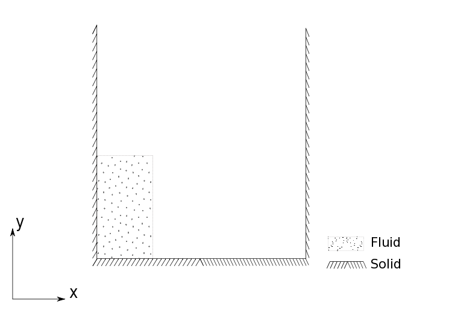

.. _design_overview:

=====================
The PySPH framework
=====================

This document is an introduction to the design of PySPH. This provides
additional high-level details on the functionality that the PySPH framework
provides.  This should allow you to use PySPH effectively and extend the
framework to solve problems other than those provided in the main
distribution.

To elucidate some of the internal details of PySPH, we will consider a typical
SPH problem and proceed to write the code that implements it. Thereafter, we
will look at how this is implemented using the PySPH framework.

The dam-break problem
-------------------------

The problem that is used for the illustration is the Weakly
Compressible SPH (WCSPH) formulation for free surface flows, applied
to a breaking dam problem:

A column of water is initially at rest (presumably held in place by
some membrane). The problem simulates a breaking dam in that the
membrane is instantly removed and the column is free to fall under
it's own weight and the effect of gravity. This and other variants of
the dam break problem can be found in the `examples` directory of
PySPH.

Equations
^^^^^^^^^^

The discrete equations for this formulation are given as

.. math::
   :label: eos

   p_a = B\left( \left(\frac{\rho_a}{\rho_0}\right)^{\gamma} - 1 \right )

.. math::
   :label: continuity

   \frac{d\rho_a}{dt} = \sum_{b=1}^{N}m_b\,(\vec{v_b} - \vec{v_a})\cdot\,\nabla_a W_{ab}

.. math::
   :label: momentum

   \frac{d\vec{v_a}}{dt} = -\sum_{b=1}^Nm_b\left(\frac{p_a}{\rho_a^2} + \frac{p_b}{\rho_b^2}\right)\nabla W_{ab}

.. math::
   :label: position

   \frac{d\vec{x_a}}{dt} = \vec{v_a}

Boundary conditions
^^^^^^^^^^^^^^^^^^^^

The dam break problem involves two *types* of particles. Namely, the
*fluid* (water column) and *solid* (tank). The basic boundary
condition enforced on a solid wall is the no-penetration boundary
condition which can be stated as

.. math::

   \vec{v_f}\cdot \vec{n_b} = 0

Where :math:`\vec{n_b}` is the local normal vector for the
boundary. For this example, we use the *dynamic boundary conditions*.
For this boundary condition, the boundary particles are treated as
*fixed* fluid particles that evolve with the continuity
(:eq:`continuity`) and equation the of state (:eq:`eos`). In addition,
they contribute to the fluid acceleration via the momentum equation
(:eq:`momentum`). When fluid particles approach a solid wall, the
density of the fluids and the solids increase via the continuity
equation. With the increased density and consequently increased
pressure, the boundary particles express a repulsive force on the
fluid particles, thereby enforcing the no-penetration condition.

Time integration
^^^^^^^^^^^^^^^^^

For the time integration, we use a second order predictor-corrector
integrator. For the predictor stage, the following operations are
carried out:

.. math::
   :label: predictor

   \rho^{n + \frac{1}{2}} = \rho^n + \frac{\Delta t}{2}(a_\rho)^{n-\frac{1}{2}} \\

   \boldsymbol{v}^{n + \frac{1}{2}} = \boldsymbol{v}^n + \frac{\Delta t}{2}(\boldsymbol{a_v})^{n-\frac{1}{2}} \\

   \boldsymbol{x}^{n + \frac{1}{2}} = \boldsymbol{x}^n + \frac{\Delta t}{2}(\boldsymbol{u} + \boldsymbol{u}^{\text{XSPH}})^{n-\frac{1}{2}}

Once the variables are predicted to their half time step values, the
pairwise interactions are carried out to compute the
accelerations. Subsequently, the corrector is used to update the
particle positions:

.. math::
   :label: corrector

   \rho^{n + 1} = \rho^n + \Delta t(a_\rho)^{n+\frac{1}{2}} \\

   \boldsymbol{v}^{n + 1} = \boldsymbol{v}^n + \Delta t(\boldsymbol{a_v})^{n+\frac{1}{2}} \\

   \boldsymbol{x}^{n + 1} = \boldsymbol{x}^n + \Delta t(\boldsymbol{u} + \boldsymbol{u}^{\text{XSPH}})^{n+\frac{1}{2}}

.. note::

   The acceleration variables are *prefixed* like :math:`a_`. The
   boldface symbols in the above equations indicate vector
   quantities. Thus :math:`a_\boldsymbol{v}` represents :math:`a_u,\,
   a_v,\, \text{and}\, a_w` for the vector components of acceleration.

Required arrays and properties
^^^^^^^^^^^^^^^^^^^^^^^^^^^^^^^

We will be using two **ParticleArrays** (see
:py:class:`pysph.base.particle_array.ParticleArray`), one for the fluid and
another for the solid. Recall that for the dynamic boundary conditions, the
solid is treated like a fluid with the only difference being that the velocity
(:math:`a_\boldsymbol{v}`) and position accelerations (:math:`a_\boldsymbol{x}
= \boldsymbol{u} + \boldsymbol{u}^{\text{XSPH}}`) are never calculated. The
solid particles therefore remain fixed for the duration of the simulation.

To carry out the integrations for the particles, we require the
following variables:

  - SPH properties: `x, y, z, u, v, w, h, m, rho, p, cs`
  - Acceleration variables: `au, av, aw, ax, ay, az, arho`
  - Properties at the beginning of a time step: `x0, y0, z0, u0, v0, w0, rho0`

A non-PySPH implementation
--------------------------

We first consider the pseudo-code for the non-PySPH implementation. We assume
we have been given two **ParticleArrays** `fluid` and `solid` corresponding to
the dam-break problem. We also assume that an :py:class:`pysph.base.nnps.NNPS`
object `nps` is available and can be used for neighbor queries:

.. code-block:: python

   from pysph.base import nnps
   fluid = get_particle_array_fluid(...)
   solid = get_particle_array_solid(...)
   particles = [fluid, solid]
   nps = nnps.LinkedListNNPS(dim=2, particles=particles, radius_scale=2.0)

The part of the code responsible for the interactions can be defined
as

.. code-block:: python

   class SPHCalc:
       def __init__(nnps, particles):
	   self.nnps = nnps
	   self.particles = particles

       def compute(self):
           self.eos()
           self.accelerations()

       def eos(self):
	   for array in self.particles:
	       num_particles = array.get_number_of_particles()
	       for i in range(num_particles):
		   array.p[i] =  # TAIT EOS function for pressure
		   array.cs[i] = # TAIT EOS function for sound speed

       def accelerations(self):
	   fluid, solid = self.particles[0], self.particles[1]
	   nps = self.nps
	   nbrs = UIntArray()

	   # continuity equation for the fluid
	   dst = fluid; dst_index = 0

	   # source is fluid
	   src = fluid; src_index = 0
	   num_particles = dst.get_number_of_particles()
	   for i in range(num_particles):

	       # get nearest fluid neigbors
	       nps.get_nearest_particles(src_index, dst_index, d_idx=i, nbrs)

	       for j in nbrs:
		   # pairwise quantities
		   xij = dst.x[i] - src.x[j]
		   yij = dst.y[i] - src.y[j]
		   ...

		   # kernel interaction terms
		   wij = kenrel.function(xi, ...)  # kernel function
		   dwij= kernel.gradient(xi, ...)  # kernel gradient

		   # compute the interaction and store the contribution
		   dst.arho[i] += # interaction term

	   # source is solid
	   src = solid; src_index = 1
	   num_particles = dst.get_number_of_particles()
	   for i in range(num_particles):

	       # get nearest fluid neigbors
	       nps.get_nearest_particles(src_index, dst_index, d_idx=i, nbrs)

	       for j in nbrs:
		   # pairwise quantities
		   xij = dst.x[i] - src.x[j]
		   yij = dst.y[i] - src.y[j]
		   ...

		   # kernel interaction terms
		   wij = kenrel.function(xi, ...)  # kernel function
		   dwij= kernel.gradient(xi, ...)  # kernel gradient

		   # compute the interaction and store the contribution
		   dst.arho[i] += # interaction term

	   # Destination is solid
	   dst = solid; dst_index = 1

	   # source is fluid
	   src = fluid; src_index = 0

	   num_particles = dst.get_number_of_particles()
	   for i in range(num_particles):

	       # get nearest fluid neigbors
	       nps.get_nearest_particles(src_index, dst_index, d_idx=i, nbrs)

	       for j in nbrs:
		   # pairwise quantities
		   xij = dst.x[i] - src.x[j]
		   yij = dst.y[i] - src.y[j]
		   ...

		   # kernel interaction terms
		   wij = kenrel.function(xi, ...)  # kernel function
		   dwij= kernel.gradient(xi, ...)  # kernel gradient

		   # compute the interaction and store the contribution
		   dst.arho[i] += # interaction term

We see that the use of multiple particle arrays has forced us to write
a fairly long piece of code for the accelerations. In fact, we have
only shown the part of the main loop that computes :math:`a_\rho` for
the continuity equation. Recall that our problem states that the
continuity equation should evaluated for all particles, taking
influences from all other particles into account. For two particle
arrays (*fluid*, *solid*), we have four such pairings (fluid-fluid,
fluid-solid, solid-fluid, solid-solid). The last one can be eliminated
when we consider the that the boundary has zero velocity and hence the
contribution will always be trivially zero.

The apparent complexity of the `SPHCalc.accelerations` method
notwithstanding, we notice that similar pieces of the code are being
repeated. In general, we can break down the computation for a general
source-destination pair like so:

.. code-block:: python

   # consider first destination particle array

   for all dst particles:
       get_neighbors_from_source()
       for all neighbors:
           compute_pairwise_terms()
           compute_inteactions_for_dst_particle()

   # consider next source for this destination particle array
   ...

   # consider the next destination particle array

.. note::

   The `SPHCalc.compute` method first calls the EOS before calling the
   main loop to compute the accelerations. This is because the EOS
   (which updates the pressure) must logically be completed for all
   particles before the accelerations (which uses the pressure) are
   computed.

The predictor-corrector integrator for this problem can be defined as

.. code-block:: python

   class Integrator:
       def __init__(self, particles, nps, calc):
           self.particles = particles
           self.nps = nps
           self.calc = calc

       def initialize(self):
           for array in self.particles:
               array.rho0[:] = array.rho[:]
	       ...
               array.w0[:] = array.w[:]

      def stage1(self, dt):
	  dtb2 = 0.5 * dt
	  for array in self.particles:
	      array.rho = array.rho0[:] + dtb2*array.arho[:]

	      array.u = array.u0[:] + dtb2*array.au[:]
	      array.v = array.v0[:] + dtb2*array.av[:]
              ...
	      array.z = array.z0[:] + dtb2*array.az[:]

      def stage2(self, dt):
	  for array in self.particles:
	      array.rho = array.rho0[:] + dt*array.arho[:]

	      array.u = array.u0[:] + dt*array.au[:]
	      array.v = array.v0[:] + dt*array.av[:]
              ...
	      array.z = array.z0[:] + dt*array.az[:]

      def integrate(self, dt):
          self.initialize()
	  self.stage1(dt)   # predictor step
          self.nps.update()    # update NNPS structure
          self.calc.compute()  # compute the accelerations
          self.stage2(dt)   # corrector step

The `Integrator.integrate` method is responsible for updating the
solution the next time level. Before the predictor stage, the
`Integrator.initialize` method is called to store the values `x0,
y0...` at the beginning of a time-step. Given the positions of the
particles at the half time-step, the **NNPS** data structure is
updated before calling the `SPHCalc.compute` method. Finally, the
corrector step is called once we have the updated accelerations.

This hypothetical implementation can be integrated to the final time
by calling the `Integrator.integrate` method repeatedly. In the next
section, we will see how PySPH does this automatically.

PySPH implementation
---------------------

Now that we have a hypothetical implementation outlined, we can proceed to
describe the abstractions that PySPH introduces, enabling a highly user
friendly and flexible way to define pairwise particle interactions.  To see a
working example, see `dam_break_2d.py
<https://bitbucket.org/pysph/pysph/src/master/pysph/examples/dam_break_2d.py>`_.

We assume that we have the same **ParticleArrays** (*fluid* and
*solid*) and **NNPS** objects as before.

Specifying the equations
^^^^^^^^^^^^^^^^^^^^^^^^^

Given the particle arrays, we ask for a given set of operations to be
performed on the particles by passing a *list* of **Equation** objects (see
:doc:`../reference/equations`) to the **Solver** (see
:py:class:`pysph.solver.solver.Solver`)

.. code-block:: python

   equations = [

       # Equation of state
       Group(equations=[

	       TaitEOS(dest='fluid', sources=None, rho0=ro, c0=co, gamma=gamma),
	       TaitEOS(dest='boundary', sources=None, rho0=ro, c0=co, gamma=gamma),

	       ], real=False),

       Group(equations=[

	       # Continuity equation
	       ContinuityEquation(dest='fluid', sources=['fluid', 'boundary']),
	       ContinuityEquation(dest='boundary', sources=['fluid']),

	       # Momentum equation
	       MomentumEquation(dest='fluid', sources=['fluid', 'boundary'],
			alpha=alpha, beta=beta, gy=-9.81, c0=co),

	       # Position step with XSPH
	       XSPHCorrection(dest='fluid', sources=['fluid'])
	       ]),
       ]

We see that we have used two **Group** objects (see
:py:class:`pysph.sph.equation.Group`), segregating two parts of the evaluation
that are logically dependent. The second group, where the accelerations are
computed *must* be evaluated after the first group where the pressure is
updated. Recall we had to do a similar seggregation for the `SPHCalc.compute`
method in our hypothetical implementation:

.. code-block:: python

   class SPHCalc:
       def __init__(nnps, particles):
           ...

       def compute(self):
           self.eos()
           self.accelerations()
.. note::

    PySPH will respect the order of the **Equation** and equation
    **Groups** as provided by the user. This flexibility also means it
    is quite easy to make subtle errors.

Note that in the first group, we have an additional parameter called
``real=False``.  This is only relevant for parallel simulations and what it
says is that the equations in that group should be applied to all particles
(remote and local), non-local particles are not "real".  By default a
``Group`` has ``real=True``, thus only local particles are operated on.
However, we wish to apply the Equation of state on all particles.

Writing the equations
^^^^^^^^^^^^^^^^^^^^^^

It is important for users to be able to easily write out new SPH equations of
motion.  PySPH provides a very convenient way to write these equations.  The
PySPH framework allows the user to write these equations in pure Python. These
pure Python equations are then used to generate high-performance code and then
called appropriately to perform the simulations.

There are two types of particle computations in SPH simulations:

 1. The most common type of interaction is to change the property of one
    particle (the destination) using the properties of a source particle.

 2. A less common type of interaction is to calculate say a sum (or product or
    maximum or minimum) of values of a particular property.  This is commonly
    called a "reduce" operation in the context of Map-reduce_ programming
    models.

Computations of the first kind are inherently parallel and easy to perform
correctly both in serial and parallel.  Computations of the second kind
(reductions) can be tricky in parallel.  As a result, in PySPH we distinguish
between the two.  This will be elaborated in more detail in the following.

.. _Map-reduce: http://en.wikipedia.org/wiki/MapReduce

In general an SPH algorithm proceeds as the following pseudo-code
illustrates:

.. code-block:: python

    for destination in particles:
        for equation in equations:
            equation.initialize(destination)

    # This is where bulk of the computation happens.
    for destination in particles:
        for source in destination.neighbors:
            for equation in equations:
                equation.loop(source, destination)

    for destination in particles:
        for equation in equations:
            equation.post_loop(destination)

    # Reduce any properties if needed.
    total_mass = reduce_array(particles.m, 'sum')
    max_u = reduce_array(particles.u, 'max')

The neighbors of a given particle are identified using a nearest neighbor
algorithm.  PySPH does this automatically for the user and internally uses a
link-list based algorithm to identify neighbors.

In PySPH we follow some simple conventions when writing equations. Let us look
at a few equations first. In keeping the analogy with our hypothetical
implementation and the `SPHCalc.accelerations` method above, we consider the
implementations for the PySPH :py:class:`pysph.sph.wc.basic.TaitEOS` and
:py:class:`pysph.sph.basic_equations.ContinuityEquation` objects. The former
looks like:

.. code-block:: python

   class TaitEOS(Equation):
       def __init__(self, dest, sources=None,
		    rho0=1000.0, c0=1.0, gamma=7.0):
	   self.rho0 = rho0
	   self.rho01 = 1.0/rho0
	   self.c0 = c0
	   self.gamma = gamma
	   self.gamma1 = 0.5*(gamma - 1.0)
	   self.B = rho0*c0*c0/gamma
	   super(TaitEOS, self).__init__(dest, sources)

       def loop(self, d_idx, d_rho, d_p, d_cs):
	   ratio = d_rho[d_idx] * self.rho01
	   tmp = pow(ratio, self.gamma)

	   d_p[d_idx] = self.B * (tmp - 1.0)
	   d_cs[d_idx] = self.c0 * pow( ratio, self.gamma1 )

Notice that it has only one ``loop`` method and this loop is applied
for all particles.  Since there are no sources, there is no need for
us to find the neighbors. There are a few important conventions that
are to be followed when writing the equations.

    - ``d_*`` indicates a destination array.

    - ``s_*`` indicates a source array.

    - ``d_idx`` and ``s_idx`` represent the destination and source index
      respectively.

    - Each function can take any number of arguments as required, these are
      automatically supplied internally when the application runs.

    - All the standard math symbols from ``math.h`` are also available.

.. py:currentmodule:: pysph.sph.basic_equations

Let us look at the :py:class:`ContinuityEquation` as another simple example.
It is instantiated as:

.. code-block:: python

   class ContinuityEquation(Equation):
       def initialize(self, d_idx, d_arho):
	   d_arho[d_idx] = 0.0

       def loop(self, d_idx, d_arho, s_idx, s_m, DWIJ, VIJ):
	   vijdotdwij = DWIJ[0]*VIJ[0] + DWIJ[1]*VIJ[1] + DWIJ[2]*VIJ[2]
	   d_arho[d_idx] += s_m[s_idx]*vijdotdwij

Notice that the ``initialize`` method merely sets the value to zero.  The
``loop`` method also accepts a few new quantities like ``DWIJ``, ``VIJ`` etc.
These are precomputed quantities and are automatically provided depending on
the equations needed for a particular source/destination pair.  The following
precomputed quantites are available and may be passed into any equation:

    - ``HIJ = 0.5*(d_h[d_idx] + s_h[s_idx])``.

    - ``XIJ[0] = d_x[d_idx] - s_x[s_idx]``,
      ``XIJ[1] = d_y[d_idx] - s_y[s_idx]``,
      ``XIJ[2] = d_z[d_idx] - s_z[s_idx]``

    - ``R2IJ = XIJ[0]*XIJ[0] + XIJ[1]*XIJ[1] + XIJ[2]*XIJ[2]``

    - ``RIJ = sqrt(R2IJ)``

    - ``WIJ = KERNEL(XIJ, RIJ, HIJ)``

    - ``WJ = KERNEL(XIJ, RIJ, s_h[s_idx])``

    - ``RHOIJ = 0.5*(d_rho[d_idx] + s_rho[s_idx])``

    - ``WI = KERNEL(XIJ, RIJ, d_h[d_idx])``

    - ``RHOIJ1 = 1.0/RHOIJ``

    - ``DWIJ``: ``GRADIENT(XIJ, RIJ, HIJ, DWIJ)``
    - ``DWI``: ``GRADIENT(XIJ, RIJ, s_h[s_idx], DWJ)``
    - ``DWI``: ``GRADIENT(XIJ, RIJ, d_h[d_idx], DWI)``

    - ``VIJ[0] = d_u[d_idx] - s_u[s_idx]``
      ``VIJ[1] = d_v[d_idx] - s_v[s_idx]``
      ``VIJ[2] = d_w[d_idx] - s_w[s_idx]``

    - ``DT_ADAPT``: is an array of three doubles that stores an adaptive
      time-step, the first element is the CFL based time-step limit, the
      second is the force-based limit and the third a viscosity based limit.
      See :py:class:`pysph.sph.wc.basic.MomentumEquation` for an example of
      how this is used.

In addition if one requires the current time or the timestep in an equation,
the following may be passed into any of the methods of an equation:

    - ``t``: is the current time.

    - ``dt``: the current time step.

In an equation, any undeclared variables are automatically declared to be
doubles in the high-performance Cython code that is generated.  In addition
one may declare a temporary variable to be a ``matrix`` or a ``cPoint`` by
writing:

.. code-block:: python

    mat = declare("matrix((3,3))")
    point = declare("cPoint")

When the Cython code is generated, this gets translated to:

.. code-block:: cython

    cdef double[3][3] mat
    cdef cPoint point

One may also perform any reductions on properties.  Consider a trivial example
of calculating the total mass and the maximum ``u`` velocity in the following
equation:

.. code-block:: python

    class FindMaxU(Equation):
        def reduce(self, dst):
            m = serial_reduce_array(dst.array.m, 'sum')
            max_u = serial_reduce_array(dst.array.u, 'max')
            dst.total_mass[0] = parallel_reduce_array(m, 'sum')
            dst.max_u[0] = parallel_reduce_array(u, 'max')

where:

    - ``dst``: refers to a destination ``ParticleArrayWrapper``.

    - ``src``: refers to a the source ``ParticleArrayWrapper``.

    - ``serial_reduce_array``: is a special function provided that performs
      reductions correctly in serial. It currently supports ``sum, prod, max``
      and ``min`` operations.  See
      :py:func:`pysph.base.reduce_array.serial_reduce_array`.  There is also a
      :py:func:`pysph.base.reduce_array.parallel_reduce_array` which is to be
      used to reduce an array across processors.  Using
      ``parallel_reduce_array`` is expensive as it is an all-to-all
      communication.  One can reduce these by using a single array and use
      that to reduce the communication.

The ``ParticleArrayWrapper``, wraps a ``ParticleArray`` into a
high-performance Cython object.  It has an ``array`` attribute which is a
reference the the underlying ``ParticleArray`` and also attributes
corresponding to each property that are ``DoubleArrays``.  For example in the
Cython code one may access ``dst.x`` to get the raw arrays used by the
particle array.  This is mainly done for performance reasons.

Note that in the above example,
:py:func:`pysph.base.reduce_array.serial_reduce_array` is passed a
``dst.array.m``, this is important as in parallel the ``dst.m`` will contain
all particle properties including ghost properties.  On the other hand
``dst.array.m`` will be a numpy array of only the real particles.

We recommend that for any kind of reductions one always use the
``serial_reduce_array`` function and the ``parallel_reduce_array`` inside a
``reduce`` method.  One should not worry about parallel/serial modes in this
case as this is automatically taken care of by the code generator.  In serial,
the parallel reduction does nothing.

With this machinery, we are able to write complex equations to solve almost
any SPH problem.  A user can easily define a new equation and instantiate the
equation in the list of equations to be passed to the application.  It is
often easiest to look at the many existing equations in PySPH and learn the
general patterns.

Writing the Integrator
^^^^^^^^^^^^^^^^^^^^^^

The integrator stepper code is similar to the equations in that they are all
written in pure Python and Cython code is automatically generated from it.
The simplest integrator is the Euler integrator which looks like this::

    class EulerIntegrator(Integrator):
        def one_timestep(self, t, dt):
            self.initialize()
            self.compute_accelerations()
            self.stage1()
            self.do_post_stage(dt, 1)

Note that in this case the integrator only needs to implement one timestep
using the ``one_timestep`` method above.  The ``initialize`` and ``stage``
methods need to be implemented in stepper classes which perform the actual
stepping of the values.  Here is the stepper for the Euler integrator::

    class EulerStep(IntegratorStep):
        def initialize(self):
            pass
        def stage1(self, d_idx, d_u, d_v, d_w, d_au, d_av, d_aw, d_x, d_y,
                      d_z, d_rho, d_arho, dt=0.0):
            d_u[d_idx] += dt*d_au[d_idx]
            d_v[d_idx] += dt*d_av[d_idx]
            d_w[d_idx] += dt*d_aw[d_idx]

            d_x[d_idx] += dt*d_u[d_idx]
            d_y[d_idx] += dt*d_v[d_idx]
            d_z[d_idx] += dt*d_w[d_idx]

            d_rho[d_idx] += dt*d_arho[d_idx]

As can be seen the general structure is very similar to how equations are
written in that the functions take an arbitrary number of arguments and are
set.  The value of ``dt`` is also provided automatically when the methods are
called.

It is important to note that if there are additional variables to be stepped
in addition to these standard ones, you must write your own stepper.
Currently, only certain steppers are supported by the framework. Take a look
at the :doc:`../reference/integrator` for more examples.
