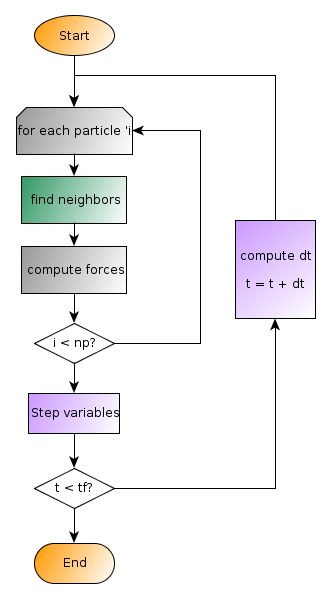
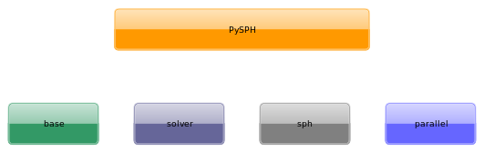

.. _design_overview:

=====================
An Overview of PySPH
=====================

This document presents the design of PySPH. Read this if you want to
extend PySPH to solve problems other than those provided in the main
distribution.

Consider a typical SPH simulation described by the discrete equations:

.. math::

   p_a = B\left( \left(\frac{\rho_a}{\rho_0}\right)^{\gamma} - 1 \right )
 
   \frac{D\rho_a}{Dt} = \sum_{b=1}^{N}m_b\,(\vec{v_b} - \vec{v_a})\cdot\,\nabla_a W_{ab}
   
   \frac{D\vec{v_a}}{Dt} = -\sum_{b=1}^Nm_b\left(\frac{p_a}{\rho_a^2} + \frac{p_b}{\rho_b^2}\right)\nabla W_{ab}

   \frac{D\vec{x_a}}{Dt} = \vec{v_a}

One might expect an algorithm for SPH to proceed along the lines of
the following figure:

.. _sph-flowchart:

--------------------
PySPH Design
--------------------

PySPH attempts to abstract out the operations represented in the
flowchart. To do this, PySPH is divided into four modules as shown in
the figure: `pysph_modules`_. The module breakup is implied by the
color scheme used.

.. _pysph_modules:

**********
pysph.base
**********

The :mod:`base` module defines the data structures to hold particle
information and index the particle positions for fast neighbor queries
and as such, is the building block for the particle framework that is
PySPH. 

As seen in the flowchart (`sph-flowchart`_), the *find neighbors*
process is within the inner loop, iterating over each particle. This
module can be thought of as the *base* over which all of the other
functionality of PySPH is built.

.. toctree::
   :maxdepth: 2

   base

**********
pysph.sph
**********

The :mod:`sph` module is where all the SPH functions are defined. It
also defines the **SPHCalc** object which is used to iterate over each
particle (colored gray in the flowchart: `sph-flowchart`_)

*************
pysph.solver
*************

The :mod:`solver` module is used to drive the simulation via the
**Solver** object and also the important function of integration
(represented as *step variables* in the flowchart:
`sph-flowchart`_). Other functions like computing the new time step
and saving output (not shown in the flowchart) are also under the
ambit of the :mod:`solver` module.

.. toctree::
   :maxdepth: 2

   solver_interfaces
