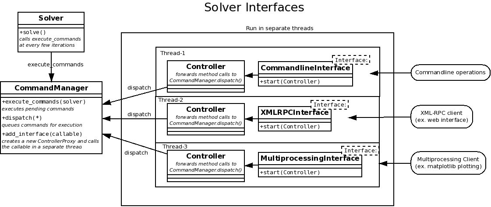

Solver Interfaces
=================

Interfaces are a way to control, gather data and execute commands on a running
solver instance. This can be useful for example to pause/continue the solver,
get the iteration count, get/set the dt or final time or simply to monitor the
running of the solver.

.. py:currentmodule:: pysph.solver.controller

CommandManager
--------------

The :py:class:`CommandManager` class provides functionality to control the solver in
a restricted way so that adding multiple interfaces to the solver is possible
in a simple way.

The figure :ref:`image_controller` shows an overview of the classes and objects
involved in adding an interface to the solver.

.. _image_controller:

    
    Overview of the Solver Interfaces

The basic design of the controller is as follows:

#. :py:class:`~pysph.solver.solver.Solver` has a method
   :py:meth:`~pysph.solver.solver.Solver.set_command_handler` takes a callable
   and a command_interval, and calls the callable with self as an argument
   every `command_interval` iterations
 
#. The method :meth:`CommandManager.execute_commands` of `CommandManager` object is
   set as the command_handler for the solver. Now `CommandManager` can do any operation
   on the solver
 
#. Interfaces are added to the `CommandManager` by the :meth:`CommandManager.add_interface`
   method, which takes a callable (Interface) as an argument and calls the callable
   in a separate thread with a new :class:`Controller` instance as an argument
 
#. A `Controller` instance is a proxy for the `CommandManager` which redirects
   its methods to call :meth:`CommandManager.dispatch` on the `CommandManager`, which is
   synchronized in the `CommandManager` class so that only one thread (Interface)
   can call it at a time. The `CommandManager` queues the commands and sends them to
   all procs in a parallel run and executes them when the solver calls its
   :meth:`execute_commands` method
 
#. Writing a new Interface is simply writing a function/method which calls
   appropriate methods on the :class:`Controller` instance passed to it.

Controller
----------

The :py:class:`Controller` class is a convenience class which has various methods
which redirect to the :py:meth:`Controller.dispatch` method to do the actual
work of queuing the commands. This method is synchronized so that multiple
controllers can operate in a thread-safe manner. It also restricts the operations
which are possible on the solver through various interfaces. This enables adding
multiple interfaces to the solver convenient and safe. Each interface gets a
separate Controller instance so that the various interfaces are isolated.

Blocking and Non-Blocking mode
------------------------------

The :py:class:`Controller` object has a notion of Blocking and Non-Blocking mode.

* In **Blocking** mode operations wait until the command is actually executed on the
  solver and then return the result. This means execution stops until the
  execute_commands method of the :py:class:`CommandManager` is executed by the
  solver, which is after every :py:attr:`~pysph.solver.solver.Solver.commmand_interval` iterations.
  This mode is the default.

* In **Non-Blocking** mode the Controller queues the command for execution and
  returns a task_id of the command. The result of the command can then be
  obtained anytime later by the get_result method of the Controller passing the
  task_id as argument. The get_result call blocks until result can be obtained.

**Switching between modes**

The blocking/non-blocking modes can be get/set using the methods 
:py:meth:`Controller.get_blocking` and :py:meth:`Controller.set_blocking` methods

**NOTE :**
The blocking/non-blocking mode is not for getting/setting solver properties.
These methods always return immediately, even if the setter is actually executed
only when the :py:meth:`CommandManager.execute_commands` function is called by
the solver.

.. py:currentmodule:: pysph.solver.solver_interfaces

Interfaces
----------

Interfaces are functions which are called in a separate thread and receive a
:py:class:`Controller` instance so that they can query the solver, get/set
various properties and execute commands on the solver in a safe manner.

Here's the example of a simple interface which simply prints out the iteration
count every second to monitor the solver

.. _simple_interface:

::

    import time
    
    def simple_interface(controller):
        while True:
            print controller.get_count()
            time.sleep(1)

You can use ``dir(controller)`` to find out what methods are available on the
controller instance.

A few simple interfaces are implemented in the :py:mod:`~pysph.solver.solver_interfaces`
module, namely :py:class:`CommandlineInterface`, :py:class:`XMLRPCInterface`
and :py:class:`MultiprocessingInterface`, and also in `examples/controller_elliptical_drop_client.py`.
You can check the code to see how to implement various kinds of interfaces.

Adding Interface to Solver
--------------------------

To add interfaces to a plain solver (not created using :py:class:`~pysph.solver.application.Application`),
the following steps need to be taken:

- Set :py:class:`~pysph.solver.controller.CommandManager` for the solver (it is not setup by default)
- Add the interface to the CommandManager

The following code demonstrates how the the :ref:`Simple Interface <simple_interface>` created above
can be added to a solver::

    # add CommandManager to solver
    command_manager = CommandManager(solver)
    solver.set_command_handler(command_manager.execute_commands)
    
    # add the interface
    command_manager.add_interface(simple_interface)

For code which uses :py:class:`~pysph.solver.application.Application`, you
simply need to add the interface to the application's command_manager::

    app = Application()
    app.set_solver(s)
    ...
    app.command_manager.add_interface(simple_interface)

Commandline Interface
---------------------

The :py:class:`CommandLine` interface enables you to control the solver from
the commandline even as it is running. Here's a sample session of the command-line
interface from the controller_elliptical_drop.py example::

    $ python controller_elliptical_drop.py
    pysph[0]>>> 
    Invalid command
    Valid commands are:
        p | pause
        c | cont
        g | get <name>
        s | set <name> <value>
        q | quit -- quit commandline interface (solver keeps running)
    pysph[9]>>> g dt
    1e-05
    pysph[64]>>> g tf
    0.1
    pysph[114]>>> s tf 0.01
    None
    pysph[141]>>> g tf
    0.01
    pysph[159]>>> get_particle_array_names
    ['fluid']

The number inside the square brackets indicates the iteration count.

Note that not all operations can be performed using the command-line interface,
notably those which use complex python objects.

XML-RPC Interface
-----------------

The :py:class:`XMLRPCInterface` interface exports the controller object's
methods over an XML-RPC interface. An example html file
`controller_elliptical_drop_client.html` uses this XML-RPC interface to
control the solver from a web page.

The following code snippet shows the use of XML-RPC interface, which is
not much different from any other interface, as they all export the interface
of the Controller object::
    
    import xmlrpclib
    
    # address is a tuple of hostname, port, ex. ('localhost',8900)
    client = xmlrpclib.ServerProxy(address, allow_none=True)
    
    # client has all the methods of the controller
    print client.system.listMethods()
    
    print client.get_t()
    print client.get('count')

The XML-RPC interface also implements a
simple http server which serves html, javascript and image files from the
directory it is started from. This enables direct use of the file
`controller_elliptical_drop_client.html` to get an html interface without
the need of a dedicated http server.

The figure :ref:`fig_html_client` shows a screenshot of the html client
in action

.. _fig_html_client:
.. figure:: images/html_client.png
    :align: center
    
    PySPH html client using XML-RPC interface

One limitation of XML-RPC interface is that arbitrary python objects cannot be
sent across. XML-RPC standard predefines a limited set of types which can be
transferred.

Multiprocessing Interface
-------------------------

The :py:class:`MultiprocessingInterface` interface also exports the controller
object similar to the XML-RPC interface, but it is more featured, can use
authentication keys and can send arbitrary picklable objects. Usage of
Multiprocessing client is also similar to the XML-RPC client::
    
    from pysph.solver.solver_interfaces import MultiprocessingClient
    
    # address is a tuple of hostname, port, ex. ('localhost',8900)
    # authkey is authentication key set on server, defaults to 'pysph'
    client = MultiprocessingClient(address, authkey)
    
    # controller proxy
    controller = client.controller
    
    pa_names = controller.get_particle_array_names()
    
    # arbitrary python objects can be transferred (ParticleArray)
    pa = controller.get_named_particle_array(pa_names[0])
    

Example
-------

Here's an example (straight from `controller_elliptical_drop_client.py`)
put together to show how the controller can be used to create
useful interfaces for the solver. The code below plots the particle positions
as a scatter map with color-mapped velocities, and updates the plot every second
while maintaining user interactivity::

    from pysph.solver.solver_interfaces import MultiprocessingClient
    
    client = MultiprocessingClient(address, authkey)
    controller = client.controller
    
    pa_name = controller.get_particle_array_names()[0]
    pa = controller.get_named_particle_array(pa_name)
    
    #plt.ion()
    fig = plt.figure()
    ax = fig.add_subplot(111)
    line = ax.scatter(pa.x, pa.y, c=numpy.hypot(pa.u,pa.v))
    
    global t
    t = time.time()
    def update():
        global t
        t2 = time.time()
        dt = t2 - t
        t = t2
        print 'count:', controller.get_count(), '\ttimer time:', dt,
        pa = controller.get_named_particle_array(pa_name)
    
        line.set_offsets(zip(pa.x, pa.y))
        line.set_array(numpy.hypot(pa.u,pa.v))
        fig.canvas.draw()
        
        print '\tresult & draw time:', time.time()-t
        
        return True
    
    update()
    gobject.timeout_add_seconds(1, update)
    plt.show()

