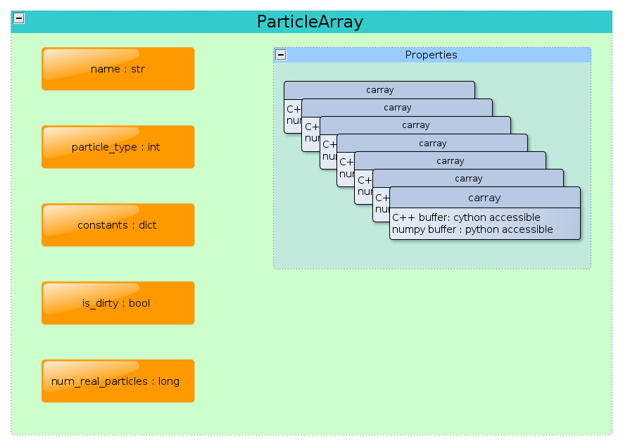

.. _working_with_particles:

==============
ParticleArray
==============

Particles are ubiquitous in SPH and in PySPH. The domain is
discretized with a finite number of points, to which are assigned
physical properties corresponding to the fluid being modelled. This
leads us to the concept of a set of arrays that represent a fluid.

In PySPH, a *homogeneous* collection of particles is represented by a
**ParticleArray** as shown in the figure:

.. _figure_particle_array:

The figure shows only a subset of the attributes of a
**ParticleArray** pertinent to this discussion. Refer to the reference
documentation (:doc:`../reference/particle_array`) for a more complete
listing of class attributes and methods.

-------------------------
Creating particle arrays
-------------------------

From the user's perspective, a :class:`ParticleArray` may be created like so:
..  sourcecode:: python

	 import numpy

     	 # Import the base module
     	 import pysph.base.api as base

	 # create the numpy arrays representing the properties
	 x = numpy.linspace(...)
	 y = numpy.linspace(...)
	 .
	 .
	 .
	 f = numpy.sin(x)

	 fluid = base.get_particle_array(name="fluid", x=x, y=y, ..., f=f)

This creates an instance of a :class:`ParticleArray`, *fluid* with the
requested properties. From within python, the properties may be
accessed via the standard attribute access method for Python objects::

	 In [10] : fluid.x
	 Out[4] : array([....])

^^^^^^^^^^^^^^^^^^^^^^^^^^^^^^^^^^^
Important ParticleArray attributes
^^^^^^^^^^^^^^^^^^^^^^^^^^^^^^^^^^^

**name**: PySPH permits the use of multiple arrays and warrants the
  use of a unique name identifier to distinguish between different
  particle arrays.

**constants**: Properties that are constant in space and time for all
  particles of a given type are stored in the *constants* attribute.

**is_dirty**: In PySPH, the indexing scheme for the particles may be
  rendered invalid after updating the particle properties. Moreover,
  other particle arrays like stationary boundaries remain fixed and
  the initial indexing is valid.. The *is_dirty* flag essentially
  helps PySPH distinguish these two cases, thus saving time that would
  have been spent re-indexing these particles. Thus, setting the
  *is_dirty* flag for a :class:`ParticleArray` forces PySPH to
  re-compute neighbors for that array.

**num_real_particles**: Every :class:`ParticleArray` object is given a
  set of deault properties, one of which is the *tag* property. The *tag* of a
  particle is an integer which is used by PySPH to determine if a particle
  belongs to a remote processor (0 local, else remote). The
  *num_real_particles* attributes counts the number of properties that have the
  tag value 0.

---------------------------
Data buffers and the carray
---------------------------

The numpy arrays that are used to create the :class:`ParticleArray`
object are used to construct a raw data buffer which is accessible
through Cython at C speed. Internally, each property for the particle
array is stored as a :class:`carray`.

.. note::

   This discussion may be omitted by the casual end user. If you are
   extending PySPH and speed is a concern, read on.

Each :class:`carray` has an associated data type corresponding to the
particle property. The available types are:

 * IntArray
 * LongArray
 * FloatArray
 * DoubleArray

The type of a :class:`carray` may be determined via it's
:func:`get_c_type` method.

The :class:`carray` object provides faster access to the data when
compared with the corresponding numpy arrays, even in Python. Particle
properties may be accessed using the following methods:

.. function:: get(i)
   :noindex:

   Get the element at the specified index.

.. function:: set(i, val)
   :noindex:

   Set the element at the specified index to the given value. The
   value must be of the same c-type as the array.

^^^^^^^^^^^^^^^^^^^^^^^^^^
Faster buffer access
^^^^^^^^^^^^^^^^^^^^^^^^^^

As mentioned, the data represented by a :class:`carray` may be
accessed at C speed using Cython. This is done using the *data*
attribute only accessible through Cython::

	  arr = pa.get_carray(prop)
	  val =  arr.data[index]

Peep into the functions (:mod:`sph.funcs`) to learn how to use this
feature.

---------
Particles
---------

Since PySPH supports an arbitrary number of :class:`ParticleArray`
objects, it would be convenient to group them all together into a
single container. This way, common functions like updating the
indexing scheme (for particle arrays that are *dirty*) may be called
consistently on each array. This is accomplished by the object
:class:`Particles`:

.. class:: Particles(arrays[, locator_type])

   .. attribute:: arrays : A list of ParticleArray objects

You must provide an instance of :class:`Particles` to PySPH to carry
out a simulation.

^^^^^^^^^^^^^^^^^^^^^^^^^^^^^^^
Specifying an indexing scheme
^^^^^^^^^^^^^^^^^^^^^^^^^^^^^^^

Upon creation of a :class:`Particles` instance, we can pass arguments
to indicate the kind of spatial indexing scheme to use. The default is
a box sort algorithm (see :doc:`../reference/nnps`). Currently, this is the only
indexing scheme implemented.

See the reference documentation :doc:`../reference/particle_array` for a
further description.

------------
Summary
------------

In PySPH, a :class:`ParticleArray` object may be instantiated from
numpy arrays. We may use an arbitrary collection of these objects with
the only restriction that their *names* are unique.  The
:class:`ParticleArray` objects are grouped together to form a
:class:`Particles` object which is used by PySPH. This container may
be heterogeneous in that different particle arrays correspond to
different *types*.

..  LocalWords:  ParticleArray num deault carray
