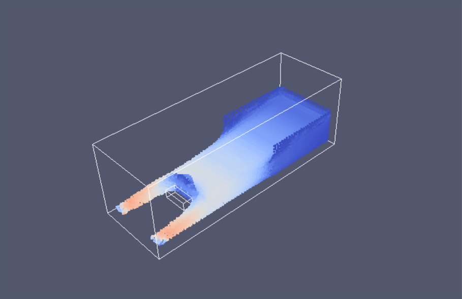
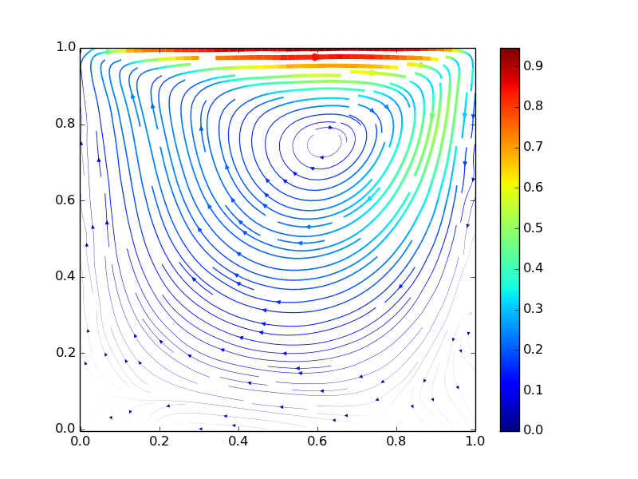
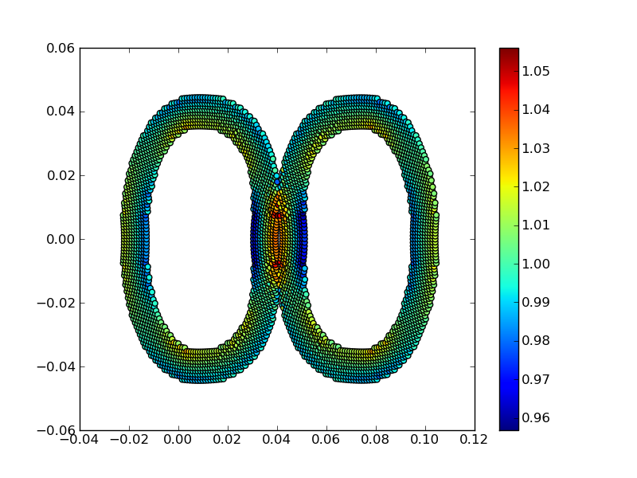

===========
Overview
===========

PySPH is an open source framework for Smoothed Particle Hydrodynamics (SPH)
simulations.  It is implemented in Python_ and the performance critical parts
are implemented in Cython_ and PyOpenCL_.

PySPH is implemented in a way that allows a user to specify the entire SPH
simulation in pure Python. High-performance code is generated from this
high-level Python code, compiled on the fly and executed. PySPH can use OpenMP
to utilize multi-core CPUs effectively. PySPH can work with OpenCL and use
your GPGPUs. PySPH also features optional automatic parallelization
(multi-CPU) using mpi4py_ and Zoltan_. If you wish to use the parallel
capabilities you will need to have these installed.

Here are videos of simulations made with PySPH.

.. raw:: html

    

    <iframe width="560" height="315"
        src="https://www.youtube.com/embed/videoseries?list=PLH8Y2KepC2_VPLrcTiWGaYYh88gGVAuVr"
        frameborder="0" allowfullscreen>
    </iframe>
    

PySPH is hosted on `github <https://github.com/pypr/pysph>`_. Please see the
site for development details.

.. _Python: http://www.python.org
.. _Cython: http://www.cython.org
.. _PyOpenCL: https://documen.tician.de/pyopencl/
.. _mpi4py: http://mpi4py.scipy.org
.. _Zoltan: http://www.cs.sandia.gov/zoltan/

---------
Features
---------

  - User scripts and equations are written in pure Python.
  - Flexibility to define arbitrary SPH equations operating on particles.
  - Ability to define your own multi-step integrators in pure Python.
  - High-performance: our performance is comparable to hand-written solvers
    implemented in FORTRAN.
  - Seamless multi-core support with OpenMP.
  - Seamless GPU support with PyOpenCL_.
  - Seamless parallel integration using Zoltan_.
  - `BSD license <https://github.com/pypr/pysph/tree/master/LICENSE.txt>`_.

-----------------
SPH formulations
-----------------

Currently, PySPH has numerous examples to solve the viscous, incompressible
Navier-Stokes equations using the weakly compressible (WCSPH) approach. The
following formulations are currently implemented:

- `Weakly Compressible SPH (WCSPH)`_ for free-surface flows (Gesteira et al. 2010, Journal of Hydraulic Research, 48, pp. 6--27)

   3D dam-break past an obstacle SPHERIC benchmark `Test 2`_

- `Transport Velocity Formulation`_ for incompressilbe fluids (Adami et al. 2013, JCP, 241, pp. 292--307).

   Streamlines for a driven cavity

- `SPH for elastic dynamics`_ (Gray et al. 2001, CMAME, Vol. 190, pp 6641--6662)

   Collision of two elastic rings.

- `Compressible SPH`_ (Puri et al. 2014, JCP, Vol. 256, pp 308--333)

.. _`Weakly Compressible SPH (WCSPH)`: http://www.tandfonline.com/doi/abs/10.1080/00221686.2010.9641250

.. _`Transport Velocity Formulation`: http://dx.doi.org/10.1016/j.jcp.2013.01.043

.. _`SPH for elastic dynamics`: http://dx.doi.org/10.1016/S0045-7825(01)00254-7

.. _`Compressible SPH`: http://dx.doi.org/10.1016/j.jcp.2013.08.060

.. _`Test 2`: https://wiki.manchester.ac.uk/spheric/index.php/Test2

--------
Credits
--------

PySPH is primarily developed at the `Department of Aerospace
Engineering, IIT Bombay <http://www.aero.iitb.ac.in>`__. We are grateful
to IIT Bombay for the support.  Our primary goal is to build a
powerful SPH-based tool for both application and research. We hope that
this makes it easy to perform reproducible computational research.

To see the list of contributors the see `github contributors page
<https://github.com/pypr/pysph/graphs/contributors>`_

Some earlier developers not listed on the above are:

- Pankaj Pandey (stress solver and improved load balancing, 2011)
- Chandrashekhar Kaushik (original parallel and serial implementation in 2009)

-------------
Citing PySPH
-------------

You may use one of the following articles to formally refer to PySPH:

 - Prabhu Ramachandran, *PySPH: a reproducible and high-performance framework
   for smoothed particle hydrodynamics*, In Proceedings of the 15th Python in
   Science Conference, pages 127--135, July 11th to 17th, 2016. `Link to paper
   <http://conference.scipy.org/proceedings/scipy2016/prabhu_ramachandran_pysph.html>`_.

The following is an older presentation:

 - Prabhu Ramachandran and Kunal Puri, *PySPH: A framework for parallel
   particle simulations*, In proceedings of the 3rd International
   Conference on Particle-Based Methods (Particles 2013), Stuttgart,
   Germany, 18th September 2013.

--------
History
--------

- 2009: PySPH started with a simple Cython based 1D implementation written by
  Prabhu.

- 2009-2010: Chandrashekhar Kaushik worked on a full 3D SPH implementation with
  a more general purpose design.  The implementation was in a mix of Cython and
  Python.

- 2010-2012: The previous implementation was a little too complex and was
  largely overhauled by Kunal and Pankaj.  This became the PySPH 0.9beta
  release.  The difficulty with this version was that it was almost entirely
  written in Cython, making it hard to extend or add new formulations without
  writing more Cython code.  Doing this was difficult and not too pleasant.  In
  addition it was not as fast as we would have liked it. It ended up feeling
  like we might as well have implemented it all in C++ and exposed a Python
  interface to that.

- 2011-2012: Kunal also implemented SPH2D_ and another internal version called
  ZSPH in Cython which included Zoltan_ based parallelization using PyZoltan_.
  This was specific to his PhD research and again required writing Cython
  making it difficult for the average user to extend.

- 2013-present In early 2013, Prabhu reimplemented the core of PySPH to be
  almost entirely auto-generated from pure Python.  The resulting code was
  faster than previous implementations and very easy to extend entirely from
  pure Python.  Kunal and Prabhu integrated PyZoltan into PySPH and the current
  version of PySPH was born.  Subsequently, OpenMP support was also added in
  2015.

.. _SPH2D: https://bitbucket.org/kunalp/sph2d
.. _PyZoltan: https://bitbucket.org/pysph/pyzoltan
.. _Zoltan: http://www.cs.sandia.gov/zoltan/

-------
Support
-------

If you have any questions or are running into any difficulties with PySPH,
please email or post your questions on the pysph-users mailing list here:
https://groups.google.com/d/forum/pysph-users

Please also take a look at the `PySPH issue tracker
<https://github.com/pypr/pysph/issues>`_.

----------
Changelog
----------

.. include:: ../../CHANGES.rst
