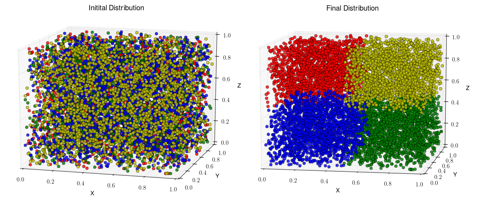

.. _pyzoltan-docs:

=========================
Introduction to PyZoltan
=========================

.. py:currentmodule:: pyzoltan.core.zoltan

PyZoltan is as the name suggests, is a Python wrapper for the Zoltan_
data management library. Although it's primary purpose is a tool for
dynamic load balancing for PySPH, the features are general enough to
warrant a separate discussion. In :ref:`introduction`, we touched upon
how to perform nearest neighbor queries in a distributed
environment. In this document, we will introduce the PyZoltan
interface in it's native non-SPH format.

In PyZoltan, we wrap the specific routines and objects that we wish to
use. The following features of Zoltan are currently supported:

 - Dynamic load balancing using geometric algorithms
 - Unstructured point-to-point communication
 - Distributed data directories

PyZoltan interfaces with Zoltan, which is itself a library that is
called to perform specific tasks on the application data. Information
about the application data is provided to Zoltan through the `method
of callbacks
<http://www.cs.sandia.gov/Zoltan/ug_html/ug_query.html>`_, whereby,
query functions are registered with Zoltan. These query functions are
called internally by Zoltan and are responsible to provide the correct
information about the application data to the library. The user is
responsible to make available this data in consonance with the
application requirement.

-------------------------------------
A simple example: Partitioning points
-------------------------------------

The following simple example demonstrates the partitioning of a random
collection of points in the unit cube :math:`[0,1]^3`. The objects to
be partitioned in this case is therefore the points themselves which
can be thought of as particles in an SPH simulation. We begin with
some imports:

.. code-block:: python

    # Imports
    import mpi4py.MPI as mpi
    from pyzoltan.core.carray import UIntArray, DoubleArray
    from pyzoltan.core import zoltan

    from numpy import random
    import numpy as np

    from mpl_toolkits.mplot3d import Axes3D
    import matplotlib.pyplot as plt

    comm = mpi.COMM_WORLD
    rank = comm.Get_rank()
    size = comm.Get_size()

    colors = ['r', 'g', 'b', 'y', 'm', 'k', 'c', 'burlywood']

^^^^^^^^^^^^^^^^^
Creating the data
^^^^^^^^^^^^^^^^^

After the initial imports, we define the local data on each processor
and broadcast this to the root node for plotting the initial
assignment:

.. code-block:: python

    numPoints = 1<<12

    x = random.random( numPoints )
    y = random.random( numPoints )
    z = random.random( numPoints )
    gid = np.arange( numPoints*size, dtype=np.uint32 )[rank*numPoints:(rank+1)*numPoints]

    X = np.zeros( size * numPoints )
    Y = np.zeros( size * numPoints )
    Z = np.zeros( size * numPoints )
    GID = np.arange( numPoints*size, dtype=np.uint32 )

    comm.Gather( sendbuf=x, recvbuf=X, root=0 )
    comm.Gather( sendbuf=y, recvbuf=Y, root=0 )
    comm.Gather( sendbuf=z, recvbuf=Z, root=0 )

.. note::

   Each object (point) is assigned a *unique* global identifier (the
   `gid` array). The identifiers must be unique for a load balancing
   cycle.

.. note::

   The data type of the global identifiers is of type `ZOLTAN_ID_TYPE`
   (default uint32). This is set at the time of building the Zoltan
   library.

^^^^^^^^^^^^^^^^^^^^^^^^^^^
ZoltanGeometricPartitioner
^^^^^^^^^^^^^^^^^^^^^^^^^^^

The :py:class:`ZoltanGeometricPartitioner` is a concrete sub-class of
:py:class:`PyZoltan`. This class defines all helper methods needed for
a domain decomposition using a geometric algorithm. After the data has
been initialized, we instantiate the
:py:class:`ZoltanGeometricPartitioner` object and set some parameters:

.. code-block:: python

    xa = DoubleArray(numPoints); xa.set_data(x)
    ya = DoubleArray(numPoints); ya.set_data(y)
    za = DoubleArray(numPoints); za.set_data(z)
    gida = UIntArray(numPoints); gida.set_data(gid)

    pz = zoltan.ZoltanGeometricPartitioner(
	dim=3, comm=comm, x=xa, y=ya, z=za, gid=gida)

    pz.set_lb_method('RCB')
    pz.Zoltan_Set_Param('DEBUG_LEVEL', '1')

.. note::

   We use CArrays internally to represent the data in PyZoltan. This
   is done mainly for compatibility with the PySPH particle data
   structure.

The complete list of parameters can be found in the Zoltan reference
manual. All parameters are supported through the wrapper
:py:meth:`PyZoltan.Zoltan_Set_Param` method. In this example, we set
the desired load balancing algorithm (Recursive Coordinate Bisection)
and the output debug level.

^^^^^^^^^^^^^^^^^^^^^^^^^^^^^^^^^
Calling the load balance function
^^^^^^^^^^^^^^^^^^^^^^^^^^^^^^^^^

Once all the parameters are appropriately set-up, we can ask Zoltan to
provide new assignments for the particles:

.. code-block:: python

    pz.Zoltan_LB_Balance()

This will call the chosen load balancing function internally and upon
return, set a number of lists (arrays) indicating which objects need
to be exported and which objects need to be imported. The data
attributes for the export lists are:

 - *numExport* : Number of objects to be exported
 - *exportLocalids* : Local indices of the objects to be exported
 - *exportGlobalids* : Global indices of the objects to be exported
 - *exportProcs* : A list of size `numExport` indicating to which processor each object is exported

And similar arrays for the import lists. The import/export lists
returned by Zoltan give an application all the information required to
initiate the data transfer.

.. note::

   Zoltan does **not** perform the data transfer. The data transfer
   must be done by the application or using the Unstructured
   communication utilities provided by Zoltan.

Given the new assignments, we once again broadcast this to the root to
plot the final partition. The partition generated by this approach is
shown below.

   Point assignment to 4 processors where color indicates
   assignment.

We can see that the `RCB` method has resulted in cuts orthogonal to
the domain axes. Each processor has exactly one fourth of the total
number of particles.

The code for this example can be found in
`pyzoltan/core/tests/3d_partition.py`

----------------------------------
Inverting the Import/Export lists
----------------------------------

In the example above, Zoltan returned a list of objects that were to
be imported and exported. There arise situations in applications
however, when only one set of arrays is available. For example, a
common scenario is that we might know which objects need to be
exported to remote processors but do not know in advance which objects
need to be imported. The matter is complicated for dynamic
applications because without a knowledge of the number of objects to
be imported, we cannot allocate buffers of appropriate size on the
receiving end.

For these scenarios when only one set (either import or export) of
arrays is available, we use the
:py:meth:`PyZoltan.Zoltan_Invert_Lists` method to get the other
set.

:py:class:`PyZoltan` exposes this important utility function from
Zoltan by assuming that the export lists are known to the
application. Upon return from this method, the relevant import lists
are also known. Note that the behaviour of import and export lists can
be interchanged from the application.

A simple example demonstrating this is given below:

.. code-block:: python

    from pyzoltan.core import carray
    from pyzoltan.core import zoltan

    import numpy
    import mpi4py.MPI as mpi

    comm = mpi.COMM_WORLD; rank = comm.Get_rank(); size = comm.Get_size()

    if rank == 0:
	proclist = numpy.array( [1, 1, 2, 1], dtype=numpy.int32 )
	locids = numpy.array( [1, 3, 5, 7], dtype=numpy.uint32 )
	glbids = numpy.array( [1, 3, 5, 7], dtype=numpy.uint32 )

    if rank == 1:
	proclist = numpy.array( [0, 2, 0], dtype=numpy.int32 )
	locids = numpy.array( [1, 3, 5], dtype=numpy.uint32 )
	glbids = numpy.array( [11, 33, 55], dtype=numpy.uint32 )

    if rank == 2:
	proclist = numpy.array( [1, 1], dtype=numpy.int32 )
	locids = numpy.array( [1, 3], dtype=numpy.uint32 )
	glbids = numpy.array( [111, 333], dtype=numpy.uint32 )

    # create the Zoltan object
    zz = zoltan.PyZoltan(comm)

    # set the export lists
    numExport = proclist.size; zz.numExport = numExport
    zz.exportLocalids.resize(numExport); zz.exportLocalids.set_data(locids)
    zz.exportGlobalids.resize(numExport); zz.exportGlobalids.set_data(glbids)
    zz.exportProcs.resize(numExport); zz.exportProcs.set_data(proclist)

    print 'Proc %d to send %s to %s'%(rank, glbids, proclist)

    # Invert the lists
    zz.Zoltan_Invert_Lists()

    # get the import lists
    numImport = zz.numImport
    importlocids = zz.importLocalids.get_npy_array()
    importglbids = zz.importGlobalids.get_npy_array()
    importprocs = zz.importProcs.get_npy_array()

    print 'Proc %d to recv %s from %s'%(rank, importglbids, importprocs)

In this example (which is hard coded for up to 3 processors), each
processor artificially creates a list of objects it knows it must send
to remote processors, which is set-up as the export lists for the
:py:class:`PyZoltan` object. Thereafter,
:py:meth:`PyZoltan.Zoltan_Invert_Lists` is called to get the lists
that must be imported by each processor. The output from this example
is shown below::

    $ mpirun -n 3 python invert_lists.py
    Proc 2 to send [111 333] to [1 1]
    Proc 1 to send [11 33 55] to [0 2 0]
    Proc 0 to send [1 3 5 7] to [1 1 2 1]
    Proc 2 to recv [ 5 33] from [0 1]
    Proc 0 to recv [11 55] from [1 1]
    Proc 1 to recv [  1   3   7 111 333] from [0 0 0 2 2]

We can see that after a call to this method, each processor knows of
remote data that must be received. In an application, this information
can be used to effect the data transfer.

Another option is to use the unstructured communication utilities
offered by Zoltan. This is described next.

------------------------------------------
Unstructured point to point communication
------------------------------------------

.. py:currentmodule:: pyzoltan.core.zoltan_comm

In the previous section, we saw how to use the Zoltan library function
to invert a set of export indices to get corresponding import
indices. Naturally, with a little bit of work, we can structure the
requisite communication (`MPI` send and receives) to exchange the
data.

This set of operations is fairly common and Zoltan_ (PyZoltan)
provides a very convenient utility called :py:class:`ZComm` to perform
such communication. The typical use case for :py:class:`ZComm` is when
we know the list of local objects to send to remote processors but
have no information about the objects to be received. An example
(`pyzoltan/core/tests/zcomm.py`) demonstrating the use of the
:py:class:`ZComm` object is outlined below.

The example can be run with an arbitrary number of processors. Each
processor allocates some data locally and randomly picks :math:`5` of
these objects to be sent to remote processors. The remote processors
are also picked randomly:

.. code-block:: python

    import mpi4py.MPI as mpi
    import numpy as np
    from numpy import random

    # import the unstructured communication package
    from pyzoltan.core import zoltan_comm
    from pyzoltan.core import zoltan

    # MPI comm, rank and size
    comm = mpi.COMM_WORLD; rank = comm.Get_rank(); size = comm.Get_size()

    # each processor creates some random data
    numObjectsTotal = 1<<10

    x = random.random(numObjectsTotal)
    gids = np.array( np.arange(size * numObjectsTotal) )[rank*numObjectsTotal:(rank+1)*numObjectsTotal]
    gids = gids.astype(np.uint32)

    # arbitrarily assign some objects to be sent to some other processor
    nsend = np.int32( random.random_integers(low=1, high=10) )
    object_ids = random.random_integers( low=0, high=numObjectsTotal, size=nsend )
    proclist = random.random_integers(low=0, high=size-1, size=nsend).astype(np.int32)

    my_indices = np.where(proclist == rank)[0]
    proclist[my_indices] = (rank+1)%size

This information is sufficient enough to instantiate the
:py:class:`ZComm` object which will be used as the communication plan
to exchange this data. Once the communication plan is setup, each
processor knows of the data it must receive with the `ZComm.nreturn`
attribute. This is used to allocate receive buffers:

.. code-block:: python

    # create the ZComm object
    tag = np.int32(0)
    zcomm = zoltan_comm.ZComm(comm, tag=tag, nsend=nsend, proclist=proclist)

    # the data to send and receive
    senddata = x[ object_ids ]
    recvdata = np.ones( zcomm.nreturn )

With the send buffer and the allocated receive buffer, we can perform
the communication using the :py:meth:`ZComm.Comm_Do` method:

.. code-block:: python

    # use zoltan to exchange doubles
    print "Proc %d, Sending %s to %s"%(rank, senddata, proclist)
    zcomm.Comm_Do(senddata, recvdata)
    print "Proc %d, Received %s"%(rank, recvdata)

Note that the user does not need to explicitly write the `MPI` send
and receive calls. All that is required from the user is to correctly
allocate the data on the receive side. The output from this example is
(it will vary given the use of random numbers)::

    $ mpirun  -n 3 python zcomm.py
    Proc 2, Sending [ 0.83476393  0.07041833  0.20059537  0.7722934   0.4529769 ] to [0 1 0 0 1]
    Proc 2, Received [ 0.50391764  0.40028207]
    Proc 0, Sending [ 0.50391764] to [2]
    Proc 1, Sending [ 0.29755463  0.40028207  0.69433472] to [0 2 0]
    Proc 1, Received [ 0.07041833  0.4529769 ]
    Proc 0, Received [ 0.29755463  0.69433472  0.83476393  0.20059537  0.7722934 ]

^^^^^^^^^^^^^^^^^^^^^^^^^^^^^^^^^^^^^^^^^
Using the plan for similar communication
^^^^^^^^^^^^^^^^^^^^^^^^^^^^^^^^^^^^^^^^^

The :py:class:`ZComm` object was used to send values of type `float64`
in this example. If the number of objects to be sent and their
destinations are the same, we can modify the :py:class:`ZComm` to send
other objects. For example, the same object can be used to exchange
the global indices (`uint32`) like so:

.. code-block:: python

    senddata = gids[ object_ids ]
    recvdata = np.ones(zcomm.nreturn, dtype=np.uint32)
    zcomm.set_nbytes(recvdata.itemsize)

    print "Proc %d, Sending %s to %s"%(rank, senddata, proclist)
    zcomm.Comm_Do(senddata, recvdata)
    print "Proc %d, Received %s"%(rank, recvdata)

.. note::

   The :py:meth:`ZComm.set_nbytes` method is used to indicate the size
   of the individual objects that is communicated via
   :py:meth:`ZComm.Comm_Do`

The output with this change is::

    $ mpirun  -n 3  python zcomm.py
    Proc 1, Sending [1054 1692 2034] to [0 2 0]
    Proc 0, Sending [214] to [2]
    Proc 2, Sending [2720 3034 2511 2412 2975] to [0 1 0 0 1]
    Proc 2, Received [ 214 1692]
    Proc 1, Received [3034 2975]
    Proc 0, Received [1054 2034 2720 2511 2412]

^^^^^^^^^^^^^^^^^^^^^^^^^^^^^^^^^
Reversing the communication plan
^^^^^^^^^^^^^^^^^^^^^^^^^^^^^^^^^

It is often the case for dynamic applications that objects initially
shared with remote processors have their values updated on remote
processors. Subsequently, these updated values are required on the
originating processor, necessitating them to be communicated back.

For such scenarios, the communication plan represented by
:py:class:`ZComm` can be used to *reverse* the communication. That is
the data that was originally sent will be treated as a receive and
vice-versa.

To illustrate the use of this feature, we continue with our
example. The received data (array of unsigned ints) is modified on the
remote processor and communicated back using the
:py:meth:`ZComm.Comm_Do_Reverse` method:

.. code-block:: python

    recvdata[:] = rank

    updated_info = np.zeros(zcomm.nsend, dtype=senddata.dtype)
    print 'Proc %d, sending updated data %s'%(rank, recvdata)
    zcomm.Comm_Do_Reverse(recvdata, updated_info)
    print 'Proc %d, received updated data %s'%(rank, updated_info)

.. note::

   The size of the buffer each processor will receive in the reverse
   communication phase is equal to the number of objects initially
   sent. This is available through the `ZComm.send` attribute

The output from this when run on 3 processors is::

    $ mpirun  -n 3  python zcomm.py
    Proc 1, Sending [1054 1692 2034] to [0 2 0]
    Proc 0, Sending [214] to [2]
    Proc 2, Sending [2720 3034 2511 2412 2975] to [0 1 0 0 1]
    Proc 2, Received [ 214 1692]
    Proc 1, Received [3034 2975]
    Proc 0, Received [1054 2034 2720 2511 2412]
    Proc 0, sending updated data [0 0 0 0 0]
    Proc 2, sending updated data [2 2]
    Proc 1, sending updated data [1 1]
    Proc 0, received updated data [2]
    Proc 1, received updated data [0 2 0]
    Proc 2, received updated data [0 1 0 0 1]

------------------------------------------
Distributed data directories
------------------------------------------

.. py:currentmodule:: pyzoltan.core.zoltan_dd

The Zoltan `Distributed Data Directory`_ utility is a convenient way
for a processor to locate remote data. It is implemented as a parallel
hash map, keyed on the object identifiers (global indices) and with
arbitrary user data associated with each entry.

The use of this feature is highly problem dependent since the user
defined data will necessarily change for different applications. We
use a simple example demonstrating it's use. Each processor stores
ownership of the object in the distributed directory *without* any
user data associated with each entry.

We begin with the standard set of imports and create some data on each
processor and assign each object a unique global identifier:

.. code-block:: python

    import numpy
    import pyzoltan.api as pz
    import mpi4py.MPI as mpi

    comm = mpi.COMM_WORLD
    rank = comm.Get_rank()
    size = comm.Get_size()

    # every processor owns some data
    numObjectsTotal = 5
    my_indices = numpy.array( range( rank*numObjectsTotal,(rank+1)*numObjectsTotal ), dtype=numpy.uint32 )

    gid = pz.UIntArray(my_indices.size); gid.set_data( my_indices )

Additionally, each processor has an **IntArray** which denotes object
assignment:

.. code-block:: python

    part_assignment = numpy.array( [rank]*numObjectsTotal, dtype=numpy.int32 )
    part = pz.IntArray( part_assignment.size ); part.set_data( part_assignment )

This is sufficient data to create the distributed directory:

.. code-block:: python

    # create a zoltan dd and store the object assignments
    dd = pz.Zoltan_DD(comm)

    # update the dd with the data
    dd.Zoltan_DD_Update(gid, part)

Note that after instantiation of the :py:class:`Zoltan_DD` object, we
call the :py:meth:`Zoltan_DD.Zoltan_DD_Update` method to update the
data associated with this directory. Now, given the shared data
available with each processor, we can query for object assignments. In
the example below, each processor queries for the objects with global
indices `numObjectsTotal + rank` and `numObjectsTotal - rank`:

.. code-block:: python

    # now we can query the dd
    owner_data = pz.IntArray()   # output array for the object data assignment
    owner_parts = pz.IntArray()  # output array for the object assignment

    # every processor requests for information about some data
    query_gids = pz.UIntArray(2); query_gids.set_data( numpy.array([numObjectsTotal+rank,
								    numObjectsTotal-rank], dtype=numpy.uint32) )

    # use Zoltan_DD_Find to query the data
    dd.Zoltan_DD_Find(query_gids, owner_parts, owner_data)

The result from this quey with :math:`3` processors is shown below::

    $ mpirun  -n 3 python zoltan_dd.py
    Processor 0, query_gids = [5 5], owner_parts = [1 1], owner_data = [1 1]
    Processor 1, query_gids = [6 4], owner_parts = [1 0], owner_data = [1 0]
    Processor 2, query_gids = [7 3], owner_parts = [1 0], owner_data = [1 0]

.. _`Distributed Data Directory`: http://www.cs.sandia.gov/Zoltan/ug_html/ug_util_dd.html
.. _Zoltan: http://www.cs.sandia.gov/Zoltan/
