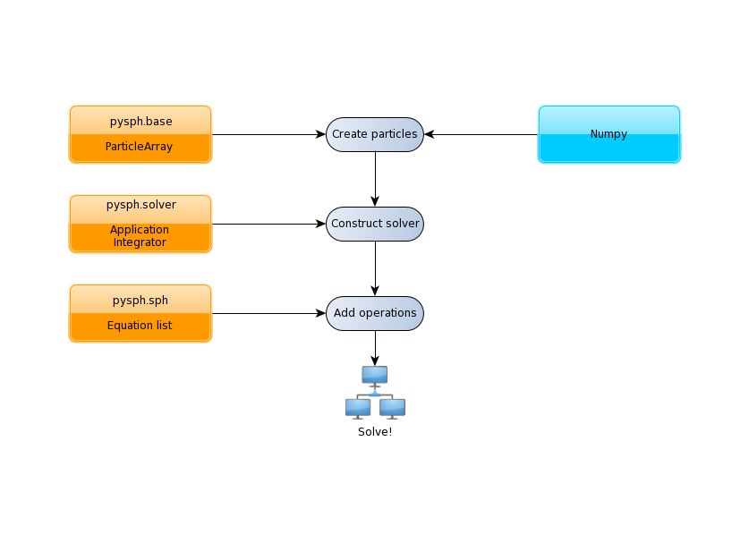
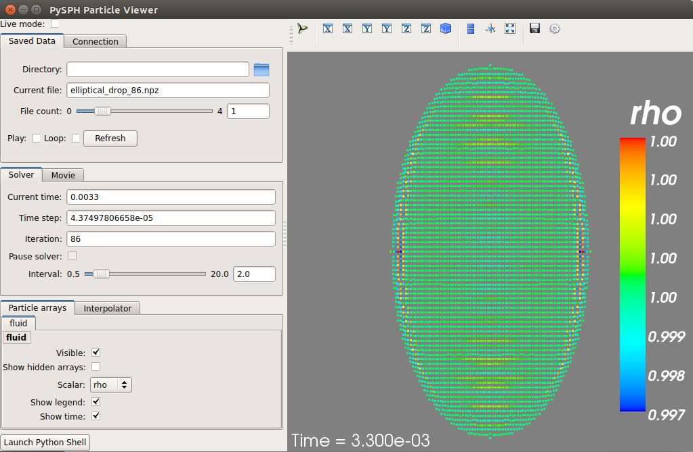

.. _simple_tutorial:

==================
Learning the ropes
==================

In the tutorials, we will introduce the PySPH framework in the context
of the examples provided. Read this if you are a casual user and want
to use the framework *as is*. If you want to add new functions and
capabilities to PySPH, you should read :ref:`design_overview`. If you
are new to PySPH however, we highly recommend that you go through this
document and the next tutorial (:doc:`circular_patch`).

Recall that PySPH is a framework for parallel SPH-like simulations in
Python. The idea therefore, is to provide a user friendly mechanism to
set-up problems while leaving the internal details to the
framework. *All* examples follow the following steps:

The tutorials address each of the steps in this flowchart for problems
with increasing complexity.

The first example we consider is a "patch" test for SPH formulations for
incompressible fluids in `elliptical_drop.py
<https://bitbucket.org/pysph/pysph/src/master/pysph/examples/elliptical_drop.py>`_.
This problem simulates the evolution of a 2D circular patch of fluid under the
influence of an initial velocity field given by:

.. math::

   u &= -100 x \\
   v &= 100 y

The kinematical constraint of incompressibility causes the initially
circular patch of fluid to deform into an ellipse such that the volume
(area) is conserved. An expression can be derived for this deformation
which makes it an ideal test to verify codes.

Imports
~~~~~~~~~~~~~

Taking a look at the example (see `elliptical_drop.py
<https://bitbucket.org/pysph/pysph/src/master/pysph/examples/elliptical_drop.py>`_),
the first several lines are imports of various modules:

.. code-block:: python

    import os
    from numpy import array, ones_like, mgrid, sqrt
    import numpy as np

    from pysph.base.utils import get_particle_array
    from pysph.base.kernels import Gaussian

    from pysph.solver.application import Application
    from pysph.sph.integrator import EPECIntegrator
    from pysph.sph.scheme import WCSPHScheme

.. note::

    This is common for most examples and it is worth noting the pattern of the
    PySPH imports. Fundamental SPH constructs like the kernel and particle
    containers are imported from the ``base`` subpackage. The framework
    related objects like the solver and integrator are imported from the
    ``solver`` subpackage. Finally, we import from the ``sph`` subpackage, the
    physics related part for this problem.

Functions for loading/generating the particles
~~~~~~~~~~~~~~~~~~~~~~~~~~~~~~~~~~~~~~~~~~~~~~~

The code begins with a few functions related to obtaining the exact solution
for the given problem which is used for comparing the computed solution.

A single new class called ``EllipticalDrop`` which derives from
:py:class:`pysph.solver.application.Application` is defined. There are several
methods implemented on this class:

 - ``initialize``: lets users specify any parameters of interest relevant to
   the simulation.

 - ``create_scheme``: lets the user specify the
   :py:class:`pysph.sph.scheme.Scheme` to use to solve the problem.  Several
   standard schemes are already available and can be readily used.

 - ``create_particles``: this method is where one creates the particles to be
   simulated.

 - ``post_process``: optionally post-process the results generated.

Of these, ``create_particles`` and ``create_scheme`` are mandatory for without
them SPH would be impossible.  The rest (and other methods) are optional.  To
see a complete listing of possible methods that one can subclass see
:py:class:`pysph.solver.application.Application`.

The ``create_particles`` method looks like:

.. code-block:: python

    class EllipticalDrop(Application):
        # ...
        def create_particles(self):
            """Create the circular patch of fluid."""
            dx = self.dx
            hdx = self.hdx
            co = self.co
            ro = self.ro
            name = 'fluid'
            x, y = mgrid[-1.05:1.05+1e-4:dx, -1.05:1.05+1e-4:dx]
            x = x.ravel()
            y = y.ravel()

            m = ones_like(x)*dx*dx
            h = ones_like(x)*hdx*dx
            rho = ones_like(x) * ro

            p = ones_like(x) * 1./7.0 * co**2
            cs = ones_like(x) * co

            u = -100*x
            v = 100*y

            # remove particles outside the circle
            indices = []
            for i in range(len(x)):
                if sqrt(x[i]*x[i] + y[i]*y[i]) - 1 > 1e-10:
                    indices.append(i)

            pa = get_particle_array(x=x, y=y, m=m, rho=rho, h=h, p=p, u=u, v=v,
                                    cs=cs, name=name)
            pa.remove_particles(indices)

            print("Elliptical drop :: %d particles"%(pa.get_number_of_particles()))
            self.scheme.setup_properties([pa])

            return [pa]

.. py:currentmodule:: pysph.base.particle_array

The method is used to initialize the particles in Python. In PySPH, we use a
:py:class:`ParticleArray` object as a container for particles of a given
*species*. You can think of a particle species as any homogenous entity in a
simulation. For example, in a two-phase air water flow, a species could be
used to represent each phase. A :py:class:`ParticleArray` can be conveniently
created from the command line using NumPy arrays. For example

.. code-block:: python

    >>> from pysph.base.utils import get_particle_array
    >>> x, y = numpy.mgrid[0:1:0.01, 0:1:0.01]
    >>> x = x.ravel(); y = y.ravel()
    >>> pa = sph.get_particle_array(x=x, y=y)

would create a :py:class:`ParticleArray`, representing a uniform distribution
of particles on a Cartesian lattice in 2D using the helper function
:py:func:`get_particle_array` in the **base** subpackage.  The
:py:func:`get_particle_array_wcsph` is a special version of this suited to
weakly-compressible formulations.

.. note::

   **ParticleArrays** in PySPH use *flattened* or one-dimensional arrays.

The :py:class:`ParticleArray` is highly convenient, supporting methods for
insertions, deletions and concatenations. In the ``create_particles``
function, we use this convenience to remove a list of particles that fall
outside a circular region:

.. code-block:: python

   pa.remove_particles(indices)

.. py:currentmodule:: pyzoltan.core.carray

where, a list of indices is provided.  One could also provide the indices in
the form of a :py:class:`LongArray` which, as the name suggests, is an array
of 64 bit integers.

.. note::

   Any one-dimensional (NumPy) array is valid input for PySPH. You can
   generate this from an external program for solid modelling and load
   it.

.. note::

   PySPH works with multiple **ParticleArrays**. This is why we
   actually return a *list* in the last line of the
   `get_circular_patch` function above.

The ``create_particles`` always returns a list of particle arrays even if
there is only one.  The method ``self.scheme.setup_properties`` automatically
adds any properties needed for the particular scheme being used.

Setting up the PySPH framework
~~~~~~~~~~~~~~~~~~~~~~~~~~~~~~~

As we move on, we encounter instantiations of the PySPH framework objects.
In this example, the :py:class:`pysph.sph.scheme.WCSPH` scheme is created in
the ``create_scheme`` method.  The ``WCSPHScheme`` internally creates other
basic objects needed for the SPH simulation.  In this case, the scheme
instance is passed a list of fluid particle array names and an empty list of
solid particle array names.  In this case there are no solid boundaries.  The
class is also passed a variety of values relevant to the scheme and
simulation.  The kernel to be used is created and passed to the
``configure_solver`` method of the scheme.  The
:py:class:`pysph.sph.integrator.EPECIntegrator` is used to integrate the
particle properties.  Various solver related parametes are also setup.

.. code-block:: python

        def create_scheme(self):
            s = WCSPHScheme(
                ['fluid'], [], dim=2, rho0=self.ro, c0=self.co,
                h0=self.dx*self.hdx, hdx=self.hdx, gamma=7.0, alpha=0.1, beta=0.0
            )
            kernel = Gaussian(dim=2)
            dt = 5e-6; tf = 0.0076
            s.configure_solver(
                kernel=kernel, integrator_cls=EPECIntegrator, dt=dt, tf=tf,
                adaptive_timestep=True, cfl=0.3, n_damp=50,
                output_at_times=[0.0008, 0.0038]
            )
            return s

As can be seen, various options are configured for the solver, including
initial damping etc.  The scheme is responsible for:

 - setting up the actual equations that describe the interactions between
   particles (see :doc:`../reference/equations`),

 - setting up the kernel (:doc:`../reference/kernels`) and integrator
   (:doc:`../reference/integrator`) to use for the simulation.

 - setting up the Solver (:doc:`../reference/solver`), which marshalls the
   entire simulation.

For a more detailed introduction to these aspects of PySPH please read, the
:doc:`circular_patch` tutorial which provides greater detail on these.
However, by simply creating the ``WCSPHScheme`` and creating the particles,
one can simulate the problem.

.. py:currentmodule:: pysph.solver.application

The astute reader may notice that the ``EllipticalDrop`` example is
subclassing the :py:class:`Application`.  This makes it easy to pass command
line arguments to the solver. It is also important for the seamless parallel
execution of the same example. To appreciate the role of the
:py:class:`Application` consider for a moment how might we write a parallel
version of the same example. At some point, we would need some MPI imports and
the particles should be created in a distributed fashion. All this (and more)
is handled through the abstraction of the :py:class:`Application` which hides
all this detail from the user.

Running the example
~~~~~~~~~~~~~~~~~~~

.. py:currentmodule:: pysph.solver.application

In the last two lines of the example, we instantiate the ``EllipticalDrop``
class and run it:

.. code-block:: python

    if __name__ == '__main__':
        app = EllipticalDrop()
        app.run()

There is an additional ``post_process`` call in the code which is entirely
optional and will generate some data for comparison with the exact solution.

The :py:class:`Application` takes care of creating the particles, creating the
solver, handling command line arguments etc.  Many parameters can be
configured via the command line, and these will override any parameters setup
in the respective ``create_*`` methods.  For example one may do the following
to find out the various options::

    $ pysph run elliptical_drop -h

If we run the example without any arguments it will run until a final time of
0.0075 seconds.  We can change this example to 0.005 by the
following::

    $ pysph run elliptical_drop --tf=0.005

When this is run, PySPH will generate Cython code from the equations and
integrators that have been provided, compiles that code and runs the
simulation.  This provides a great deal of convenience for the user without
sacrificing performance.  The generated code is available in
``~/.pysph/source``.  If the code/equations have not changed, then the code
will not be recompiled.  This is all handled automatically without user
intervention.  By default, output files will be generated in the directory
``elliptical_drop_output``.

If we wish to utilize multiple cores we could do::

    $ pysph run elliptical_drop --openmp

If we wish to run the code in parallel (and have compiled PySPH with Zoltan_
and mpi4py_) we can do::

    $ mpirun -np 4 pysph run elliptical_drop

This will automatically parallelize the run using 4 processors. In this example
doing this will only slow it down as the number of particles is extremely
small.

Visualizing and post-processing
~~~~~~~~~~~~~~~~~~~~~~~~~~~~~~~

You can view the data generated by the simulation (after the simulation
is complete or during the simulation) by running the ``pysph view``
command.  To view the simulated data you may do::

    $ pysph view elliptical_drop_output

If you have Mayavi_ installed this should show a UI that looks like:

.. _Mayavi: http://code.enthought.com/projects/mayavi
.. _mpi4py: http://mpi4py.scipy.org/
.. _Zoltan: http://www.cs.sandia.gov/zoltan/

On the user interface, the right side shows the visualized data.  On top of it
there are several toolbar icons.  The left most is the Mayavi logo and clicking
on it will present the full Mayavi user interface that can be used to configure
any additional details of the visualization.

On the bottom left of the main visualization UI there is a button which has the
text "Launch Python Shell".  If one clicks on this, one obtains a full Python
interpreter with a few useful objects available.  These are::

    >>> dir()
    ['__builtins__', '__doc__', '__name__', 'interpolator', 'mlab',
     'particle_arrays', 'scene', 'self', 'viewer']
    >>> len(particle_arrays)
    1
    >>> particle_arrays[0].name
    'fluid'

The ``particle_arrays`` object is a list of **ParticleArrays**.  The
``interpolator`` is an instance of
:py:class:`pysph.tools.interpolator.Interpolator` that is used by the viewer.
The other objects can be used to script the user interface if desired.

Loading output data files
^^^^^^^^^^^^^^^^^^^^^^^^^^^

The simulation data is dumped out either in ``*.hdf5`` files (if one has h5py_
installed) or ``*.npz`` files otherwise. You may use the
:py:func:`pysph.solver.utils.load` function to access the raw data ::

    from pysph.solver.utils import load
    data = load('elliptical_drop_100.hdf5')
    # if one has only npz files the syntax is the same.
    data = load('elliptical_drop_100.npz')

When opening the saved file with ``load``, a dictionary object is returned.
The particle arrays and other information can be obtained from this
dictionary::

    particle_arrays = data['arrays']
    solver_data = data['solver_data']

``particle_arrays`` is a dictionary of all the PySPH particle arrays.
You may obtain the PySPH particle array, ``fluid``, like so::

    fluid = particle_arrays['fluid']
    p = fluid.p

``p`` is a numpy array containing the pressure values.  All the saved particle
array properties can thus be obtained and used for any post-processing task.
The ``solver_data`` provides information about the iteration count, timestep
and the current time.

A good example that demonstrates the use of these is available in the
``post_process`` method of the ``elliptical_drop.py`` example.

.. _h5py: http://www.h5py.org

Interpolating properties
^^^^^^^^^^^^^^^^^^^^^^^^^

Data from the solver can also be interpolated using the
:py:class:`pysph.tools.interpolator.Interpolator` class.  Here is the simplest
example of interpolating data from the results of a simulation onto a fixed
grid that is automatically computed from the known particle arrays::

    from pysph.solver.utils import load
    data = load('elliptical_drop_output/elliptical_drop_100.npz')
    from pysph.tools.interpolator import Interpolator
    parrays = data['arrays']
    interp = Interpolator(parrays.values(), num_points=10000)
    p = interp.interpolate('p')

``p`` is now a numpy array of size 10000 elements shaped such that it
interpolates all the data in the particle arrays loaded.  ``interp.x`` and
``interp.y`` are numpy arrays of the chosen ``x`` and ``y`` coordinates
corresponding to ``p``.  To visualize this we may simply do::

    from matplotlib import pyplot as plt
    plt.contourf(interp.x, interp.y, p)

It is easy to interpolate any other property too.  If one wishes to explicitly
set the domain on which the interpolation is required one may do::

    xmin, xmax, ymin, ymax, zmin, zmax = 0., 1., -1., 1., 0, 1
    interp.set_domain((xmin, xmax, ymin, ymax, zmin, zmax), (40, 50, 1))
    p = interp.interpolate('p')

This will create a meshgrid in the specified region with the specified number
of points.

One could also explicitly set the points on which one wishes to interpolate the
data as::

    interp.set_interpolation_points(x, y, z)

Where ``x, y, z`` are numpy arrays of the coordinates of the points on which
the interpolation is desired.  This can also be done with the constructor as::

    interp = Interpolator(parrays.values(), x=x, y=y, z=z)

For more details on the class and the available methods, see
:py:class:`pysph.tools.interpolator.Interpolator`.

In addition to this there are other useful pre and post-processing utilities
described in :doc:`../reference/tools`.

Doing more
~~~~~~~~~~~

.. py:currentmodule:: pysph.solver.application

The :py:class:`Application` has several more methods that can be used in
additional contexts, for example one may override the following additional
methods:

 - ``add_user_options``: this is used to create additional user-defined
   command line arguments.  The command line options are available in
   ``self.options`` and can be used in the other methods.

 - ``consume_user_options``: this is called after the command line arguments are
   parsed, and can be optionally used to setup any variables that have been
   added by the user in ``add_user_options``.  Note that the method is called
   before the particles and solver etc. are created.

 - ``create_domain``: this is used when a periodic domain is needed.

 - ``create_inlet_outlet``:  Override this to return any inlet an outlet
   objects.  See the :py:class:`pysph.sph.simple_inlet_outlet` module.

There are many others, please see the :py:class:`Application` class to see
these.

There are several `examples
<https://bitbucket.org/pysph/pysph/src/master/pysph/examples/>`_ that
ship with PySPH, explore these to get a better idea of what is possible.
