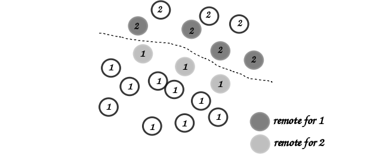
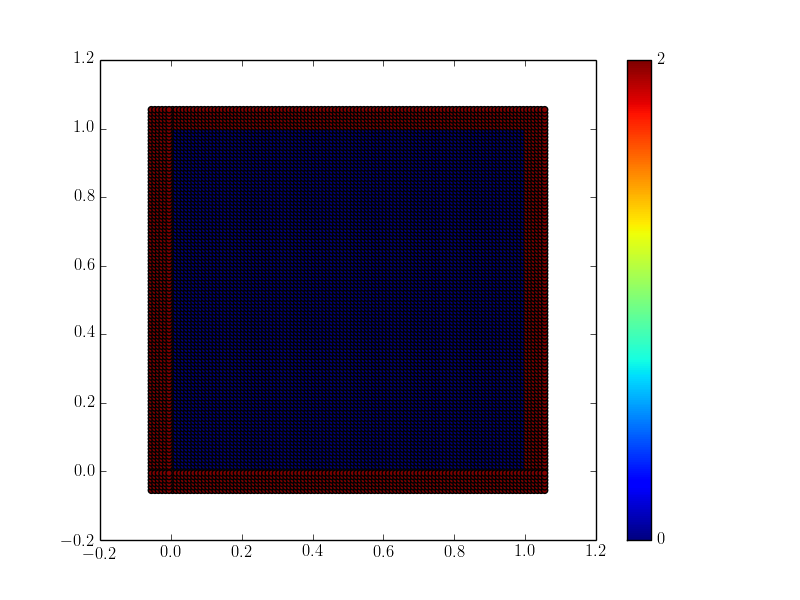

.. _introduction:

==========================
Using the PySPH library
==========================

In this document, we describe the fundamental data structures for
working with particles in PySPH. Take a look at :ref:`tutorials` for a
tutorial introduction to some of the examples. For the experienced
user, take a look at :ref:`design_overview` for some of the internal
code-generation details and if you want to extend PySPH for your
application.

-----------------------
Working With Particles
-----------------------

As an object oriented framework for particle methods, PySPH provides
convenient data structures to store and manipulate collections of
particles. These can be constructed from within Python and are fully
compatible with NumPy arrays. We begin with a brief description for
the basic data structures for arrays.

.. py:currentmodule:: pyzoltan.core.carray

^^^^^^^^^^
C-arrays
^^^^^^^^^^

The :py:class:`BaseArray` class provides a typed array data structure
called **CArray**. These are used throughout PySPH and are
fundamentally very similar to NumPy arrays. The following named types
are supported:

    - :py:class:`UIntArray`    (32 bit unsigned integers)
    - :py:class:`IntArray`     (32 bit signed integers)
    - :py:class:`LongArray`    (64 bit signed integers)
    - :py:class:`DoubleArray`  (64 bit floating point numbers

Some simple commands to work with **BaseArrays** from the interactive
shell are given below

.. code-block:: python

    >>> import numpy
    >>> from pyzoltan.core.carray import DoubleArray
    >>> array = DoubleArray(10)                      # array of doubles of length 10
    >>> array.set_data( numpy.arange(10) )           # set the data from a NumPy array
    >>> array.get(3)                                 # get the value at a given index
    >>> array.set(5, -1.0)                           # set the value at an index to a value
    >>> array[3]                                     # standard indexing
    >>> array[5] = -1.0                              # standard indexing

.. py:currentmodule:: pysph.base.particle_array

^^^^^^^^^^^^^^
ParticleArray
^^^^^^^^^^^^^^

In PySPH, a collection of **BaseArrays** make up what is called a
:py:class:`ParticleArray`. This is the main data structure that is used to
represent particles and can be created from NumPy arrays like so:

.. code-block:: python

   >>> import numpy
   >>> from pysph.base.utils import get_particle_array
   >>> x, y = numpy.mgrid[0:1:0.1, 0:1:0.1]             # create some data
   >>> x = x.ravel(); y = y.ravel()                     # flatten the arrays
   >>> pa = get_particle_array(name='array', x=x, y=y)  # create the particle array

In the above, the helper function
:py:func:`pysph.base.utils.get_particle_array` will instantiate and return a
:py:class:`ParticleArray` with properties `x` and `y` set from given NumPy
arrays. In general, a :py:class:`ParticleArray` can be instantiated with an
arbitrary number of properties. Each property is stored internally as a
:py:class:`pyzoltan.core.carray.BaseArray` of the appropriate type.

By default, every :py:class:`ParticleArray` returned using the helper
function will have the following properties:

    - `x, y, z`   : Position coordinates (doubles)
    - `u, v, w`   : Velocity (doubles)
    - `h, m, rho` : Smoothing length, mass and density (doubles)
    - `au, av, aw`: Accelerations (doubles)
    - `p`         : Pressure (doubles)
    - `gid`       : Unique global index (unsigned int)
    - `pid`       : Processor id (int)
    - `tag`       : Tag (int)

The role of the particle properties like positions, velocities and
other variables should be clear. These define either the kinematic or
dynamic properties associated with SPH particles in a simulation.

PySPH introduces a global identifier for a particle which is required
to be *unique* for that particle. This is represented with the
property **gid** which is of type **unsigned int**. This property is
used in the parallel load balancing algorithm with Zoltan.

The property **pid** for a particle is an **integer** that is used to
identify the processor to which the particle is currently assigned.

The property **tag** is an **integer** that is used for any other
identification. For example, we might want to mark all boundary
particles with the tag 100. Using this property, we can delete all
such particles as

.. code-block:: python

   >>> pa.remove_tagged_particles(tag=100)

This gives us a very flexible way to work with particles. Another way
of deleting/extracting particles is by providing the indices (as a
`list`, `NumPy array` or a :py:class:`LongArray`) of the particles to
be removed:

.. code-block:: python

   >>> indices = [1,3,5,7]
   >>> pa.remove_particles( indices )
   >>> extracted = pa.extract_particles(indices, props=['rho', 'x', 'y'])

A :py:class:`ParticleArray` can be concatenated with another array to
result in a larger array:

.. code-block:: python

   >>> pa.append_parray(another_array)

To set a given list of properties to zero:

.. code-block:: python

   >>> props = ['au', 'av', 'aw']
   >>> pa.set_to_zero(props)

Properties in a particle array are automatically sized depending on the number
of particles.  There are times when fixed size properties are required.  For
example if the total mass or total force on a particle array needs to be
calculated, a fixed size constant can be added.  This can be done by adding a
``constant`` to the array as illustrated below:

.. code-block:: python

    >>> pa.add_constant('total_mass', 0.0)
    >>> pa.add_constant('total_force', [0.0, 0.0, 0.0])
    >>> print pa.total_mass, pa.total_force

In the above, the ``total_mass`` is a fixed ``DoubleArray`` of length 1 and
the ``total_force`` is a fixed ``DoubleArray`` of length 3.  These constants
will never be resized as one adds or removes particles to/from the particle
array.  The constants may be used inside of SPH equations just like any other
property.

The constants can also set in the constructor of the :py:class:`ParticleArray`
by passing a dictionary of constants as a ``constants`` keyword argument.  For
example:

.. code-block:: python

    >>> pa = ParticleArray(
    ...     name='test', x=x,
    ...     constants=dict(total_mass=0.0, total_force=[0.0, 0.0, 0.0])
    ... )

Take a look at :py:class:`ParticleArray` reference documentation for
some of the other methods and their uses.

.. py:currentmodule:: pysph.base.nnps

-------------------------------------------
Nearest Neighbour Particle Searching (NNPS)
-------------------------------------------

To carry out pairwise interactions for SPH, we need to find the nearest
neighbours for a given particle within a specified interaction radius. The
:py:class:`NNPS` object is responsible for handling these nearest neighbour
queries for a *list* of particle arrays:

.. code-block:: python

   >>> from pysph.base import nnps
   >>> pa1 = get_particle_array(...)                    # create one particle array
   >>> pa2 = get_particle_array(...)                    # create another particle array
   >>> particles = [pa1, pa2]
   >>> nps = nnps.LinkedListNNPS(dim=3, particles=particles, radius_scale=3)

The above will create an :py:class:`NNPS` object that uses the classical
*linked-list* algorithm for nearest neighbour searches. The radius of
interaction is determined by the argument `radius_scale`. The book-keeping
cells have a length of :math:`\text{radius_scale} \times h_{\text{max}}`,
where :math:`h_{\text{max}}` is the maximum smoothing length of *all*
particles assigned to the local processor.

Note that the ``NNPS`` classes also support caching the neighbors
computed.  This is useful if one needs to reuse the same set of
neighbors.  To enable this, simply pass ``cache=True`` to the
constructor::

    >>> nps = nnps.LinkedListNNPS(dim=3, particles=particles, cache=True)

Since we allow a list of particle arrays, we need to distinguish
between *source* and *destination* particle arrays in the neighbor
queries.

.. note::

   A **destination** particle is a particle belonging to that species
   for which the neighbors are sought.

   A **source** particle is a particle belonging to that species which
   contributes to a given destination particle.

With these definitions, we can query for nearest neighbors like so:

.. code-block:: python

   >>> nbrs = UIntArray()
   >>> nps.get_nearest_particles(src_index, dst_index, d_idx, nbrs)

where `src_index`, `dst_index` and `d_idx` are integers. This will
return, for the *d_idx* particle of the *dst_index* particle array
(species), nearest neighbors from the *src_index* particle array
(species).  Passing the `src_index` and `dst_index` every time is
repetitive so an alternative API is to call ``set_context`` as done
below::

    >>> nps.set_context(src_index=0, dst_index=0)

If the ``NNPS`` instance is configured to use caching, then it will also
pre-compute the neighbors very efficiently.  Once the context is set one
can get the neighbors as::

    >>> nps.get_nearest_neighbors(d_idx, nbrs)

Where `d_idx` and `nbrs` are as discussed above.

If we want to re-compute the data structure for a new distribution of
particles, we can call the :py:meth:`NNPS.update` method:

.. code-block:: python

   >>> nps.update()

.. py:currentmodule:: pysph.base.nnps

^^^^^^^^^^^^^^^^^^^^^^
Periodic domains
^^^^^^^^^^^^^^^^^^^^^^

The constructor for the :py:class:`NNPS` accepts an optional argument
(:py:class:`DomainManager`) that is used to delimit the maximum
spatial extent of the simulation domain. Additionally, this argument
is also used to indicate the extents for a periodic domain. We
construct a :py:class:`DomainManager` object like so

.. code-block:: python

   >>> from pysph.base.nnps import DomainManager
   >>> from pysph.base.point import Point
   >>> domain = DomainManager(xmin, xmax, ymin, ymax, zmin, zmax,
                              periodic_in_x=True, periodic_in_y=True,
                              periodic_in_z=False)

where `xmin ... zmax` are floating point arguments delimiting the
simulation domain and `periodic_in_x,y,z` are bools defining the
periodic axes.

When the :py:class:`NNPS` object is constructed with this
:py:class:`DomainManager`, care is taken to create periodic ghosts for
particles in the vicinity of the periodic boundaries. These *ghost*
particles are given a special **tag** defined by
:py:class:`ParticleTAGS`

.. code-block:: python

   class ParticleTAGS:
       Local = 0
       Remote = 1
       Ghost = 2

.. note::

   The *Local* tag is used to for ordinary particles assigned and
   owned by a given processor. This is the default tag for all
   particles.

.. note::

   The *Remote* tag is used for ordinary particles assigned to but not
   owned by a given processor. Particles with this tag are typically
   used to satisfy neighbor queries *across* processor boundaries in a
   parallel simulation.

.. note::

   The *Ghost* tag is used for particles that are created to satisfy
   boundary conditions locally.

.. py:currentmodule:: pysph.base.particle_array

^^^^^^^^^^^^^^^^^^^^^^^^^^^^^^^^^^^^^^^
Particle aligning
^^^^^^^^^^^^^^^^^^^^^^^^^^^^^^^^^^^^^^^

In PySPH, the :py:class:`ParticleArray` aligns all particles upon a
call to the :py:meth:`ParticleArray.align_particles` method. The
aligning is done so that all particles with the *Local* tag are placed
first, followed by particles with other tags.

There is no preference given to the tags other than the fact that a
particle with a non-zero tag is placed after *all* particles with a
zero (*Local*) tag. Intuitively, the local particles represent *real*
particles or particles that we want to do active computation on
(destination particles).

The data attribute `ParticleArray.num_real_particles` returns the
number of real or *Local* particles. The total number of particles in
a given :py:class:`ParticleArray` can be obtained by a call to the
:py:meth:`ParticleArray.get_number_of_particles` method.

The following is a simple example demonstrating this default behaviour
of PySPH:

.. code-block:: python

   >>> x = numpy.array( [0, 1, 2, 3], dtype=numpy.float64 )
   >>> tag = numpy.array( [0, 2, 0, 1], dtype=numpy.int32 )

   >>> pa = utils.get_particle_array(x=x, tag=tag)

   >>> print pa.get_number_of_particles()                     # total number of particles
   >>> 4
   >>> print pa.num_real_particles                            # no. of particles with tag 0
   >>> 2

   >>> x, tag = pa.get('x', 'tag', only_real_particles=True)  # get only real particles (tag == 0)
   >>> print x
   >>> [0. 2.]
   >>> print tag
   >>> [0 0]

   >>> x, tag = pa.get('x', 'tag', only_real_particles=False) # get all particles
   >>> print x
   >>> [0. 2. 1. 3.]
   >>> print tag
   >>> [0 0 2 1]

We are now in a position to put all these ideas together and write our
first SPH application.

.. py:currentmodule:: pyzoltan.core.zoltan
.. py:currentmodule:: pysph.parallel.parallel_manager

-------------------------------
Parallel NNPS with PyZoltan
-------------------------------

PySPH uses the Zoltan_ data management library for dynamic load
balancing through a Python wrapper :py:class:`PyZoltan`, which
provides functionality for parallel neighbor queries in a manner
completely analogous to :py:class:`NNPS`.

Particle data is managed and exchanged in parallel via a derivative of
the abstract base class :py:class:`ParallelManager` object. Continuing
with our example, we can instantiate a
:py:class:`ZoltanParallelManagerGeometric` object as:

.. code-block:: python

   >>> ... # create particles
   >>> from pysph.parallel import ZoltanParallelManagerGeometric
   >>> pm = ZoltanParallelManagerGeometric(dim, particles, comm, radius_scale, lb_method)

The constructor for the parallel manager is quite similar to the
:py:class:`NNPS` constructor, with two additional parameters, `comm`
and `lb_method`. The first is the `MPI communicator` object and the
latter is the partitioning algorithm requested. The following
geometric load balancing algorithms are supported:

 - Recursive Coordinate Bisection (RCB_)
 - Recursive Inertial Bisection (RIB_)
 - Hilbert Space Filling Curves (HSFC_)

The particle distribution can be updated in parallel by a call to the
:py:meth:`ParallelManager.update` method. Particles across processor
boundaries that are needed for neighbor queries are assigned the tag
*Remote* as shown in the figure:

   Local and remote particles in the vicinity of a processor boundary
   (dashed line)

.. py:currentmodule:: pysph.base.kernels
.. py:currentmodule:: pysph.base.nnps

---------------------------------------
Putting it together: A simple example
---------------------------------------

Now that we know how to work with particles, we will use the data
structures to carry out the simplest SPH operation, namely, the
estimation of particle density from a given distribution of particles.

We consider particles distributed on a uniform Cartesian lattice (
:math:`\Delta x = \Delta y = \Delta`) in a doubly periodic domain
:math:`[0,1]\times[0,1]`.

The particle mass is set equal to the "volume" :math:`\Delta^2`
associated with each particle and the smoothing length is taken as
:math:`1.3\times \Delta`. With this initialization, we have for the
estimation for the particle density

.. math::

  <\rho>_a = \sum_{b\in\mathcal{N}(a)} m_b W_{ab} \approx 1

We will use the :py:class:`CubicSpline` kernel, defined in
`pysph.base.kernels` module. The code to set-up the particle
distribution is given below

.. code-block:: python

   # PySPH imports
   from pyzoltan.core.carray import UIntArray
   from pysph.base.utils import utils
   from pysph.base.kernels import CubicSpline
   from pysph.base.nnps import DomainManager
   from pysph.base.nnps import LinkedListNNPS

   # NumPy
   import numpy

   # Create a particle distribution
   dx = 0.01; dxb2 = 0.5 * dx
   x, y = numpy.mgrid[dxb2:1:dx, dxb2:1:dx]

   x = x.ravel(); y = y.ravel()
   h = numpy.ones_like(x) * 1.3*dx
   m = numpy.ones_like(x) * dx*dx

   # Create the particle array
   pa = utils.get_particle_array(x=x,y=y,h=h,m=m)

   # Create the periodic DomainManager object and NNPS
   domain = DomainManager(xmin=0., xmax=1., ymin=0., ymax=1., periodic_in_x=True, periodic_in_y=True)
   nps = LinkedListNNPS(dim=2, particles=[pa,], radius_scale=2.0, domain=domain)

   # The SPH kernel. The dimension argument is needed for the correct normalization constant
   k = CubicSpline(dim=2)

.. note::

   Notice that the particles were created with an offset of
   :math:`\frac{\Delta}{2}`. This is required since the
   :py:class:`NNPS` object will *box-wrap* particles near periodic
   boundaries.

The :py:class:`NNPS` object will create periodic ghosts for the
particles along each periodic axis.

The ghost particles are assigned the `tag` value 2. For this example,
periodic ghosts are created along each coordinate direction as shown
in the figure.

^^^^^^^^^^^^^^^^^^^
SPH Kernels
^^^^^^^^^^^^^^^^^^^

Pairwise interactions in SPH are weighted by the kernel
:math:`W_{ab}`. In PySPH, the `pysph.base.kernels` module provides a
Python interface for these terms. The general definition for an SPH
kernel is of the form:

.. code-block:: python

   class Kernel(object):
       def __init__(self, dim=1):
	   self.radius_scale = 2.0
	   self.dim = dim

       def kernel(self, xij=[0., 0, 0], rij=1.0, h=1.0):
	   ...
	   return wij

       def gradient(self, xij=[0., 0, 0], rij=1.0, h=1.0, grad=[0, 0, 0]):
	   ...
	   grad[0] = dwij_x
	   grad[1] = dwij_y
	   grad[2] = dwij_z

The kernel is an object with two methods `kernel` and
`gradient`. :math:`\text{xij}` is the difference vector between the
destination and source particle :math:`\boldsymbol{x}_{\text{i}} -
\boldsymbol{x}_{\text{j}}` with :math:`\text{rij} = \sqrt{
\boldsymbol{x}_{ij}^2}`. The `gradient` method accepts an additional
argument that upon exit is populated with the kernel gradient values.

^^^^^^^^^^^^^^^^^^^^^^^^^^^^^
Density summation
^^^^^^^^^^^^^^^^^^^^^^^^^^^^^

In the final part of the code, we iterate over all target or
destination particles and compute the density contributions from
neighboring particles:

.. code-block:: python

   nbrs = UIntArray()                                                      # array for neighbors
   x, y, h, m  = pa.get('x', 'y', 'h', 'm', only_real_particles=False)     # source particles will include ghosts

   for i in range( pa.num_real_particles ):                                # iterate over all local particles
       xi = x[i]; yi = y[i]; hi = h[i]

       nps.get_nearest_particles(0, 0, i, nbrs)                            # get neighbors
       neighbors = nbrs.get_npy_array()                                    # numpy array of neighbors

       rho = 0.0
       for j in neighbors:                                                 # iterate over each neighbor

	   xij = xi - x[j]                                                 # interaction terms
	   yij = yi - y[j]
	   rij = numpy.sqrt( xij**2 + yij**2 )
	   hij = 0.5 * (h[i] + h[j])

	   wij = k.kernel( [xij, yij, 0.0], rij, hij)                      # kernel interaction

	   rho += m[j] * wij

       pa.rho[i] = rho                                                    # contribution for this destination

The average density computed in this manner can be verified as
:math:`\rho_{\text{avg}} = 0.99994676895585222`.

--------
Summary
--------

In this document, we introduced the most fundamental data structures
in PySPH for working with particles. With these data structures, PySPH
can be used as a library for managing particles for your application.

If you are interested in the PySPH framework and want to try out some
eaxmples, check out the tutorials: :ref:`tutorials`.

.. _Zoltan: http://www.cs.sandia.gov/Zoltan/

.. _RCB: http://www.cs.sandia.gov/Zoltan/ug_html/ug_alg_rcb.html
.. _RIB: http://www.cs.sandia.gov/Zoltan/ug_html/ug_alg_rib.html
.. _HSFC: http://www.cs.sandia.gov/Zoltan/ug_html/ug_alg_hsfc.html

..  LocalWords:  DomainManager maximum
